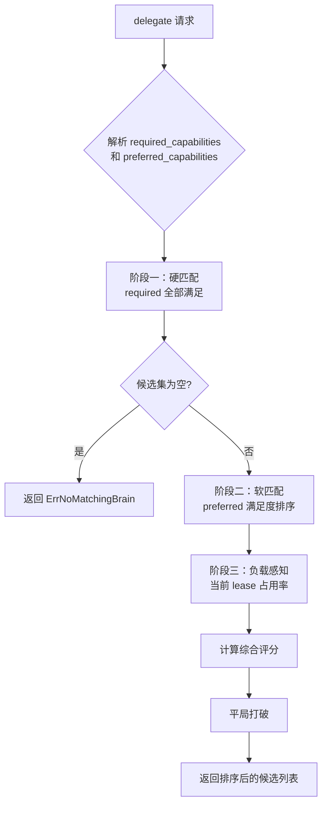
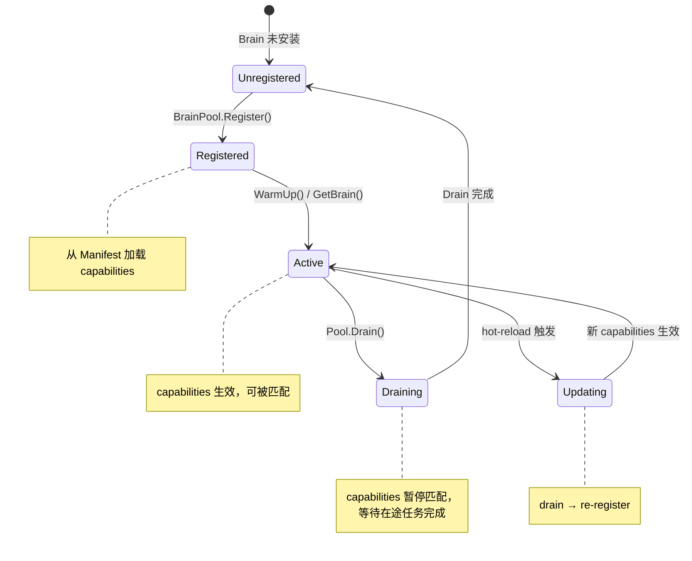

# 35. Brain Capability 标签体系与匹配算法

> **状态**：v1 · 2026-04-17
> **归属**：[32-v3-Brain架构.md](./32-v3-Brain架构.md) §3.6 的下位规格
> **依赖**：[33-Brain-Manifest规格.md](./33-Brain-Manifest规格.md) · [35-BrainPool实现设计.md](./35-BrainPool实现设计.md) · [35-语义审批分级设计.md](./35-语义审批分级设计.md) · [35-Dispatch-Policy-冲突图与Batch分组算法.md](./35-Dispatch-Policy-冲突图与Batch分组算法.md)
> **实现目标**：`sdk/kernel/capability.go`（新增）、`sdk/kernel/capability_matcher.go`（新增）
> **作者**：Brain v3 架构组

---

## 0. 关键区分（再次强调）

本文档描述的是 **Brain Capability（脑级能力标签）**，与 §7.7.4 ToolConcurrencySpec 中的 **Tool Capability Binding（工具级资源绑定）** 是不同层级的概念：

| 概念 | 粒度 | 回答的问题 | 用于 |
|------|------|-----------|------|
| **Brain Capability**（本文） | brain 级别 | "这个脑会什么" | delegate 候选筛选、搜索、路由 |
| **Tool Capability Binding** | tool × resource 级别 | "这个工具触碰什么资源" | 并发控制、Lease 管理 |

两者名字相近但职责正交。本文档只讨论前者。

---

## 1. 概述

### 1.1 Capability 在架构中的位置

Brain Capability 是 brain 的**能力标签与路由信号**，贯穿四个核心子系统：

```text
┌─────────────────────────────────────────────────────────────────┐
│                      Central Brain                               │
│  "我需要 trading.execute 能力的 brain"                           │
└──────────────────────┬──────────────────────────────────────────┘
                       │ delegate 请求（携带 required/preferred capabilities）
                       ▼
┌──────────────────────────────────────────────────────────────────┐
│  CapabilityMatcher                                               │
│  (1) 硬匹配 → (2) 软匹配 → (3) 负载感知                         │
│  输出：候选 brain 的排序列表                                      │
└──────┬───────────────────────────────────────┬──────────────────┘
       │                                       │
       ▼                                       ▼
┌──────────────┐                    ┌──────────────────────┐
│ BrainPool    │                    │ LeaseManager          │
│ GetBrain()   │                    │ ResourceKey 冲突判定   │
│ 进程管理      │                    │ Capability 命名空间    │
└──────────────┘                    └──────────────────────┘
       │                                       │
       ▼                                       ▼
┌──────────────┐                    ┌──────────────────────┐
│ 语义审批      │                    │ Context Engine        │
│ Capability    │                    │ Capability 标签       │
│ 级别影响      │                    │ 用于跨脑上下文路由     │
│ 审批层级      │                    │                      │
└──────────────┘                    └──────────────────────┘
```

### 1.2 Capability 的四大作用

1. **delegate 候选筛选**：Central Brain 根据任务需要的 capabilities 筛选合适的专精大脑
2. **Lease 冲突判定**：Capability 标签参与 ResourceKey 的命名空间，影响冲突图的边生成
3. **审批决策输入**：Capability 级别影响语义审批的等级推导（L0-L4）
4. **跨脑上下文路由**：Context Engine 根据 Capability 标签将上下文片段路由到相关 brain

---

## 2. 标签体系设计

### 2.1 标签分类

Brain Capability 标签分为四类，每类回答不同的问题：

| 类别 | 前缀约定 | 回答的问题 | 示例 |
|------|---------|-----------|------|
| **function** | `{domain}.{verb}` | "这个脑能做什么操作" | `trading.execute`, `fs.write` |
| **domain** | `domain.{area}` | "这个脑覆盖什么领域" | `domain.crypto`, `domain.devops` |
| **resource** | `resource.{type}` | "这个脑能访问什么资源" | `resource.exchange_api`, `resource.browser` |
| **mode** | `mode.{pattern}` | "这个脑支持什么运行模式" | `mode.background`, `mode.streaming` |

### 2.2 标准值枚举

#### 2.2.1 function 标签（功能操作）

| 标签 | 含义 | 典型 brain |
|------|------|-----------|
| `trading.execute` | 下单/撤单等交易执行 | quant |
| `trading.review` | 交易审查/复审 | quant |
| `risk.manage` | 风险管理/仓位控制 | quant |
| `risk.assess` | 风险评估/分析 | quant |
| `market.subscribe` | 行情订阅 | data |
| `market.query` | 历史行情查询 | data |
| `feature.compute` | 特征工程计算 | data |
| `fs.read` | 文件系统读取 | code |
| `fs.write` | 文件系统写入 | code |
| `fs.search` | 文件系统搜索 | code |
| `code.execute` | 代码/命令执行 | code |
| `code.test` | 测试运行 | code, verifier |
| `web.browse` | 网页浏览 | browser |
| `web.extract` | 网页内容提取 | browser |
| `web.form_fill` | 表单填写/提交 | browser |
| `web.screenshot` | 页面截图 | browser |
| `verify.check` | 验证/检查 | verifier |
| `verify.assert` | 断言/确认 | verifier |
| `fault.diagnose` | 故障诊断 | fault |
| `fault.recover` | 故障恢复 | fault |
| `llm.review` | LLM 审查/分析 | central |
| `llm.summarize` | LLM 摘要/总结 | central |

#### 2.2.2 domain 标签（领域覆盖）

| 标签 | 含义 |
|------|------|
| `domain.crypto` | 加密货币/数字资产 |
| `domain.equity` | 股票/权益 |
| `domain.devops` | 开发运维 |
| `domain.security` | 安全审计 |
| `domain.data_science` | 数据科学/分析 |
| `domain.web_automation` | Web 自动化 |
| `domain.nlp` | 自然语言处理 |
| `domain.finance` | 通用金融 |
| `domain.infrastructure` | 基础设施 |
| `domain.testing` | 测试/质量保证 |

#### 2.2.3 resource 标签（资源访问）

| 标签 | 含义 |
|------|------|
| `resource.exchange_api` | 交易所 API |
| `resource.market_data` | 市场数据源 |
| `resource.filesystem` | 本地文件系统 |
| `resource.browser` | 浏览器实例 |
| `resource.database` | 数据库连接 |
| `resource.shell` | Shell/终端 |
| `resource.network` | 网络出口 |
| `resource.gpu` | GPU 计算资源 |
| `resource.mmap` | 共享内存（mmap ring buffer） |
| `resource.llm` | LLM Provider API |

#### 2.2.4 mode 标签（运行模式）

| 标签 | 含义 |
|------|------|
| `mode.background` | 支持后台长驻运行 |
| `mode.streaming` | 支持流式数据推送 |
| `mode.interactive` | 支持交互式对话 |
| `mode.batch` | 支持批量处理 |
| `mode.ephemeral` | 临时性、用完即毁 |
| `mode.stateful` | 有状态会话（如 browser session） |
| `mode.idempotent` | 操作幂等 |
| `mode.hot_reload` | 支持热重载 |
| `mode.daemon` | 守护进程模式 |
| `mode.on_demand` | 按需启动 |

### 2.3 标签层级

每个 brain 的 capabilities 分为两个层级：

| 层级 | 含义 | 在 Manifest 中的声明方式 | 匹配权重 |
|------|------|------------------------|---------|
| **primary** | 核心能力，该 brain 的主要职责 | `capabilities` 数组中的标签 | 1.0 |
| **secondary** | 辅助能力，非主要但可以做 | `capabilities_secondary` 数组（可选） | 0.5 |

**示例**：Quant Brain 的 primary 是 `trading.execute`、`risk.manage`，secondary 是 `market.query`（它能查行情，但 Data Brain 更专业）。

### 2.4 标签声明位置：Manifest capabilities 字段

标签格式遵循 Manifest JSON Schema 已定义的规则：`^[a-z][a-z0-9_]*\.[a-z][a-z0-9_]*$`（即 `domain.verb` 格式）。

```json
{
  "schema_version": 1,
  "kind": "quant",
  "name": "Quant Brain",
  "brain_version": "1.0.0",
  "capabilities": [
    "trading.execute",
    "trading.review",
    "risk.manage",
    "risk.assess"
  ],
  "capabilities_secondary": [
    "market.query",
    "domain.crypto",
    "domain.finance",
    "mode.background",
    "resource.exchange_api"
  ],
  "runtime": { "type": "native", "entrypoint": "bin/brain-quant-sidecar" },
  "policy": { "tool_scope": "delegate.quant" }
}
```

### 2.5 现有 Brain 的标准 Capability 映射

| Brain | Kind | Primary Capabilities | Secondary Capabilities |
|-------|------|---------------------|----------------------|
| Data Brain | `data` | `market.subscribe`, `market.query`, `feature.compute` | `domain.crypto`, `mode.daemon`, `mode.streaming`, `resource.market_data`, `resource.mmap` |
| Quant Brain | `quant` | `trading.execute`, `trading.review`, `risk.manage`, `risk.assess` | `market.query`, `domain.crypto`, `domain.finance`, `mode.background`, `resource.exchange_api` |
| Code Brain | `code` | `fs.read`, `fs.write`, `fs.search`, `code.execute`, `code.test` | `domain.devops`, `mode.ephemeral`, `resource.filesystem`, `resource.shell` |
| Browser Brain | `browser` | `web.browse`, `web.extract`, `web.form_fill`, `web.screenshot` | `domain.web_automation`, `mode.stateful`, `resource.browser`, `resource.network` |
| Verifier Brain | `verifier` | `verify.check`, `verify.assert`, `code.test` | `domain.testing`, `mode.ephemeral` |
| Fault Brain | `fault` | `fault.diagnose`, `fault.recover` | `domain.infrastructure`, `mode.on_demand`, `resource.shell` |

---

## 3. Capability 匹配算法

### 3.1 匹配流程总览



### 3.2 输入结构

```go
// DelegateCapabilityRequest 是 delegate 请求中的能力需求声明。
// 由 Central Brain 在规划阶段填充。
type DelegateCapabilityRequest struct {
    // RequiredCapabilities 硬性需求：候选 brain 必须全部具备。
    // 不满足任何一项则直接排除。
    RequiredCapabilities []string `json:"required_capabilities"`

    // PreferredCapabilities 软性偏好：有则加分，无则不扣分。
    // 用于在多个满足硬性需求的候选中做排序。
    PreferredCapabilities []string `json:"preferred_capabilities,omitempty"`

    // ExcludeKinds 显式排除的 brain kind（如当前请求不应委托给自己）。
    ExcludeKinds []string `json:"exclude_kinds,omitempty"`
}
```

### 3.3 阶段一：硬匹配（Hard Match）

硬匹配是淘汰赛：`required_capabilities` 中的每一项都必须出现在候选 brain 的 `capabilities`（primary）或 `capabilities_secondary`（secondary）中。

```go
// hardMatch 检查候选 brain 是否满足全部硬性需求。
// 返回 true 表示该 brain 通过硬匹配。
func hardMatch(
    required []string,
    brainPrimary []string,
    brainSecondary []string,
) bool {
    // 构建候选 brain 的全部 capability 集合
    all := make(map[string]bool, len(brainPrimary)+len(brainSecondary))
    for _, c := range brainPrimary {
        all[c] = true
    }
    for _, c := range brainSecondary {
        all[c] = true
    }

    // required 中每一项都必须在 all 集合中
    for _, req := range required {
        if !all[req] {
            return false
        }
    }
    return true
}
```

### 3.4 阶段二：软匹配（Soft Match）

对通过硬匹配的候选，计算 preferred_capabilities 的满足度。primary 命中权重 1.0，secondary 命中权重 0.5。

```go
// softMatchScore 计算候选 brain 对 preferred 需求的满足度。
// 返回值范围 [0.0, 1.0]，1.0 表示全部满足且全在 primary 中。
func softMatchScore(
    preferred []string,
    brainPrimary []string,
    brainSecondary []string,
) float64 {
    if len(preferred) == 0 {
        return 1.0 // 无偏好时所有候选等分
    }

    primarySet := make(map[string]bool, len(brainPrimary))
    for _, c := range brainPrimary {
        primarySet[c] = true
    }
    secondarySet := make(map[string]bool, len(brainSecondary))
    for _, c := range brainSecondary {
        secondarySet[c] = true
    }

    var totalWeight float64
    maxWeight := float64(len(preferred)) // 满分

    for _, pref := range preferred {
        if primarySet[pref] {
            totalWeight += 1.0 // primary 命中：满分
        } else if secondarySet[pref] {
            totalWeight += 0.5 // secondary 命中：半分
        }
        // 未命中：0 分
    }

    return totalWeight / maxWeight
}
```

### 3.5 阶段三：负载感知（Load Awareness）

查询 BrainPool 和 LeaseManager 获取候选 brain 的当前负载，避免把任务全部堆到同一个 brain。

```go
// loadRatio 返回候选 brain 的当前负载率。
// 返回值范围 [0.0, 1.0]，1.0 表示满负荷。
func loadRatio(
    kind string,
    poolStatus map[string]BrainPoolStatus,
    leaseStats map[string]LeaseStats,
) float64 {
    // 维度 1：Pool 层面的进程利用率
    var poolLoad float64
    if status, ok := poolStatus[kind]; ok && status.TotalInstances > 0 {
        poolLoad = float64(status.InUseInstances) / float64(status.TotalInstances)
    }

    // 维度 2：Lease 层面的资源锁定率
    var leaseLoad float64
    if stats, ok := leaseStats[kind]; ok && stats.TotalSlots > 0 {
        leaseLoad = float64(stats.ActiveLeases) / float64(stats.TotalSlots)
    }

    // 取两者较大值（保守估计）
    if poolLoad > leaseLoad {
        return poolLoad
    }
    return leaseLoad
}
```

### 3.6 综合评分公式

```
Score = HardMatchBonus + SoftMatchRatio * W_soft + (1 - LoadRatio) * W_load
```

| 参数 | 值 | 含义 |
|------|-----|------|
| `HardMatchBonus` | 100.0 | 通过硬匹配的基础分（保证硬匹配通过者远高于未通过者） |
| `W_soft` | 50.0 | 软匹配权重 |
| `W_load` | 30.0 | 负载权重 |

```go
const (
    hardMatchBonus = 100.0
    wSoft          = 50.0
    wLoad          = 30.0
)

// calculateScore 计算候选 brain 的综合评分。
func calculateScore(softScore float64, load float64) float64 {
    return hardMatchBonus +
        softScore*wSoft +
        (1.0-load)*wLoad
}
```

**评分范围**：通过硬匹配的候选评分在 [100.0, 180.0] 之间。

### 3.7 平局打破策略

当两个候选的评分相同时，按以下优先级打破：

1. **primary capability 命中数更多者优先**：专精度更高
2. **当前负载更低者优先**：负载均衡
3. **注册时间更早者优先**：稳定性偏好（更早启动的 brain 更成熟）
4. **kind 字典序**：最终兜底，保证确定性

```go
// tieBreak 在评分相同时打破平局。返回值 < 0 表示 a 优先。
func tieBreak(a, b *MatchCandidate) int {
    // 1. primary 命中数
    if a.PrimaryHits != b.PrimaryHits {
        return b.PrimaryHits - a.PrimaryHits // 多者优先
    }
    // 2. 负载
    if a.LoadRatio != b.LoadRatio {
        if a.LoadRatio < b.LoadRatio {
            return -1
        }
        return 1
    }
    // 3. 注册时间
    if !a.RegisteredAt.Equal(b.RegisteredAt) {
        if a.RegisteredAt.Before(b.RegisteredAt) {
            return -1
        }
        return 1
    }
    // 4. 字典序兜底
    if a.Kind < b.Kind {
        return -1
    }
    if a.Kind > b.Kind {
        return 1
    }
    return 0
}
```

### 3.8 完整匹配流程伪代码

```go
// Match 是 CapabilityMatcher 的核心方法。
// 输入 delegate 请求的能力需求，返回排序后的候选列表。
func (m *CapabilityMatcher) Match(
    ctx context.Context,
    req DelegateCapabilityRequest,
) ([]MatchResult, error) {

    // 获取所有已注册 brain 的 capability 信息
    registry := m.registry.All()

    // 获取 pool 状态和 lease 统计（一次性快照，避免匹配过程中数据变化）
    poolStatus := m.pool.Status()
    leaseStats := m.leaseManager.Stats()

    // 构建排除集合
    excludeSet := make(map[string]bool, len(req.ExcludeKinds))
    for _, k := range req.ExcludeKinds {
        excludeSet[k] = true
    }

    var candidates []MatchCandidate

    // === 阶段一：硬匹配 ===
    for _, brain := range registry {
        if excludeSet[brain.Kind] {
            continue
        }
        if !hardMatch(req.RequiredCapabilities, brain.Primary, brain.Secondary) {
            continue
        }
        candidates = append(candidates, MatchCandidate{
            Kind:         brain.Kind,
            Primary:      brain.Primary,
            Secondary:    brain.Secondary,
            RegisteredAt: brain.RegisteredAt,
        })
    }

    if len(candidates) == 0 {
        return nil, fmt.Errorf("capability matcher: no brain matches required=%v", req.RequiredCapabilities)
    }

    // === 阶段二 + 阶段三：软匹配 + 负载感知 → 综合评分 ===
    for i := range candidates {
        c := &candidates[i]
        c.SoftScore = softMatchScore(req.PreferredCapabilities, c.Primary, c.Secondary)
        c.LoadRatio = loadRatio(c.Kind, poolStatus, leaseStats)
        c.Score = calculateScore(c.SoftScore, c.LoadRatio)
        c.PrimaryHits = countPrimaryHits(req.PreferredCapabilities, c.Primary)
    }

    // 排序：分数从高到低，平局用 tieBreak
    sort.SliceStable(candidates, func(i, j int) bool {
        if candidates[i].Score != candidates[j].Score {
            return candidates[i].Score > candidates[j].Score
        }
        return tieBreak(&candidates[i], &candidates[j]) < 0
    })

    // 转换为输出格式
    results := make([]MatchResult, len(candidates))
    for i, c := range candidates {
        results[i] = MatchResult{
            Kind:      c.Kind,
            Score:     c.Score,
            SoftScore: c.SoftScore,
            LoadRatio: c.LoadRatio,
            Rank:      i + 1,
        }
    }
    return results, nil
}
```

---

## 4. ResourceKey 冲突判定

### 4.1 冲突条件

两个 Capability Lease 互斥的充要条件是：**相同 ResourceKey + 不兼容 AccessMode**。

不同 ResourceKey 永远不冲突，即使 Capability 标签相同。

### 4.2 AccessMode 兼容矩阵

|  | SharedRead | SharedWriteAppend | ExclusiveWrite | ExclusiveSession |
|--|:----------:|:-----------------:|:--------------:|:----------------:|
| **SharedRead** | 兼容 | 兼容 | **互斥** | **互斥** |
| **SharedWriteAppend** | 兼容 | 兼容 | **互斥** | **互斥** |
| **ExclusiveWrite** | **互斥** | **互斥** | **互斥** | **互斥** |
| **ExclusiveSession** | **互斥** | **互斥** | **互斥** | **互斥** |

规则总结：
- `SharedRead` 与 `SharedRead` / `SharedWriteAppend` 兼容
- `SharedWriteAppend` 与 `SharedRead` / `SharedWriteAppend` 兼容
- `ExclusiveWrite` 与任何模式都互斥
- `ExclusiveSession` 与任何模式都互斥

### 4.3 ResourceKey 命名规范

ResourceKey 格式：`{capability_type}:{resource_id}`

| 组成部分 | 说明 | 示例 |
|---------|------|------|
| `capability_type` | 对应 Brain Capability 的 function 类别（`domain.verb` 的 domain 部分） | `execution`, `fs`, `session`, `market` |
| `resource_id` | 具体资源标识符，支持模板变量 | `account:paper-main`, `workdir:/repo-a`, `browser:session-1` |

完整示例：

| 工具 | ResourceKey | 说明 |
|------|------------|------|
| `quant.place_order(account=paper-main)` | `execution:account:paper-main` | 交易执行资源 |
| `quant.get_positions(account=paper-main)` | `portfolio:account:paper-main` | 组合查询资源 |
| `code.write_file(path=/repo-a/main.go)` | `fs:workdir:/repo-a` | 文件系统资源 |
| `browser.navigate(url=...)` | `session:browser:session-1` | 浏览器会话资源 |
| `data.subscribe(symbol=BTC-USDT)` | `market:symbol:BTC-USDT` | 行情订阅资源 |

### 4.4 冲突判定伪代码

```go
// ConflictsWith 判断两个 LeaseRequest 是否互斥。
// 只有 ResourceKey 相同且 AccessMode 不兼容时才返回 true。
func ConflictsWith(a, b LeaseRequest) bool {
    // 不同 ResourceKey 永远不冲突
    if a.ResourceKey != b.ResourceKey {
        return false
    }
    // 同一个 ResourceKey，检查 AccessMode 兼容性
    return !compatible(a.AccessMode, b.AccessMode)
}

// compatible 检查两个 AccessMode 是否兼容（可并行）。
func compatible(a, b AccessMode) bool {
    // Exclusive 模式与任何模式都不兼容
    if a == ExclusiveWrite || a == ExclusiveSession {
        return false
    }
    if b == ExclusiveWrite || b == ExclusiveSession {
        return false
    }
    // SharedRead 和 SharedWriteAppend 之间互相兼容
    return true
}

// BuildResourceKey 从 ToolConcurrencySpec 和 tool_call 参数构建 ResourceKey。
// Phase A 使用模板字符串替换，Phase B 预留 JSONPath extractor。
func BuildResourceKey(spec ToolConcurrencySpec, args map[string]interface{}) string {
    key := spec.ResourceKeyTemplate
    // 替换模板变量 {{var_name}} 为实际参数值
    for name, val := range args {
        placeholder := "{{" + name + "}}"
        key = strings.ReplaceAll(key, placeholder, fmt.Sprintf("%v", val))
    }
    return key
}
```

### 4.5 冲突判定与 Dispatch Policy 的集成

Dispatch Policy 的冲突图构建（§35-Dispatch-Policy）在生成图的边时，调用 `ConflictsWith` 判断任意两个 tool_call 节点是否冲突。Capability 标签通过 ResourceKey 的命名空间影响边的生成：

```text
tool_call_1: quant.place_order(account=paper-main)
  → ResourceKey = "execution:account:paper-main"
  → AccessMode = ExclusiveWrite

tool_call_2: quant.get_positions(account=paper-main)
  → ResourceKey = "portfolio:account:paper-main"
  → AccessMode = SharedRead

ConflictsWith? → false（不同 ResourceKey）→ 可并行

tool_call_3: quant.place_order(account=paper-main)
  → ResourceKey = "execution:account:paper-main"
  → AccessMode = ExclusiveWrite

ConflictsWith(tool_call_1, tool_call_3)? → true（同 ResourceKey + ExclusiveWrite）→ 必须串行
```

---

## 5. 标签动态更新

### 5.1 运行时 Capability 注册/注销

Brain 的 Capability 标签在以下时机变更：



### 5.2 注册时机

```go
// Brain 启动时注册 capabilities
func (r *CapabilityRegistry) Register(kind string, manifest BrainManifest) {
    r.mu.Lock()
    defer r.mu.Unlock()

    r.entries[kind] = CapabilityEntry{
        Kind:         kind,
        Primary:      manifest.Capabilities,
        Secondary:    manifest.CapabilitiesSecondary,
        RegisteredAt: time.Now(),
        Active:       true,
    }
}

// Brain 停止时注销 capabilities
func (r *CapabilityRegistry) Unregister(kind string) {
    r.mu.Lock()
    defer r.mu.Unlock()
    delete(r.entries, kind)
}

// Brain Drain 时暂停匹配（不删除注册信息）
func (r *CapabilityRegistry) SetActive(kind string, active bool) {
    r.mu.Lock()
    defer r.mu.Unlock()
    if entry, ok := r.entries[kind]; ok {
        entry.Active = active
        r.entries[kind] = entry
    }
}
```

### 5.3 hot-reload 时的标签更新策略

当 Brain Manifest 文件发生变更（如 capabilities 列表修改）时，采用 drain-then-re-register 策略：

```go
// hotReloadCapabilities 在 Manifest 变更时更新 capabilities。
// 遵循 drain → re-register 序列，保证不丢失在途任务。
func (m *CapabilityManager) hotReloadCapabilities(
    ctx context.Context,
    kind string,
    newManifest BrainManifest,
) error {
    // Step 1: 标记为非活跃（新的匹配不会选中此 brain）
    m.registry.SetActive(kind, false)

    // Step 2: 等待在途任务完成（Drain 语义）
    if err := m.pool.Drain(ctx, kind); err != nil {
        // Drain 失败时恢复活跃状态
        m.registry.SetActive(kind, true)
        return fmt.Errorf("hot-reload %s: drain failed: %w", kind, err)
    }

    // Step 3: 重新注册（新的 capabilities 生效）
    m.registry.Register(kind, newManifest)

    // Step 4: 重新启动（WarmUp）
    if err := m.pool.WarmUp(ctx, kind, 0); err != nil {
        return fmt.Errorf("hot-reload %s: warm-up failed: %w", kind, err)
    }

    return nil
}
```

### 5.4 与 BrainPool Entry 状态机的关系

| Pool Entry 状态 | Capability Registry 状态 | 匹配器行为 |
|----------------|------------------------|-----------|
| `starting` | `Active = false` | 不参与匹配 |
| `idle` / `in-use` | `Active = true` | 正常参与匹配 |
| `draining` | `Active = false` | 不参与匹配 |
| `closed` / `dead` | 条目已删除 | 不参与匹配 |

---

## 6. 与其他模块的关系

### 6.1 Capability → Dispatch Policy

Capability 标签影响冲突图的边生成：

- Brain Capability 决定 brain 是否被选中（匹配阶段）
- Tool Capability Binding（ToolConcurrencySpec.Capability）决定 ResourceKey 前缀
- 两个 tool_call 的 ResourceKey 冲突判定直接影响 Dispatch Policy 的冲突图边

```text
Brain Capability（本文）          Tool Capability Binding（§7.7.4）
"这个脑会什么" ──选脑──▶    "这个工具触碰什么资源" ──建图──▶ 冲突图
```

### 6.2 Capability → LeaseManager

ResourceKey 基于 Capability 命名（`{capability_type}:{resource_id}`），保证不同能力域的资源天然隔离：

- `execution:account:paper-main`（交易执行域）
- `fs:workdir:/repo-a`（文件系统域）
- `session:browser:session-1`（浏览器会话域）

同一域内的 ResourceKey 才可能冲突，跨域天然不冲突。

### 6.3 Capability → 语义审批

Capability 标签影响审批层级的推导：

| Brain Capability 类别 | 推荐最低审批级别 | 理由 |
|----------------------|----------------|------|
| `trading.*` | L3 control-plane | 金融操作 |
| `web.*` | L4 external-network | 外部网络 |
| `fs.write`, `code.execute` | L1/L2 | 本地写操作/命令执行 |
| `market.query`, `fs.read` | L0 readonly | 只读 |

这与 `35-语义审批分级设计.md` 中的 `resolveApprovalLevel` 协同：当工具没有声明 `ApprovalClass` 时，可根据所属 brain 的 capability 类别做兜底推断。

### 6.4 Capability → Context Engine

Context Engine 使用 Capability 标签做跨脑上下文路由：

- 当 Central Brain 将上下文片段发给 Quant Brain 时，只发送与 `trading.*`、`risk.*` 相关的片段
- Data Brain 只接收与 `market.*`、`feature.*` 相关的上下文
- 避免无关上下文污染 sidecar 的上下文窗口

```go
// contextRoute 根据目标 brain 的 capabilities 过滤上下文片段
func contextRoute(targetCapabilities []string, fragments []ContextFragment) []ContextFragment {
    capDomains := extractDomains(targetCapabilities) // {"trading", "risk"}
    var relevant []ContextFragment
    for _, f := range fragments {
        if f.Domain == "" || capDomains[f.Domain] {
            relevant = append(relevant, f)
        }
    }
    return relevant
}
```

---

## 7. 数据结构

### 7.1 完整 Go struct 定义

```go
// sdk/kernel/capability.go

package kernel

import (
    "context"
    "fmt"
    "sort"
    "strings"
    "sync"
    "time"
)

// ─── Brain Capability 标签 ────────────────────────────────────────────────

// BrainCapability 是单个 brain 的能力标签声明。
// 从 Brain Manifest 加载，存储在 CapabilityRegistry 中。
type BrainCapability struct {
    // Kind 是 brain 的唯一标识（如 "quant", "data", "code"）。
    Kind string

    // Primary 是核心能力标签列表（Manifest "capabilities" 字段）。
    // 格式：domain.verb，如 "trading.execute", "fs.write"。
    // 匹配时权重为 1.0。
    Primary []string

    // Secondary 是辅助能力标签列表（Manifest "capabilities_secondary" 字段）。
    // 该 brain 可以做但不是主业的能力。
    // 匹配时权重为 0.5。
    Secondary []string

    // RegisteredAt 是该 brain 注册到 Registry 的时间。
    // 用于平局打破（更早注册的 brain 更稳定）。
    RegisteredAt time.Time

    // Active 标识该 brain 当前是否参与匹配。
    // Drain 时设为 false，阻止新任务匹配到正在下线的 brain。
    Active bool
}

// HasCapability 检查该 brain 是否具备指定 capability（不区分 primary/secondary）。
func (bc *BrainCapability) HasCapability(cap string) bool {
    for _, c := range bc.Primary {
        if c == cap {
            return true
        }
    }
    for _, c := range bc.Secondary {
        if c == cap {
            return true
        }
    }
    return false
}

// IsPrimary 检查指定 capability 是否是该 brain 的核心能力。
func (bc *BrainCapability) IsPrimary(cap string) bool {
    for _, c := range bc.Primary {
        if c == cap {
            return true
        }
    }
    return false
}

// ─── Capability Registry ──────────────────────────────────────────────────

// CapabilityRegistry 管理所有已注册 brain 的能力标签。
// 线程安全，支持动态注册/注销。
type CapabilityRegistry struct {
    mu      sync.RWMutex
    entries map[string]*BrainCapability // key: kind
}

// NewCapabilityRegistry 创建空的 CapabilityRegistry。
func NewCapabilityRegistry() *CapabilityRegistry {
    return &CapabilityRegistry{
        entries: make(map[string]*BrainCapability),
    }
}

// Register 注册或更新一个 brain 的能力标签。
func (r *CapabilityRegistry) Register(kind string, primary, secondary []string) {
    r.mu.Lock()
    defer r.mu.Unlock()
    r.entries[kind] = &BrainCapability{
        Kind:         kind,
        Primary:      primary,
        Secondary:    secondary,
        RegisteredAt: time.Now(),
        Active:       true,
    }
}

// Unregister 删除一个 brain 的能力标签。
func (r *CapabilityRegistry) Unregister(kind string) {
    r.mu.Lock()
    defer r.mu.Unlock()
    delete(r.entries, kind)
}

// SetActive 设置指定 brain 是否参与匹配。
func (r *CapabilityRegistry) SetActive(kind string, active bool) {
    r.mu.Lock()
    defer r.mu.Unlock()
    if entry, ok := r.entries[kind]; ok {
        entry.Active = active
    }
}

// All 返回所有活跃 brain 的能力标签快照。
func (r *CapabilityRegistry) All() []BrainCapability {
    r.mu.RLock()
    defer r.mu.RUnlock()
    result := make([]BrainCapability, 0, len(r.entries))
    for _, e := range r.entries {
        if e.Active {
            result = append(result, *e)
        }
    }
    return result
}

// Get 返回指定 brain 的能力标签（不论是否活跃）。
func (r *CapabilityRegistry) Get(kind string) (*BrainCapability, bool) {
    r.mu.RLock()
    defer r.mu.RUnlock()
    e, ok := r.entries[kind]
    if !ok {
        return nil, false
    }
    cp := *e
    return &cp, true
}

// ─── Capability Matcher ───────────────────────────────────────────────────

// CapabilityMatcher 是 delegate 候选筛选的核心组件。
// 它从 CapabilityRegistry 读取所有 brain 的能力标签，
// 根据 DelegateCapabilityRequest 做三阶段匹配。
type CapabilityMatcher struct {
    registry     *CapabilityRegistry
    pool         BrainPool
    leaseManager LeaseStatsProvider
}

// LeaseStatsProvider 提供 Lease 统计信息，用于负载感知。
type LeaseStatsProvider interface {
    Stats() map[string]LeaseStats
}

// LeaseStats 是单个 brain kind 的 Lease 统计快照。
type LeaseStats struct {
    ActiveLeases int // 当前活跃的 lease 数量
    TotalSlots   int // 该 kind 的最大并发 lease 槽位数
}

// NewCapabilityMatcher 创建 CapabilityMatcher。
func NewCapabilityMatcher(
    registry *CapabilityRegistry,
    pool BrainPool,
    leaseManager LeaseStatsProvider,
) *CapabilityMatcher {
    return &CapabilityMatcher{
        registry:     registry,
        pool:         pool,
        leaseManager: leaseManager,
    }
}

// MatchCandidate 是匹配过程中的内部候选记录。
type MatchCandidate struct {
    Kind         string
    Primary      []string
    Secondary    []string
    RegisteredAt time.Time
    SoftScore    float64
    LoadRatio    float64
    Score        float64
    PrimaryHits  int
}

// ─── Match Result ─────────────────────────────────────────────────────────

// MatchResult 是单个候选 brain 的匹配结果。
// 由 CapabilityMatcher.Match() 返回。
type MatchResult struct {
    // Kind 是候选 brain 的 kind。
    Kind string

    // Score 是综合评分（越高越优先）。
    Score float64

    // SoftScore 是 preferred capabilities 的满足度 [0.0, 1.0]。
    SoftScore float64

    // LoadRatio 是当前负载率 [0.0, 1.0]。
    LoadRatio float64

    // Rank 是在候选列表中的排名（1-based）。
    Rank int
}

// ─── ResourceKey ──────────────────────────────────────────────────────────

// ResourceKey 是 Capability Lease 的资源标识符。
// 格式：{capability_type}:{resource_id}
//
// 示例：
//   "execution:account:paper-main"
//   "fs:workdir:/repo-a"
//   "session:browser:session-1"
//   "market:symbol:BTC-USDT"
type ResourceKey string

// NewResourceKey 构建 ResourceKey。
func NewResourceKey(capabilityType, resourceID string) ResourceKey {
    return ResourceKey(capabilityType + ":" + resourceID)
}

// CapabilityType 返回 ResourceKey 的能力域前缀。
func (rk ResourceKey) CapabilityType() string {
    parts := strings.SplitN(string(rk), ":", 2)
    if len(parts) == 0 {
        return ""
    }
    return parts[0]
}

// ResourceID 返回 ResourceKey 的资源标识部分。
func (rk ResourceKey) ResourceID() string {
    parts := strings.SplitN(string(rk), ":", 2)
    if len(parts) < 2 {
        return ""
    }
    return parts[1]
}

// String 实现 Stringer 接口。
func (rk ResourceKey) String() string {
    return string(rk)
}

// ─── AccessMode 兼容性 ────────────────────────────────────────────────────

// Compatible 检查两个 AccessMode 是否兼容（可并行持有同一 ResourceKey）。
func Compatible(a, b AccessMode) bool {
    if a == ExclusiveWrite || a == ExclusiveSession {
        return false
    }
    if b == ExclusiveWrite || b == ExclusiveSession {
        return false
    }
    return true
}
```

### 7.2 编译时断言

```go
var (
    _ fmt.Stringer = ResourceKey("")
)
```

---

## 8. 测试策略

### 8.1 关键测试用例列表

#### 硬匹配测试

| 用例 | 输入 | 预期结果 |
|------|------|---------|
| 单一 required，候选有 | `required=["trading.execute"]`, quant brain 已注册 | quant 通过 |
| 单一 required，候选无 | `required=["trading.execute"]`, 只有 data brain | 候选集为空，返回 error |
| 多项 required 全部满足 | `required=["trading.execute", "risk.manage"]`, quant brain 两项都有 | quant 通过 |
| 多项 required 部分满足 | `required=["trading.execute", "web.browse"]`, quant brain 只有前者 | quant 不通过 |
| secondary 满足 required | `required=["market.query"]`, quant brain secondary 有此项 | quant 通过 |
| empty required | `required=[]` | 所有活跃 brain 全部通过 |

#### 软匹配测试

| 用例 | 输入 | 预期结果 |
|------|------|---------|
| preferred 全部 primary 命中 | quant: primary=["trading.execute"], preferred=["trading.execute"] | softScore = 1.0 |
| preferred 全部 secondary 命中 | quant: secondary=["domain.crypto"], preferred=["domain.crypto"] | softScore = 0.5 |
| preferred 部分命中 | preferred 有 2 项，命中 1 primary | softScore = 0.5 |
| preferred 无命中 | preferred 全不在候选中 | softScore = 0.0 |
| preferred 为空 | `preferred=[]` | softScore = 1.0（所有候选等分） |

#### 负载感知测试

| 用例 | 场景 | 预期结果 |
|------|------|---------|
| 低负载优先 | brain A (load=0.2) vs brain B (load=0.8)，softScore 相同 | A 排在 B 前面 |
| 高能力抵消高负载 | brain A (softScore=1.0, load=0.8) vs brain B (softScore=0.3, load=0.1) | 需验证评分公式是否合理 |

#### 平局打破测试

| 用例 | 场景 | 预期结果 |
|------|------|---------|
| 评分相同，primary 命中数不同 | A 命中 3 个 primary，B 命中 1 个 | A 优先 |
| 评分和 primary 都相同 | A load=0.3，B load=0.5 | A 优先 |
| 全部相同 | 仅 kind 不同 | 按字典序 |

#### ResourceKey 冲突测试

| 用例 | 输入 | 预期结果 |
|------|------|---------|
| 同 key + SharedRead × SharedRead | `fs:workdir:/repo-a` | 不冲突 |
| 同 key + SharedRead × ExclusiveWrite | `fs:workdir:/repo-a` | 冲突 |
| 同 key + ExclusiveWrite × ExclusiveWrite | `execution:account:paper-main` | 冲突 |
| 同 key + ExclusiveSession × SharedRead | `session:browser:session-1` | 冲突 |
| 不同 key + ExclusiveWrite × ExclusiveWrite | `execution:account:A` vs `execution:account:B` | 不冲突 |
| 不同 capability_type 同 resource_id | `execution:paper-main` vs `portfolio:paper-main` | 不冲突 |

#### 动态更新测试

| 用例 | 场景 | 预期结果 |
|------|------|---------|
| Drain 后不参与匹配 | brain A SetActive(false) | 匹配结果不包含 A |
| hot-reload 后新 capabilities 生效 | brain A 移除 capability X，新增 Y | 之后 required=[Y] 能匹配，required=[X] 不能 |
| 注销后彻底消失 | Unregister(kind) | Get(kind) 返回 false |

#### 集成测试

| 用例 | 场景 | 预期结果 |
|------|------|---------|
| Central 委托给 Quant | required=["trading.execute"], pool 中 quant 可用 | Match 返回 quant 为最优候选 |
| 多候选排序 | 3 个 brain 都满足 required，不同 softScore 和 load | 按评分降序排列 |
| ExcludeKinds 排除 | required=["fs.read"], exclude=["code"] | code brain 不出现在候选中 |
| 空 Registry | 无任何 brain 注册 | 返回 ErrNoMatchingBrain |

### 8.2 基准测试

```go
// BenchmarkMatch_10Brains 测试 10 个 brain 注册时的匹配性能
// 目标：< 100us / 次匹配（不含网络/RPC，纯内存操作）
func BenchmarkMatch_10Brains(b *testing.B) {
    registry := setupRegistryWith10Brains()
    matcher := NewCapabilityMatcher(registry, mockPool, mockLease)
    req := DelegateCapabilityRequest{
        RequiredCapabilities:  []string{"trading.execute"},
        PreferredCapabilities: []string{"risk.manage", "domain.crypto"},
    }
    b.ResetTimer()
    for i := 0; i < b.N; i++ {
        matcher.Match(context.Background(), req)
    }
}

// BenchmarkConflictsWith 测试冲突判定性能
// 目标：< 10ns / 次判定
func BenchmarkConflictsWith(b *testing.B) {
    a := LeaseRequest{ResourceKey: "execution:account:paper-main", AccessMode: ExclusiveWrite}
    b2 := LeaseRequest{ResourceKey: "execution:account:paper-main", AccessMode: SharedRead}
    b.ResetTimer()
    for i := 0; i < b.N; i++ {
        ConflictsWith(a, b2)
    }
}
```

---

## 9. 设计决策汇总

| 决策 | 选择 | 原因 |
|------|------|------|
| 标签格式 | `domain.verb`（与 Manifest JSON Schema 一致） | 保持一致性，已有 `^[a-z][a-z0-9_]*\.[a-z][a-z0-9_]*$` 正则约束 |
| 标签层级 | primary (1.0) + secondary (0.5) | 区分"擅长"和"能做"，避免所有 brain 都声明一堆 capability 导致匹配退化 |
| 匹配三阶段 | 硬匹配 → 软匹配 → 负载感知 | 先淘汰后排序，硬约束优先 |
| 评分公式 | 线性加权（100 + soft×50 + idle×30） | 简单透明，权重可调，Phase B 可升级为更复杂模型 |
| ResourceKey 命名 | `{capability_type}:{resource_id}` | 天然隔离不同能力域，避免误冲突 |
| AccessMode 兼容矩阵 | SharedRead/SharedWriteAppend 互兼容，Exclusive 全互斥 | 经典读写锁语义，简单可预测 |
| hot-reload 策略 | drain → re-register | 保证在途任务不受影响，代价是短暂不可用 |
| 负载信号来源 | Pool 利用率 + Lease 锁定率取较大值 | 保守估计，避免过载 |

---

## 10. 演进路径

### Phase A（v3.0）

- CapabilityRegistry 基础实现（注册/注销/查询）
- CapabilityMatcher 三阶段匹配（硬匹配 + 软匹配 + 简单负载感知）
- ResourceKey 命名规范 + ConflictsWith 判定
- 六大 brain 的标准 Capability 标注

### Phase B（v3.1）

- 匹配算法升级：引入历史成功率权重（"这个 brain 过去做 trading.execute 的成功率"）
- 与 Context Engine 的集成：按 Capability domain 过滤上下文
- 动态 Capability 发现：brain 运行时通过 RPC 声明新能力

### Phase C（v3.2）

- Capability 版本化：`trading.execute@v2` 向后兼容
- 跨集群 Capability 路由：远程 brain 的 Capability 注册与匹配
- Marketplace Capability 搜索：按 Capability 标签搜索可安装的 Brain Package
