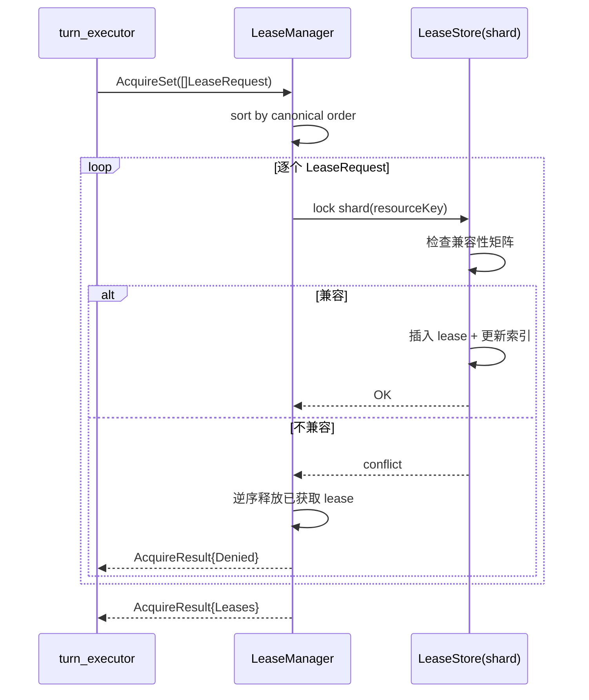
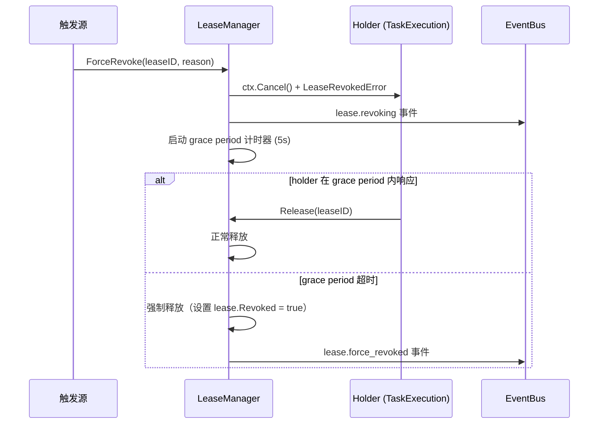
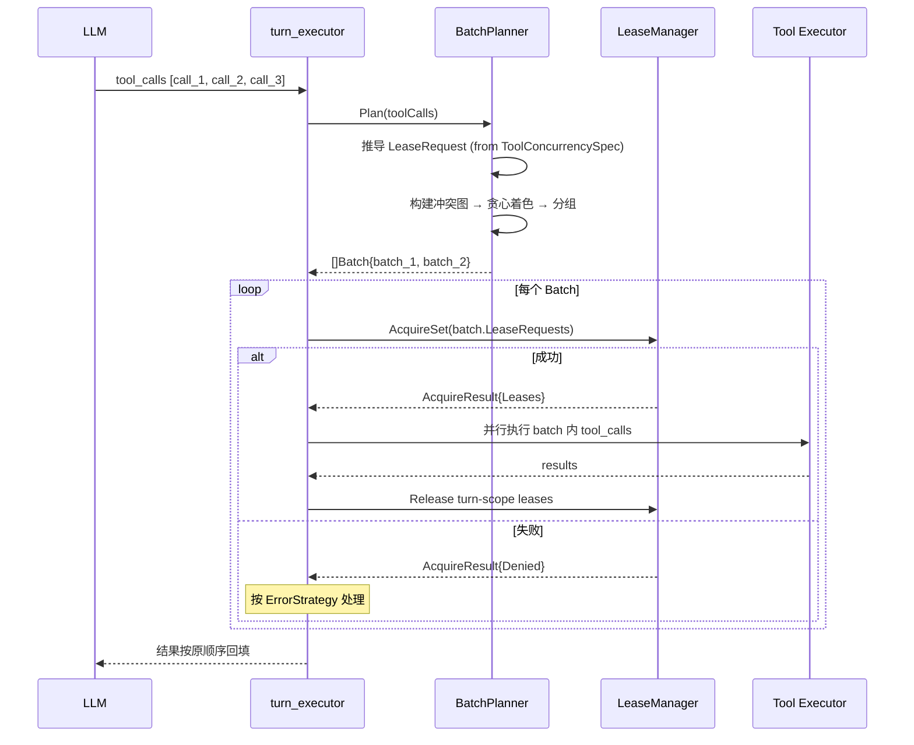
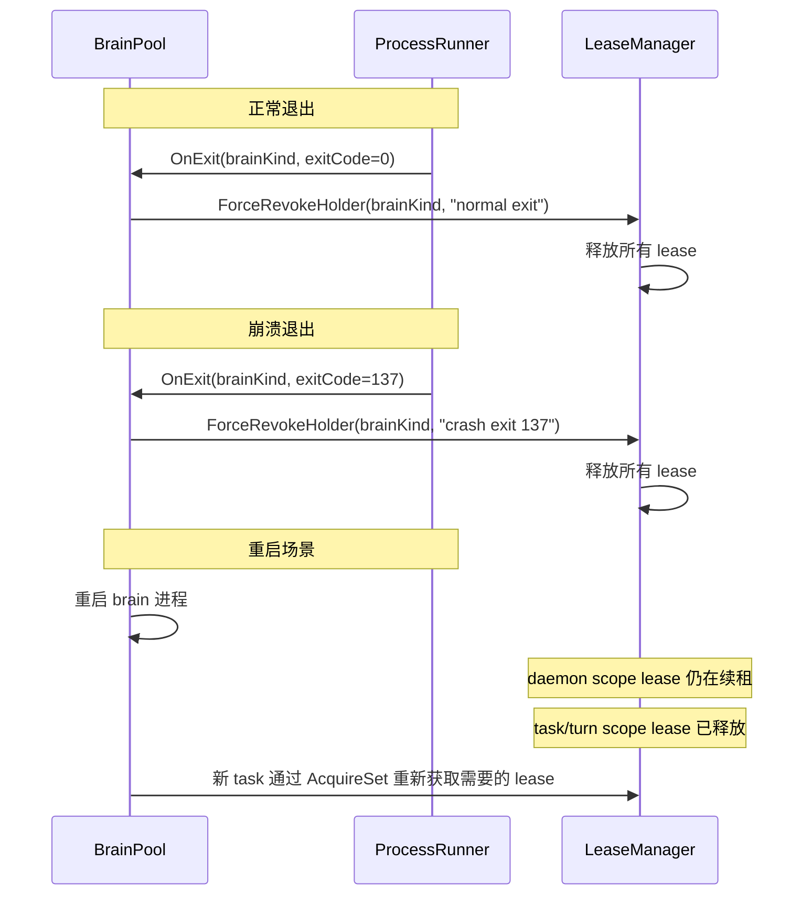

# 35. LeaseManager 实现设计

> **状态**：v1 · 2026-04-17
> **归属**：[32-v3-Brain架构.md](./32-v3-Brain架构.md) §7.7.2 / §7.9 / §13.2
> **依赖**：[35-TaskExecution生命周期状态机.md](./35-TaskExecution生命周期状态机.md) · [35-Dispatch-Policy-冲突图与Batch分组算法.md](./35-Dispatch-Policy-冲突图与Batch分组算法.md) · [35-BrainPool实现设计.md](./35-BrainPool实现设计.md)
> **实现目标**：`sdk/kernel/lease.go`（新增）+ `sdk/kernel/lease_store.go`（新增）

---

## 1. 概述

### 1.1 LeaseManager 在整体架构中的位置

LeaseManager 是 v3 多脑协作运行时的**资源并发控制核心**。在四层分离架构中，它与 BrainPool、Orchestrator、turn_executor 并列，各司其职：

```text
┌─────────────────────────────────────────────────┐
│  turn_executor + Dispatch Policy                │
│  冲突分析 → batch 分组 → AcquireSet → 并行执行  │
└──────────┬──────────────────────┬───────────────┘
           │                      │
           ▼                      ▼
┌──────────────────┐   ┌─────────────────────────┐
│  LeaseManager    │   │  Orchestrator（瘦身后）  │
│  管锁：           │   │  只做 delegate 路由      │
│  Capability ×    │   └────────────┬────────────┘
│  ResourceKey ×   │                │
│  AccessMode ×    │   ┌────────────▼────────────┐
│  Scope           │   │  Brain Pool             │
│                  │   │  管进程（不管锁）         │
└──────────────────┘   └─────────────────────────┘
```

**关键边界**：
- LeaseManager **只管锁**——Capability × ResourceKey × AccessMode × Scope
- BrainPool **只管进程**——启动、复用、回收 sidecar
- 两者互不知道对方的内部实现，通过 callback 协作（如 Brain 退出时 Pool 通知 LeaseManager 释放）

### 1.2 与 v1 Orchestrator.active 的关系

v1 的 `Orchestrator` 用一个 `active map[agent.Kind]bool` 做 brain 级别的粗粒度并发控制。问题：

| v1 问题 | v3 解决方案 |
|---------|-----------|
| brain 级锁，粒度太粗（同一 brain 的不同工具无法并行） | 资源级锁：Capability × ResourceKey |
| 无 AccessMode 概念（两个只读查询也会串行） | SharedRead / ExclusiveWrite 兼容矩阵 |
| 无 scope 概念（每次都是 turn 级别） | turn / task / daemon 三种 scope |
| 无死锁防护 | P0 AcquireSet + P1 canonical ordering + P2 wait-for graph |
| per-run Orchestrator，sidecar 无法复用 | 全局 LeaseManager + BrainPool 分离 |

**迁移策略**：`active map` 移除，替换为 LeaseManager。v1 的 `active` 语义保留为 thin wrapper（见 §9）。

---

## 2. 核心数据结构

### 2.1 Lease 三元组

```go
// Package lease 实现 Capability Lease 的完整生命周期管理。
// 位置：sdk/kernel/lease.go
package lease

import (
    "context"
    "sync"
    "time"
)

// LeaseID 是全局唯一的租约标识。
// 格式："{holder_id}:{capability}:{resource_key}:{monotonic_counter}"
type LeaseID string

// HolderID 标识租约持有者。
// 格式："{task_execution_id}" 或 "{brain_kind}:{task_execution_id}"
type HolderID string

// CapabilityLease 是完整的租约对象，由 AcquireSet 成功后返回。
type CapabilityLease struct {
    // === 标识 ===
    ID      LeaseID  // 全局唯一 ID
    Version uint64   // 乐观锁版本号，每次续租/变更递增

    // === 三元组 ===
    Capability  string     // "execution.order" / "fs.write" / "session.browser"
    ResourceKey string     // "account:paper-main" / "workdir:/repo-a"
    AccessMode  AccessMode // SharedRead / SharedWriteAppend / ExclusiveWrite / ExclusiveSession

    // === 持有者 ===
    Holder HolderID // 持有此 lease 的 TaskExecution ID

    // === 生命周期 ===
    Scope     LeaseScope // turn / task / daemon
    CreatedAt time.Time  // 创建时间
    ExpiresAt time.Time  // 到期时间（TTL 基准）
    RenewedAt time.Time  // 最后续租时间

    // === 续租状态 ===
    RenewMissCount int  // 连续续租失败次数（0 = 正常，>=3 触发强制撤销）
    Revoked        bool // 是否已被撤销（幂等释放标记）

    // === 关联 ===
    BrainKind string // 关联的 brain kind（用于崩溃回收：brain 退出时释放其所有 lease）
}
```

#### ResourceKey 命名规范

ResourceKey 是资源的唯一标识，格式为 `{namespace}:{identifier}`：

```text
命名规范：
  {namespace}:{identifier}

namespace 取值：
  account    — 交易账户          例：account:paper-main
  workdir    — 文件系统工作目录    例：workdir:/repo-a
  symbol     — 行情标的           例：symbol:BTC-USDT
  browser    — 浏览器会话         例：browser:session-1
  fs         — 文件系统路径       例：fs:/home/user/project
  db         — 数据库实例         例：db:main-sqlite
  api        — 外部 API 端点      例：api:exchange-binance

特殊值：
  "*"        — 通配符，表示该 namespace 下所有资源
               含 "*" 的 ResourceKey 与同 namespace 下任何 Exclusive 模式冲突
```

#### ResourceKey 解析算法

从 `ToolConcurrencySpec.ResourceKeyTemplate` 和 tool_call 参数生成具体 ResourceKey：

```go
// ResolveResourceKey 从模板和 tool_call JSON 参数解析出具体 ResourceKey。
//
// 算法步骤：
//   1. 模板为空 → 返回 Capability 本身作为 ResourceKey（单例资源）
//   2. 解析 tool_call JSON 参数为 map[string]any（只解一层）
//   3. 正则匹配 {{field_name}} 占位符
//   4. 逐一从 map 中取值替换
//   5. 字段缺失 → 使用 "*" 通配符（保守策略，视为与所有同类资源冲突）
//   6. JSON 解析失败 → 所有占位符替换为 "*"
func ResolveResourceKey(template string, capability string, args json.RawMessage) string
```

### 2.2 AccessMode 枚举

```go
// AccessMode 定义对资源的访问模式。
type AccessMode string

const (
    // SharedRead 共享读。多个 SharedRead 彼此兼容。
    // 典型场景：查询持仓、读取文件、获取行情快照。
    SharedRead AccessMode = "shared-read"

    // SharedWriteAppend 共享追加写。多个 SharedWriteAppend 彼此兼容。
    // 典型场景：日志追加、消息队列入队。
    // 与 SharedRead 兼容，与 Exclusive* 不兼容。
    SharedWriteAppend AccessMode = "shared-write-append"

    // ExclusiveWrite 独占写。同一资源上同一时刻只允许一个 ExclusiveWrite。
    // 典型场景：下单、写文件、修改配置。
    // 与任何其他模式（包括 SharedRead）不兼容。
    ExclusiveWrite AccessMode = "exclusive-write"

    // ExclusiveSession 独占会话。语义同 ExclusiveWrite，但强调会话粘性。
    // 典型场景：浏览器会话独占（需要保持 cookie/DOM 状态一致）。
    // 与任何其他模式不兼容。
    ExclusiveSession AccessMode = "exclusive-session"
)

// IsExclusive 返回 true 表示该模式是独占的。
func (m AccessMode) IsExclusive() bool {
    return m == ExclusiveWrite || m == ExclusiveSession
}
```

### 2.3 LeaseScope

```go
// LeaseScope 控制租约的释放时机。
type LeaseScope string

const (
    // ScopeTurn 一轮 tool batch 结束即释放。
    // 最短生命周期，适用于无状态的单次操作。
    ScopeTurn LeaseScope = "turn"

    // ScopeTask 整个 TaskExecution 完成才释放。
    // 适用于需要跨 turn 保持状态的场景（如 browser session 独占）。
    ScopeTask LeaseScope = "task"

    // ScopeDaemon 持续持有直到显式停止。
    // 适用于长驻订阅（如行情推送），需要 TTL 续租。
    ScopeDaemon LeaseScope = "daemon"
)

// Priority 返回 scope 的优先级（用于崩溃回收时的倒序释放）。
// daemon > task > turn
func (s LeaseScope) Priority() int {
    switch s {
    case ScopeDaemon:
        return 3
    case ScopeTask:
        return 2
    case ScopeTurn:
        return 1
    default:
        return 0
    }
}
```

#### Scope 与 TaskExecution 生命周期状态的映射关系

| TaskExecution 状态 | ScopeTurn | ScopeTask | ScopeDaemon |
|-------------------|-----------|-----------|-------------|
| `pending` | 未持有 | 未持有 | 未持有 |
| `running` | 在 AcquireSet 后持有 | 持有 | 持有 |
| `waiting_tool` | 持有（等待工具返回） | 持有 | 持有 |
| `waiting_event` | 已释放 | 持有 | 持有 |
| `paused` | 已释放（turn 已结束） | 持有（但暂停续租计时器） | 持有（续租继续） |
| `draining` | 已释放 | 释放中（grace period） | 释放中（grace period） |
| `restarting` | 已释放 | 已释放 | **取决于 RestartPolicy**（见下） |
| `completed` / `failed` / `canceled` / `crashed` | 已释放 | 已释放 | 已释放 |

#### Scope 与 RestartPolicy 的交互

当 TaskExecution 从 `failed`/`crashed` 进入 `restarting` 时：

| Scope | 行为 | 原因 |
|-------|------|------|
| `turn` | 不保留（turn lease 早在 batch 结束时已释放） | turn scope 生命周期最短 |
| `task` | **不保留**——进入 restarting 时释放，重启后重新获取 | task 重启视为新的执行上下文 |
| `daemon` | **尝试保留**——lease 不释放，续租继续，等进程重启后恢复 | daemon scope 追求持续性，如行情订阅不应因短暂重启而丢失 |

daemon scope 保留的前提：续租心跳在 restarting 期间由 LeaseManager 内部代发（不需要 holder 参与），若 restarting 时间超过 TTL 的 3 倍仍未恢复，则强制释放。

#### Scope 转移规则

Scope 不支持运行时变更。一旦 lease 创建，其 scope 就是固定的。如果业务逻辑需要从 turn 升级到 task，应在下一个 AcquireSet 中用 `ScopeTask` 重新申请。

### 2.4 LeaseStore

LeaseStore 是 LeaseManager 的内部存储层，使用分片 mutex 避免全局锁热点。

```go
const (
    // shardCount 分片数量。256 = 2^8，hash 取模高效。
    // 理论最大并发度 256，远超实际 ResourceKey 数量（通常 < 100）。
    shardCount = 256
)

// leaseStore 是 lease 的内存存储，按 ResourceKey hash 分片。
type leaseStore struct {
    shards [shardCount]leaseShard
}

// leaseShard 是一个分片，持有独立的 mutex。
type leaseShard struct {
    mu sync.RWMutex

    // 主存储：ResourceKey → 该资源上的所有活跃 lease
    leases map[string][]*CapabilityLease

    // === 反向索引 ===

    // byHolder：HolderID → 该 holder 持有的所有 LeaseID
    // 用途：ReleaseAll(holder) 时快速找到所有 lease
    byHolder map[HolderID]map[LeaseID]struct{}

    // byScope：LeaseScope → 该 scope 的所有 LeaseID
    // 用途：崩溃回收时按 scope 倒序释放
    byScope map[LeaseScope]map[LeaseID]struct{}

    // byExpiry：基于最小堆的过期索引
    // 用途：TTL 扫描时快速找到已过期的 lease
    expiryHeap *leaseExpiryHeap
}

// shardFor 根据 ResourceKey 确定分片号。
func (s *leaseStore) shardFor(resourceKey string) *leaseShard {
    h := fnv32a(resourceKey)
    return &s.shards[h%shardCount]
}

// fnv32a 计算 FNV-1a 32-bit hash。
func fnv32a(key string) uint32 {
    const (
        offset32 = 2166136261
        prime32  = 16777619
    )
    h := uint32(offset32)
    for i := 0; i < len(key); i++ {
        h ^= uint32(key[i])
        h *= prime32
    }
    return h
}

// leaseExpiryHeap 是按 ExpiresAt 排序的最小堆。
type leaseExpiryHeap struct {
    entries []leaseExpiryEntry
}

type leaseExpiryEntry struct {
    leaseID   LeaseID
    expiresAt time.Time
    version   uint64 // 避免 stale entry 被误处理
}
```

#### 索引维护

```text
写入（AcquireSet 成功后）：
  1. leases[resourceKey] = append(leases[resourceKey], lease)
  2. byHolder[holder][leaseID] = struct{}{}
  3. byScope[scope][leaseID] = struct{}{}
  4. expiryHeap.Push(leaseID, expiresAt, version)

删除（Release）：
  1. 从 leases[resourceKey] 中移除
  2. 从 byHolder[holder] 中移除
  3. 从 byScope[scope] 中移除
  4. expiryHeap 标记惰性删除（通过 version 比较）

续租（Renew）：
  1. 更新 lease.ExpiresAt, lease.RenewedAt, lease.Version++
  2. expiryHeap.Push 新条目（旧条目通过 version 自动失效）
```

---

## 3. AcquireSet 原子批量获取

### 3.1 算法流程

```go
// AcquireSet 原子批量获取一组 lease。
// 全部成功或全部失败，不会出现部分获取的状态。
//
// 算法步骤：
//   1. 按 ResourceKey + Capability 字典序排序（防止交叉死锁——P1 canonical ordering）
//   2. 逐个检查兼容性并获取
//   3. 任何一个失败 → 逆序释放已获取的全部 lease → 返回 denied
//   4. 全部成功 → 返回 lease 列表
//
// 此方法不阻塞等待。获取失败立即返回 AcquireResult.Denied，
// 由上层（Dispatch Policy）决定重试策略。
func (lm *LeaseManager) AcquireSet(ctx context.Context, reqs []LeaseRequest) (*AcquireResult, error) {
    if len(reqs) == 0 {
        return &AcquireResult{Leases: nil}, nil
    }

    // Step 1: Canonical ordering — 按 ResourceKey + Capability 字典序排序
    sorted := make([]LeaseRequest, len(reqs))
    copy(sorted, reqs)
    sort.Slice(sorted, func(i, j int) bool {
        if sorted[i].ResourceKey != sorted[j].ResourceKey {
            return sorted[i].ResourceKey < sorted[j].ResourceKey
        }
        return sorted[i].Capability < sorted[j].Capability
    })

    // Step 2: 逐个获取
    acquired := make([]*CapabilityLease, 0, len(sorted))
    for i, req := range sorted {
        lease, err := lm.tryAcquireOne(ctx, req)
        if err != nil {
            // Step 3: 获取失败，逆序释放已获取的全部 lease
            for j := len(acquired) - 1; j >= 0; j-- {
                lm.releaseOne(acquired[j])
            }
            return &AcquireResult{
                Denied:       true,
                DeniedReason: fmt.Sprintf("lease %d/%d denied: %v", i+1, len(sorted), err),
                DeniedIndex:  i,
                ConflictKey:  req.ResourceKey,
            }, nil
        }
        acquired = append(acquired, lease)
    }

    // Step 4: 全部成功
    return &AcquireResult{Leases: acquired}, nil
}

// AcquireResult 是 AcquireSet 的返回值。
type AcquireResult struct {
    Leases []*CapabilityLease // 成功时：所有获得的 lease

    Denied       bool   // 是否被拒绝
    DeniedReason string // 拒绝原因
    DeniedIndex  int    // 第几个 LeaseRequest 被拒绝（0-based）
    ConflictKey  string // 冲突的 ResourceKey（用于 Wait-for Graph）
}
```

#### 3.1.1 逆序释放的幂等性保证

AcquireSet 回滚（逆序释放）过程中 **Release 操作保证不会失败**，原因：

1. **Release 是幂等操作**：`releaseOne(lease)` 使用乐观锁（`lease.Version`），如果 lease 已被释放（version 不匹配），返回 `ErrAlreadyReleased` 但不视为错误——逻辑上等同成功
2. **纯内存操作无 I/O**：LeaseStore 是纯内存数据结构，Release 只涉及 map delete + 索引更新，不涉及网络或磁盘 I/O
3. **单 shard 锁内完成**：每个 Release 只持有一个 shard 锁，不会因锁竞争导致失败

因此 AcquireSet 的原子性保证为：
- **成功**：所有 lease 均已获取，返回 `AcquireResult{Leases: acquired}`
- **失败**：已获取的 lease 全部逆序释放（Release 保证成功），返回 `AcquireResult{Denied: true}`
- **不存在中间状态**（部分获取部分未释放）



### 3.2 兼容性检查

#### AccessMode 兼容矩阵（4x4）

两个 lease 在**同一 ResourceKey** 上的兼容性：

| 已持有 \ 新申请 | SharedRead | SharedWriteAppend | ExclusiveWrite | ExclusiveSession |
|----------------|:----------:|:-----------------:|:--------------:|:----------------:|
| **SharedRead** | 兼容 | 兼容 | **不兼容** | **不兼容** |
| **SharedWriteAppend** | 兼容 | 兼容 | **不兼容** | **不兼容** |
| **ExclusiveWrite** | **不兼容** | **不兼容** | **不兼容** | **不兼容** |
| **ExclusiveSession** | **不兼容** | **不兼容** | **不兼容** | **不兼容** |

规则总结：
- **Shared + Shared = 兼容**（SharedRead 和 SharedWriteAppend 之间任意组合都兼容）
- **Exclusive + 任何 = 不兼容**（只要有一方是 Exclusive，就冲突）
- **不同 ResourceKey = 总是兼容**（不管 AccessMode 如何）
- **同一 Holder 的同 ResourceKey = 可重入**（同一 task 多次申请同一资源不冲突）

```go
// isCompatible 检查新申请的 AccessMode 是否与已持有的 lease 列表兼容。
func isCompatible(existing []*CapabilityLease, req LeaseRequest, holder HolderID) bool {
    for _, lease := range existing {
        // 同一 holder 的重入：兼容
        if lease.Holder == holder {
            continue
        }
        // 任一方是 Exclusive → 不兼容
        if lease.AccessMode.IsExclusive() || req.AccessMode.IsExclusive() {
            return false
        }
    }
    return true
}
```

#### 检查时序

```text
tryAcquireOne(req):
  1. shard = store.shardFor(req.ResourceKey)
  2. shard.mu.Lock()
  3. existing = shard.leases[req.ResourceKey]
  4. if isCompatible(existing, req, holder) → 创建 lease, 插入, return OK
  5. else → return ErrConflict{existingHolder, resourceKey}
  6. shard.mu.Unlock()
```

不做 scope 优先级检查——scope 只影响释放时机，不影响获取兼容性。高 scope 不能"抢占"低 scope 的 lease。

### 3.3 等待策略

**获取失败时：立即返回 denied，不阻塞。** 这是关键设计决策：

- LeaseManager 不做等待/重试，上层（Dispatch Policy 的 BatchPlanner）决定策略
- BatchPlanner 有三种错误策略：`ContinueBatch`（跳过失败项继续）、`FailBatch`（终止本 batch）、`FailAll`（终止整个 dispatch）
- 对于 `FailBatch`，BatchPlanner 会使用指数退避 + Full Jitter 重试整个 batch

**与 Wait-for Graph 的集成点**：

```go
// AcquireSet denied 时，向 wfgChecker 投递 wait-for 边。
// 这是 P2 层死锁检测的输入。
if result.Denied {
    lm.wfgChecker.AddEdge(WaitForEdge{
        Waiter:  holder,
        Blocker: result.ConflictHolder,
        Resource: result.ConflictKey,
    })
}
// AcquireSet 成功或放弃重试时，移除 wait-for 边。
```

---

## 4. 续租机制

### 4.1 TTL 管理

| Scope | 默认 TTL | 续租周期 | 说明 |
|-------|---------|---------|------|
| `turn` | 与 turn 同生命周期 | 不续租 | turn 结束时由 turn_executor 显式释放，TTL 仅作兜底（30s） |
| `task` | 与 task 同生命周期 | 不续租 | task 终态时由 TaskExecution 显式释放，TTL 仅作兜底（5min） |
| `daemon` | 30s | 10s（TTL / 3） | 必须主动续租，否则过期回收 |

续租由 LeaseManager 内部的 `renewLoop` goroutine 驱动，不需要 holder 主动调用：

```go
// renewLoop 周期性续租所有 daemon scope 的 lease。
func (lm *LeaseManager) renewLoop(ctx context.Context) {
    ticker := time.NewTicker(lm.cfg.RenewInterval) // 默认 10s
    defer ticker.Stop()

    for {
        select {
        case <-ctx.Done():
            return
        case <-ticker.C:
            lm.renewAllDaemonLeases(ctx)
        }
    }
}

func (lm *LeaseManager) renewAllDaemonLeases(ctx context.Context) {
    // 遍历所有 shard，找到 scope=daemon 且未被撤销的 lease
    for i := range lm.store.shards {
        shard := &lm.store.shards[i]
        shard.mu.Lock()
        for leaseID := range shard.byScope[ScopeDaemon] {
            lease := shard.findByID(leaseID)
            if lease == nil || lease.Revoked {
                continue
            }
            // 检查 holder 是否仍活跃（通过 callback 查询 BrainPool）
            if lm.isHolderAlive(lease.Holder, lease.BrainKind) {
                lease.ExpiresAt = time.Now().Add(lm.cfg.DaemonTTL)
                lease.RenewedAt = time.Now()
                lease.Version++
                lease.RenewMissCount = 0
            } else {
                lease.RenewMissCount++
            }
        }
        shard.mu.Unlock()
    }
}
```

### 4.2 续租失败处理

连续续租失败的渐进式响应：

| 连续失败次数 | 动作 | 说明 |
|------------|------|------|
| 1 | 警告日志 + metrics 计数 | `brain_lease_renew_miss_total` +1 |
| 2 | 降级通知 | 向 EventBus 发布 `lease.renew_degraded` 事件，Dashboard 展示 |
| 3 | **强制撤销** | 触发 ForceRevoke 流程 |

### 4.3 强制撤销（Revoke）

#### 触发条件

1. **续租 3 次失败**——holder 的 brain 进程可能已死
2. **死锁检测选中 victim**——Wait-for Graph 环路检测后，victim 的 lease 被撤销
3. **管理员手动**——通过 Dashboard `/v1/leases/:id` DELETE 或 `ForceRevoke` API

#### 撤销流程



```go
// ForceRevoke 强制撤销一个 lease。
// 先通知 holder，等待 grace period，超时则强制释放。
func (lm *LeaseManager) ForceRevoke(ctx context.Context, leaseID LeaseID, reason string) error {
    shard, lease := lm.store.findLease(leaseID)
    if lease == nil {
        return ErrLeaseNotFound
    }

    // 通知 holder：通过 cancel 关联的 context
    if cancelFn, ok := lm.holderCancels[lease.Holder]; ok {
        cancelFn(LeaseRevokedError{
            LeaseID:  leaseID,
            Resource: lease.ResourceKey,
            Reason:   reason,
        })
    }

    // 发布事件
    lm.eventBus.Publish(LeaseEvent{
        Type:    LeaseEventRevoking,
        LeaseID: leaseID,
        Reason:  reason,
    })

    // 等待 grace period
    gracePeriod := lm.cfg.RevokeGracePeriod // 默认 5s
    timer := time.NewTimer(gracePeriod)
    defer timer.Stop()

    select {
    case <-lm.store.waitForRelease(leaseID):
        // holder 自行释放了
        return nil
    case <-timer.C:
        // 超时，强制释放
        return lm.forceRelease(shard, lease, reason)
    case <-ctx.Done():
        return ctx.Err()
    }
}
```

#### holder 感知方式

holder（TaskExecution）通过两种途径感知 lease 被撤销：

1. **context.Cancel()**——lease 关联的 context 被取消，工具执行收到 `context.Canceled`
2. **LeaseRevokedError**——通过 context 的 error cause 携带，TaskExecution 可区分"被取消"和"lease 被撤销"

收到 LeaseRevokedError 后，TaskExecution 状态转移：`running/waiting_tool/waiting_event → interrupted`（见 [35-TaskExecution生命周期状态机](./35-TaskExecution生命周期状态机.md) §1.2）。interrupted 是非终态中间状态，允许资源清理后由 RestartPolicy 决定去向（`interrupted → restarting` 或 `interrupted → failed`）。

---

## 5. 崩溃回收

崩溃回收采用**双通道**策略：快路径（exit hook）+ 慢路径（TTL 扫描），确保 lease 不会泄漏。

### 5.1 ProcessRunner exit hook（快路径）

Brain 进程退出时，BrainPool 通过 callback 立即通知 LeaseManager 释放该 brain 持有的所有 lease。

```go
// BrainPool 初始化时注册 exit hook
func NewBrainPool(runner BrainRunner, leaseMgr *LeaseManager) *brainPool {
    pool := &brainPool{
        runner:   runner,
        leaseMgr: leaseMgr,
    }

    // 注册进程退出回调
    runner.OnExit(func(brainKind string, exitCode int) {
        // 快路径：立即释放该 brain 的所有 lease
        n, err := leaseMgr.ForceRevokeHolder(
            context.Background(),
            HolderID(brainKind), // 按 brainKind 匹配
            fmt.Sprintf("brain process exited with code %d", exitCode),
        )
        if err != nil {
            log.Warnf("lease cleanup for %s failed: %v", brainKind, err)
        } else if n > 0 {
            log.Infof("released %d leases for exited brain %s", n, brainKind)
        }
    })

    return pool
}

// ForceRevokeHolder 释放指定 holder 持有的所有 lease。
// 返回释放的 lease 数量。
func (lm *LeaseManager) ForceRevokeHolder(
    ctx context.Context, holder HolderID, reason string,
) (int, error) {
    count := 0
    for i := range lm.store.shards {
        shard := &lm.store.shards[i]
        shard.mu.Lock()
        leaseIDs := shard.byHolder[holder]
        for leaseID := range leaseIDs {
            lease := shard.findByID(leaseID)
            if lease != nil && !lease.Revoked {
                lease.Revoked = true
                shard.removeLease(lease)
                count++
            }
        }
        delete(shard.byHolder, holder)
        shard.mu.Unlock()
    }
    return count, nil
}
```

### 5.2 TTL 扫描兜底（慢路径）

即使 exit hook 正常执行，TTL 扫描仍然运行，作为兜底防护：

```go
// ttlScanLoop 周期性扫描过期 lease。
func (lm *LeaseManager) ttlScanLoop(ctx context.Context) {
    ticker := time.NewTicker(lm.cfg.TTLScanInterval) // 默认 10s
    defer ticker.Stop()

    for {
        select {
        case <-ctx.Done():
            return
        case <-ticker.C:
            lm.scanExpiredLeases()
        }
    }
}

func (lm *LeaseManager) scanExpiredLeases() {
    now := time.Now()
    for i := range lm.store.shards {
        shard := &lm.store.shards[i]
        shard.mu.Lock()

        // 从 expiryHeap 弹出所有已过期的 entry
        for shard.expiryHeap.Len() > 0 {
            top := shard.expiryHeap.Peek()
            if top.expiresAt.After(now) {
                break // 堆顶未过期，后面的更不会过期
            }
            entry := shard.expiryHeap.Pop()

            // CAS 检查：version 必须匹配，防止重复释放
            lease := shard.findByID(entry.leaseID)
            if lease == nil || lease.Revoked || lease.Version != entry.version {
                continue // stale entry，跳过
            }

            // 过期释放
            lease.Revoked = true
            shard.removeLease(lease)
            lm.eventBus.Publish(LeaseEvent{
                Type:    LeaseEventExpired,
                LeaseID: entry.leaseID,
                Reason:  "TTL expired",
            })
        }

        shard.mu.Unlock()
    }
}
```

| 参数 | 默认值 | 说明 |
|------|--------|------|
| TTLScanInterval | 10s | 扫描周期 |
| 扫描范围 | 所有 shard 的 expiryHeap | 利用最小堆，只检查堆顶 |
| 单次扫描耗时目标 | < 50ms | 256 shard 逐个加锁，每个 shard 只弹堆顶 |

### 5.3 双通道防冲突

exit hook（快路径）和 TTL 扫描（慢路径）可能在时间窗口内重叠操作同一个 lease。通过**乐观锁（version）+ 幂等释放**保证安全：

```text
时间线：

T0: Brain 进程崩溃
T1: exit hook 触发 → ForceRevokeHolder
     → shard.mu.Lock()
     → lease.Revoked = true, removeLease(lease)
     → shard.mu.Unlock()

T2: TTL 扫描触发（10s 后）
     → shard.mu.Lock()
     → expiryHeap.Pop() → 找到该 lease 的 entry
     → findByID(leaseID) → nil（已被 exit hook 移除）
     → continue（跳过，幂等）
     → shard.mu.Unlock()
```

如果顺序反过来（TTL 扫描先于 exit hook）：

```text
T0: Brain 进程崩溃（但 exit hook 延迟触发）
T1: TTL 扫描 → lease 过期 → Revoked = true, removeLease
T2: exit hook 触发 → ForceRevokeHolder
     → shard.byHolder[holder] 已为空
     → count = 0（幂等）
```

**结论**：无论哪个通道先执行，另一个都能安全跳过。关键保证：
1. `lease.Revoked` 标记 + `removeLease` 在同一个 `shard.mu.Lock()` 内完成
2. `findByID` 返回 nil 或 `Revoked = true` 时跳过
3. expiryHeap 的 `version` 字段防止 stale entry 被误处理

---

## 6. 与其他模块的交互

### 6.1 与 TaskExecution 的交互

#### 释放责任方约定

| Scope | 释放责任方 | 触发时机 |
|-------|-----------|---------|
| **ScopeTurn** | `TurnExecutor` | turn 结束时显式调用 `LeaseManager.Release()` |
| **ScopeTask** | `TaskExecution` 状态机 | 进入终态时由 state transition hook 自动触发 `ReleaseAll(holder, ScopeTask)` |
| **ScopeDaemon** | `BrainPool` | Brain 退出时由 `ProcessRunner.OnExit` 触发 `ReleaseAll(brainID)` |
| **强制撤销** | `LeaseManager` 自身 | TTL 扫描到期 / Wait-for Graph 选中 victim |

#### 状态转移与 Lease 生命周期对应表

| 状态转移 | Lease 操作 | 说明 |
|---------|-----------|------|
| `pending → running` | 无 | 此时尚未执行 tool，不需要 lease |
| `running → waiting_tool` | **AcquireSet**（如果本 turn 有 tool_call） | 在 tool dispatch 前获取 |
| `waiting_tool → running` | **Release ScopeTurn** | 本 turn 的 tool batch 完成，释放 turn scope lease |
| `running → waiting_event` | **Release ScopeTurn** | watch 等待事件，释放 turn scope |
| `waiting_event → running` | 无（下个 turn 会重新 AcquireSet） | 新一轮 tool batch 会重新获取 |
| `running → paused` | **暂停 daemon 续租计时器**（task/daemon scope 保持） | turn scope 在 pause 前已释放 |
| `paused → running` | **恢复 daemon 续租计时器** | |
| `running → draining` | 开始 grace period | 等待当前 turn 完成 |
| `draining → canceled` | **ReleaseAll(holder)** | 释放 holder 的所有 lease |
| `running/waiting_tool → failed` | **ReleaseAll(holder)** | |
| `running/waiting_tool → crashed` | 由 exit hook 或 TTL 扫描释放 | 不依赖状态机回调 |
| `failed/crashed → restarting` | daemon scope 保留，其余释放 | 见 §2.3 scope 与 RestartPolicy |
| `running/waiting_tool/waiting_event → interrupted` | **Release ScopeTurn**（如持有） | lease 被 revoke，graceful 中断 |
| `interrupted → restarting` | daemon scope 保留，其余释放 | RestartPolicy 允许重试 |
| `interrupted → failed` | **ReleaseAll(holder)** | 重试耗尽或 policy=never |
| `restarting → pending` | 无 | 新一轮执行会重新 AcquireSet |

#### waiting_event 状态的特殊处理

`waiting_event` 是 watch lifecycle 的正常空闲态。此状态下：
- **turn scope lease**：已释放（上一轮 turn 已结束）
- **task scope lease**：保持持有（watch 的整个 task 期间需要）
- **daemon scope lease**：保持持有，续租继续
- 续租计时器：daemon scope 继续运行，因为 waiting_event 是活跃态（`IsActive() = true`）

### 6.2 与 Dispatch Policy 的交互



**关键时序**：AcquireSet 在 `Plan()` 之后、`Execute` 之前。

**失败时的 Batch 策略**：

| ErrorStrategy | 行为 |
|---------------|------|
| `ContinueBatch`（默认） | 跳过 AcquireSet 失败的 batch，继续执行后续 batch |
| `FailBatch` | 终止当前 batch，指数退避重试，超时后跳过 |
| `FailAll` | 终止整个 dispatch，返回错误给 LLM |

### 6.3 与语义审批的交互

**门禁顺序（硬约束）**：

```text
subtask 请求到达
  → ① 身份鉴权（callerKind == KindCentral）
  → ② license 检查
  → ③ policy 检查（ExecutionPolicy / ToolPolicy）
  → ④ health 检查（BrainPool.HealthCheck）
  → ⑤ 语义审批（SemanticApprover）        ← 在 AcquireSet 之前
  → ⑥ AcquireSet（Capability Lease）       ← 审批通过后才获取
  → ⑦ Execute（tool 执行）
```

**审批在 AcquireSet 之前**。原因：
- 如果先获取 lease 再审批，审批拒绝后需要释放 lease，造成无效占锁
- 审批是纯逻辑判断（< 1ms），lease 获取可能涉及并发竞争
- 门禁 ①-⑤ 是快速布尔判断，不消耗资源；lease ⑥ 可能阻塞

### 6.4 与死锁防护的交互

三层递进防护，LeaseManager 是核心参与者：

```text
┌──────────────────────────────────────────────────────────┐
│  P0（Phase A）：AcquireSet 批量原子申请                    │
│  ─────────────────────────────────────────────────────── │
│  - 单 turn 内所有 LeaseRequest 原子获取                    │
│  - 失败整批回滚，不会出现部分获取                           │
│  - 禁止工具执行过程中追加跨资源 lease                       │
│  → 消除单 turn 内的死锁可能                                │
├──────────────────────────────────────────────────────────┤
│  P1（Phase A）：Canonical Lease Ordering                  │
│  ─────────────────────────────────────────────────────── │
│  - AcquireSet 内部按 ResourceKey + Capability 字典序排序   │
│  - 所有 AcquireSet 使用相同排序函数                         │
│  → 消除因排序不一致导致的 ABBA 死锁                         │
├──────────────────────────────────────────────────────────┤
│  P2（Phase C）：Wait-for Graph + Victim Selection         │
│  ─────────────────────────────────────────────────────── │
│  - AcquireSet denied 时投递 wait-for 边                    │
│  - DFS 三色染色检测环路                                     │
│  - 复合评分选 victim：priority×10 + hold_time×0.01 + cost×0.1│
│  - ForceRevokeHolder 解锁                                  │
│  → 兜底处理 daemon/watch 长持有场景                         │
└──────────────────────────────────────────────────────────┘
```

**P2 集成点——AcquireSet denied 时**：

```go
// AcquireSet 返回 Denied 后，调用方投递 wait-for 边
type WaitForEdge struct {
    Waiter   HolderID // 等待方
    Blocker  HolderID // 阻塞方（持有冲突 lease 的 holder）
    Resource string   // 冲突的 ResourceKey
    Since    time.Time
}

// wfgChecker 接口（Phase C 实现）
type WaitForGraphChecker interface {
    AddEdge(edge WaitForEdge)
    RemoveEdge(waiter, blocker HolderID)
    DetectCycle() []HolderID // 返回环路上的 holder
    SelectVictim(cycle []HolderID) HolderID
}
```

### 6.5 与 Brain Pool 的交互



**Brain 退出时**：Pool 通过 `OnExit` hook 通知 LeaseManager 释放。

**Brain 重启时**：
- `daemon scope`：lease 保留（由 LeaseManager 内部续租），重启后 holder 恢复使用
- `task scope`：lease 已释放（task 状态进入 `restarting` 时释放），重启后重新获取
- `turn scope`：lease 早已释放

---

## 7. 锁序规则

### 7.1 全局锁顺序

```text
锁获取顺序（从外到内，后获取的不能在持有时调用前面的）：

  brainPool.mu（最外层）
    > kindPool.mu
      > leaseManager.store.shards[i].mu（按 shard index 升序）
        > poolEntry.mu（最内层）
```

### 7.2 禁止规则

| 禁止行为 | 原因 | 正确做法 |
|---------|------|---------|
| 持有 `leaseManager.shard.mu` 时调用 `brainPool.GetBrain` | 违反锁序，可能死锁 | 先释放 shard 锁，再调用 Pool |
| 持有 `leaseManager.shard.mu` 时发布 EventBus 事件 | EventBus 可能有同步订阅者 | 收集事件，释放锁后批量发布 |
| AcquireSet 内部跨 shard 乱序加锁 | 可能 ABBA 死锁 | **按 shard index 升序加锁** |

### 7.3 AcquireSet 内部锁顺序

AcquireSet 的 canonical ordering（ResourceKey 字典序）间接保证了 shard 锁的获取顺序：

```text
假设有 3 个 LeaseRequest：
  req_A: ResourceKey = "account:paper-main"  → shard #42
  req_B: ResourceKey = "symbol:BTC-USDT"     → shard #187
  req_C: ResourceKey = "workdir:/repo-a"     → shard #73

按 ResourceKey 字典序排序后：
  req_A → req_B → req_C

注意：字典序不等于 shard index 升序。但因为 AcquireSet 是逐个获取
（lock shard → check → insert → unlock shard），每次只持有一个 shard 锁，
不存在同时持有两个 shard 锁的情况，所以不会 ABBA 死锁。
```

**关键保证**：AcquireSet 的 `tryAcquireOne` 在返回前释放 shard 锁。不会同时持有多个 shard 锁。

---

## 8. 性能指标

### 8.1 延迟目标

| 操作 | p99 目标 | 说明 |
|------|---------|------|
| AcquireSet（4 个 lease） | < 1ms | 4 次 shard lock + 兼容性检查 |
| Release（单个） | < 100us | 1 次 shard lock + 索引更新 |
| ReleaseAll（按 holder） | < 500us | 遍历 byHolder 索引 |
| Renew（单个） | < 100us | 1 次 shard lock + 更新时间戳 |
| TTL 扫描（每周期） | < 50ms | 256 shard 逐个扫描堆顶 |

### 8.2 Prometheus 指标

```text
# HELP brain_lease_active_total 当前活跃的 lease 数量
# TYPE brain_lease_active_total gauge
brain_lease_active_total{scope="turn|task|daemon"}

# HELP brain_lease_acquire_duration_seconds AcquireSet 耗时分布
# TYPE brain_lease_acquire_duration_seconds histogram
brain_lease_acquire_duration_seconds{result="ok|denied"}

# HELP brain_lease_conflict_by_resource_total 按 ResourceKey 的冲突计数
# TYPE brain_lease_conflict_by_resource_total counter
brain_lease_conflict_by_resource_total{resource_key="..."}

# HELP brain_lease_renew_miss_total 续租失败计数
# TYPE brain_lease_renew_miss_total counter
brain_lease_renew_miss_total{brain_kind="..."}

# HELP brain_lease_revoke_total 强制撤销计数
# TYPE brain_lease_revoke_total counter
brain_lease_revoke_total{reason="ttl_expired|deadlock_victim|manual|renew_miss"}

# HELP brain_lease_deadlock_detected_total 死锁检测次数
# TYPE brain_lease_deadlock_detected_total counter
brain_lease_deadlock_detected_total

# HELP brain_lease_ttl_scan_duration_seconds TTL 扫描每周期耗时
# TYPE brain_lease_ttl_scan_duration_seconds histogram
brain_lease_ttl_scan_duration_seconds

# HELP brain_lease_store_shard_contention_total shard 锁竞争次数
# TYPE brain_lease_store_shard_contention_total counter
brain_lease_store_shard_contention_total{shard="0..255"}
```

### 8.3 调试端点

`/debug/leases`——返回所有活跃 lease 的快照，用于运维诊断。输出格式：

```json
{
  "total": 12,
  "by_scope": {"turn": 5, "task": 4, "daemon": 3},
  "leases": [
    {
      "id": "exec-001:execution.order:account:paper-main:1",
      "capability": "execution.order",
      "resource_key": "account:paper-main",
      "access_mode": "exclusive-write",
      "holder": "exec-001",
      "scope": "turn",
      "expires_at": "2026-04-17T10:30:00Z",
      "renew_miss_count": 0
    }
  ]
}
```

---

## 9. 迁移路径

### 9.1 从 Orchestrator.active map 到 LeaseManager

分 3 步迁移，每步可独立合并：

| 步骤 | 内容 | PR 对应 |
|------|------|---------|
| **Step 1** | 新建 `sdk/kernel/lease.go`，实现 LeaseManager 接口 + LeaseStore + AcquireSet。此时 Orchestrator 不变，两者并行运行。 | A-6 |
| **Step 2** | 在 `turn_executor` 中集成 AcquireSet。tool dispatch 前调用 AcquireSet，成功后执行。`active map` 仍保留。 | A-6 续 |
| **Step 3** | 移除 `active map`，Orchestrator 的 `active` 相关方法改为 LeaseManager 的 thin wrapper。 | A-3（Orchestrator 瘦身） |

### 9.2 向后兼容：thin wrapper

```go
// Orchestrator 上保留 active 查询接口，内部委托给 LeaseManager。
// 供尚未迁移的旧代码使用。

// IsActive 返回指定 brain 是否有活跃的 lease（替代 active map 查询）。
func (o *Orchestrator) IsActive(kind agent.Kind) bool {
    leases, _ := o.leaseMgr.Query(context.Background(), LeaseFilter{
        BrainKind: string(kind),
    })
    return len(leases) > 0
}

// ActiveBrains 返回所有持有 lease 的 brain kind 列表。
func (o *Orchestrator) ActiveBrains() []agent.Kind {
    snapshot, _ := o.leaseMgr.Snapshot(context.Background())
    kinds := make(map[agent.Kind]struct{})
    for _, lease := range snapshot.Leases {
        kinds[agent.Kind(lease.BrainKind)] = struct{}{}
    }
    result := make([]agent.Kind, 0, len(kinds))
    for kind := range kinds {
        result = append(result, kind)
    }
    return result
}
```

---

## 10. 测试策略

### 10.1 单元测试

| 测试用例 | 覆盖范围 |
|---------|---------|
| `TestAccessModeCompatibility` | 4x4 兼容矩阵所有 16 种组合 |
| `TestAcquireSet_AllSuccess` | 多个不冲突的 lease 全部成功 |
| `TestAcquireSet_PartialDenied_Rollback` | 第 N 个 lease 冲突，验证前 N-1 个被逆序释放 |
| `TestAcquireSet_CanonicalOrdering` | 乱序输入被排序后获取，结果一致 |
| `TestAcquireSet_SameHolder_Reentrant` | 同一 holder 重复申请同一资源，可重入 |
| `TestRelease_Idempotent` | 重复 Release 同一 lease 不报错 |
| `TestReleaseAll_ByHolder` | 释放指定 holder 的所有 lease |
| `TestTTLScan_ExpiredLeaseCleaned` | 过期 lease 被扫描清除 |
| `TestTTLScan_VersionMismatch_Skip` | 续租后旧 version 的 expiry entry 被跳过 |
| `TestRenew_MissCount_Escalation` | 1次警告 → 2次降级 → 3次撤销 |
| `TestForceRevoke_GracePeriod` | holder 在 grace period 内释放 |
| `TestForceRevoke_Timeout` | holder 超时未释放，强制释放 |
| `TestResourceKeyResolve_Template` | 模板替换正确 |
| `TestResourceKeyResolve_MissingField_Wildcard` | 字段缺失时使用 "*" |
| `TestLeaseStore_ShardDistribution` | 256 shard 的分布均匀性 |

### 10.2 并发测试

```go
// TestConcurrent_100Goroutines_10Resources
// 100 个 goroutine 竞争 10 个 ResourceKey，验证：
// - 不出现数据竞争（go test -race）
// - ExclusiveWrite 不出现并发持有
// - SharedRead 可以并发持有
// - AcquireSet 回滚后 lease 状态干净
func TestConcurrent_100Goroutines_10Resources(t *testing.T) {
    lm := NewLeaseManager(DefaultConfig())
    var wg sync.WaitGroup

    resources := make([]string, 10)
    for i := range resources {
        resources[i] = fmt.Sprintf("resource:%d", i)
    }

    for g := 0; g < 100; g++ {
        wg.Add(1)
        go func(id int) {
            defer wg.Done()
            holder := HolderID(fmt.Sprintf("task-%d", id))

            // 随机选 1-3 个资源，随机 AccessMode
            reqs := randomLeaseRequests(resources, 1+rand.Intn(3))
            result, err := lm.AcquireSet(context.Background(), reqs)
            require.NoError(t, err)

            if !result.Denied {
                // 模拟持有一段时间
                time.Sleep(time.Duration(rand.Intn(10)) * time.Millisecond)
                // 释放
                for _, lease := range result.Leases {
                    lm.Release(context.Background(), lease.ID)
                }
            }
        }(g)
    }

    wg.Wait()

    // 验证：所有 lease 已释放
    snapshot, _ := lm.Snapshot(context.Background())
    assert.Equal(t, 0, len(snapshot.Leases))
}
```

### 10.3 故障测试

| 测试用例 | 模拟场景 | 验证 |
|---------|---------|------|
| `TestBrainCrash_ExitHookRelease` | 模拟 ProcessRunner 触发 OnExit | brain 的所有 lease 被释放 |
| `TestBrainCrash_TTLFallback` | 模拟 exit hook 不触发（进程卡死） | TTL 扫描在 30s 后释放 lease |
| `TestDualChannel_NoDoubleRelease` | exit hook 和 TTL 扫描同时触发 | 不出现 panic 或重复计数 |
| `TestDaemonScope_SurviveRestart` | daemon task 崩溃重启 | daemon scope lease 在重启期间保留 |
| `TestDaemonScope_RenewFail_Revoke` | daemon scope 续租 3 次失败 | lease 被强制撤销 |
| `TestAcquireSet_ContextCancel` | AcquireSet 进行中 ctx 取消 | 已获取的 lease 回滚 |

---

## 附录 A：完整接口定义

```go
// LeaseManager 是 Capability Lease 的完整生命周期管理器。
// 位置：sdk/kernel/lease.go
type LeaseManager interface {
    // AcquireSet 原子批量获取一组 lease。
    // 全部成功或全部失败，由上层决定重试。
    AcquireSet(ctx context.Context, reqs []LeaseRequest) (*AcquireResult, error)

    // Release 释放单个 lease。幂等。
    Release(ctx context.Context, leaseID LeaseID) error

    // ReleaseAll 释放指定 holder 的所有 lease（可按 scope 过滤）。
    // scope 为空表示释放所有 scope。
    ReleaseAll(ctx context.Context, holder HolderID, scope LeaseScope) error

    // Renew 续租。更新 ExpiresAt = now + ttl。
    Renew(ctx context.Context, leaseID LeaseID, ttl time.Duration) error

    // Query 查询符合条件的 lease 快照。
    Query(ctx context.Context, filter LeaseFilter) ([]LeaseSnapshot, error)

    // ForceRevoke 强制撤销指定 lease。
    // 先通知 holder（grace period），超时后强制释放。
    ForceRevoke(ctx context.Context, leaseID LeaseID, reason string) error

    // ForceRevokeHolder 释放指定 holder 持有的所有 lease。
    // 返回释放的 lease 数量。用于 brain 崩溃回收。
    ForceRevokeHolder(ctx context.Context, holder HolderID, reason string) (int, error)

    // Subscribe 订阅 lease 事件（创建、释放、过期、撤销等）。
    Subscribe(ctx context.Context, filter LeaseEventFilter) (<-chan LeaseEvent, error)

    // Snapshot 返回当前所有 lease 的快照。用于调试和 Dashboard。
    Snapshot(ctx context.Context) (*LeaseManagerSnapshot, error)

    // Close 优雅关闭 LeaseManager。
    // 停止续租 loop 和 TTL 扫描 loop，释放所有 lease。
    Close() error
}
```

## 附录 B：配置项

```go
// LeaseManagerConfig 是 LeaseManager 的配置。
type LeaseManagerConfig struct {
    // === TTL ===
    DaemonTTL       time.Duration // daemon scope 的 TTL，默认 30s
    TaskTTL         time.Duration // task scope 的兜底 TTL，默认 5min
    TurnTTL         time.Duration // turn scope 的兜底 TTL，默认 30s

    // === 续租 ===
    RenewInterval   time.Duration // daemon scope 续租周期，默认 10s（DaemonTTL / 3）
    MaxRenewMisses  int           // 连续续租失败多少次触发撤销，默认 3

    // === TTL 扫描 ===
    TTLScanInterval time.Duration // 过期 lease 扫描周期，默认 10s

    // === 撤销 ===
    RevokeGracePeriod time.Duration // 撤销前的 grace period，默认 5s

    // === 分片 ===
    ShardCount      int           // 分片数量，默认 256（必须是 2 的幂）
}

// DefaultConfig 返回默认配置。
func DefaultConfig() LeaseManagerConfig {
    return LeaseManagerConfig{
        DaemonTTL:         30 * time.Second,
        TaskTTL:           5 * time.Minute,
        TurnTTL:           30 * time.Second,
        RenewInterval:     10 * time.Second,
        MaxRenewMisses:    3,
        TTLScanInterval:   10 * time.Second,
        RevokeGracePeriod: 5 * time.Second,
        ShardCount:        256,
    }
}
```
