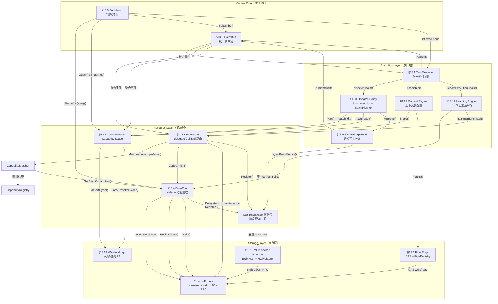
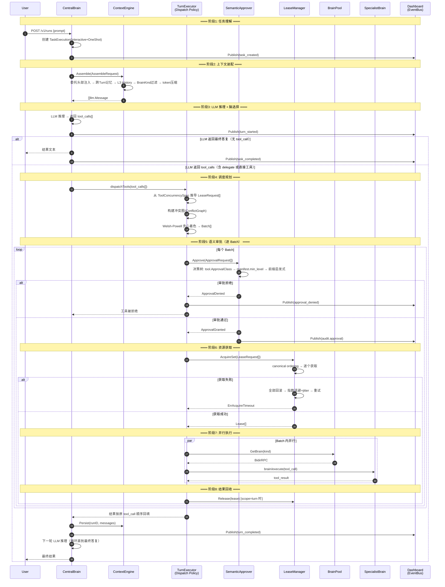
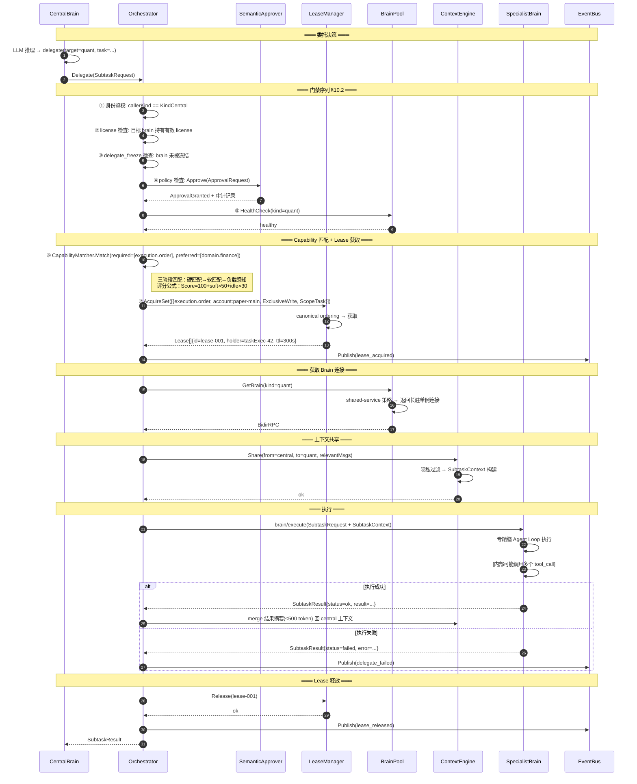
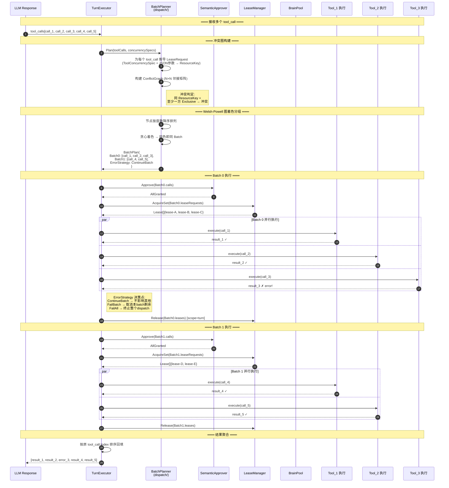
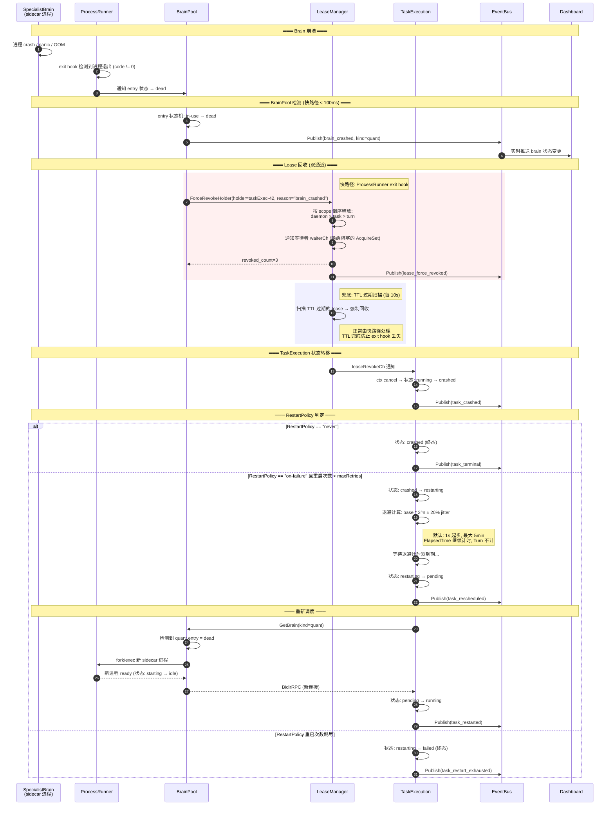
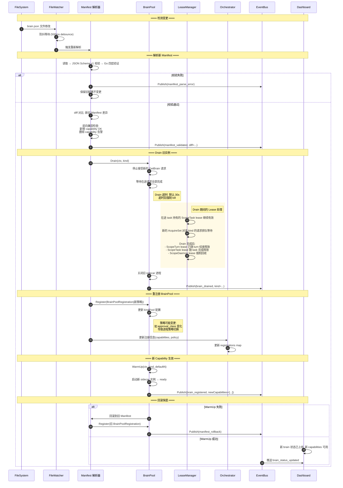
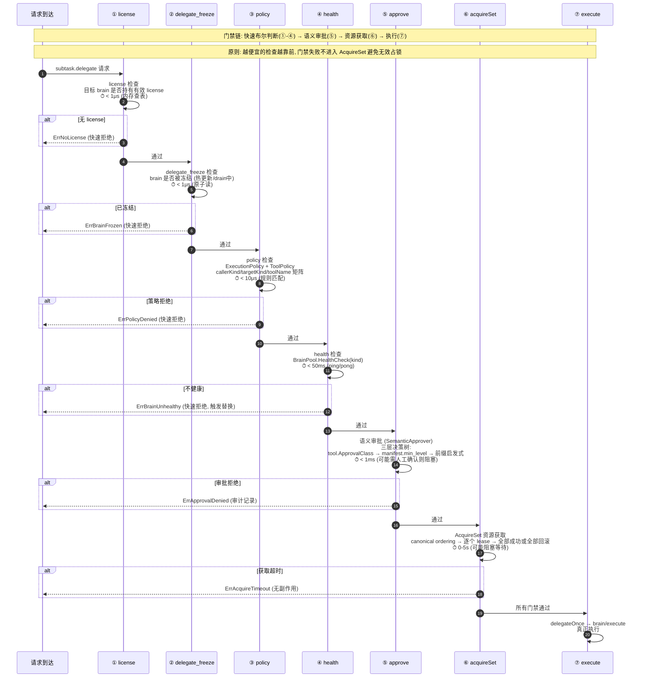

# 35. 端到端时序与模块依赖图

> **状态**：v1 · 2026-04-17
> **定位**：胶水文档——从全局视角理解 13 个核心子系统如何协作
> **上位规格**：[32-v3-Brain架构.md](./32-v3-Brain架构.md) §7.12 架构总览、§13 全部子章节
> **读者**：需要理解端到端请求流的架构师和开发者

---

## 1. 模块依赖关系图

### 1.1 四层架构总览

### 1.2 依赖关系简明表

| 调用方 | 被调用方 | 关系类型 | 说明 |
|--------|---------|---------|------|
| Dashboard | BrainPool, LeaseManager, EventBus, TaskExecution | 观测 | 只读查询+订阅，不干预执行 |
| TaskExecution | TurnExecutor, ContextEngine, EventBus, Learning | 组合 | TaskExec 是执行主循环 |
| TurnExecutor | LeaseManager, SemanticApprover | 门禁+资源 | Plan→Approve→AcquireSet→Execute |
| Orchestrator | BrainPool, ProcessRunner | 路由 | Delegate 只做路由，不管锁不管进程 |
| BrainPool | ProcessRunner, ManifestParser | 管理 | 进程生命周期管理 |
| LeaseManager | WaitForGraph | 兜底 | P2 死锁检测仅 daemon/streaming 场景 |

---

## 2. 端到端时序：用户请求 → 结果返回

---

## 3. 端到端时序：Delegate（中央脑委托专精脑）

---

## 4. 端到端时序：并行 Batch 执行

---

## 5. 端到端时序：故障恢复

---

## 6. 端到端时序：热更新 Manifest

---

## 7. 门禁执行顺序全景图

### 7.1 完整门禁时序（§10.2 在完整请求中的位置）

### 7.2 门禁速查表

| 序号 | 门禁 | 检查内容 | 典型延迟 | 失败处理 | 资源消耗 |
|------|------|---------|---------|---------|---------|
| ① | license | brain license 有效性 | < 1μs | 快速拒绝 | 无 |
| ② | delegate_freeze | brain 是否被冻结 | < 1μs | 快速拒绝 | 无 |
| ③ | policy | 执行策略+工具策略 | < 10μs | 快速拒绝 | 无 |
| ④ | health | sidecar 进程健康 | < 50ms | 拒绝+触发替换 | 一次 ping |
| ⑤ | approve | 语义审批等级 | < 1ms ~ 阻塞 | 拒绝+审计 | 可能人工 |
| ⑥ | acquireSet | Capability Lease 获取 | 0 ~ 5s | 超时+退避重试 | 锁资源 |
| ⑦ | execute | brain/execute RPC | 不限 | 工具层错误 | 完整执行 |

**设计原则**：门禁①-④是零成本布尔判断，任何一个失败立即返回，不消耗下游资源。⑤是策略判断，可能涉及人工确认但不消耗锁资源。⑥才真正获取锁。**越便宜越靠前。**

---

## 8. 模块接口契约总表

### 8.1 TaskExecution → 下游

| 调用方 | 被调用方 | 接口方法 | 输入 | 输出 | 错误处理 |
|--------|---------|---------|------|------|---------|
| TaskExecution | ContextEngine | `Assemble(ctx, AssembleRequest)` | RunID, BrainKind, TaskType, Messages, TokenBudget | `[]llm.Message` | 降级:跳过压缩/记忆,用原始消息 |
| TaskExecution | ContextEngine | `Persist(ctx, runID, brainKind, msgs)` | RunID, BrainKind, Messages | `error` | 异步,不阻塞主流程,仅日志 |
| TaskExecution | TurnExecutor | `dispatchTools(ctx, toolCalls)` | tool_use blocks 列表 | `[]ToolResult` (原序回填) | 按 ErrorStrategy 分档 |
| TaskExecution | EventBus | `Publish(event)` | TaskEvent(类型+载荷) | `error` | fire-and-forget,不阻塞执行 |
| TaskExecution | LearningEngine | `RecordExecutionChain(ctx, chain, outcome)` | ExecutionChain, Outcome | `error` | 异步,不阻塞 |

### 8.2 TurnExecutor (Dispatch Policy) → 下游

| 调用方 | 被调用方 | 接口方法 | 输入 | 输出 | 错误处理 |
|--------|---------|---------|------|------|---------|
| TurnExecutor | BatchPlanner | `Plan(toolCalls, specs)` | []ToolCallNode, []ToolConcurrencySpec | `BatchPlan{Batches, ErrorStrategy}` | 无资源工具放入 batch-0 |
| TurnExecutor | SemanticApprover | `Approve(ctx, req)` | ApprovalRequest{caller,target,toolName,level,mode} | `ApprovalDecision{granted,reason}` | 拒绝→该 tool_call 返回 ErrApprovalDenied |
| TurnExecutor | LeaseManager | `AcquireSet(ctx, reqs)` | []LeaseRequest (已排序) | `[]Lease` | 失败→全回滚→退避重试→超时返回 ErrAcquireTimeout |
| TurnExecutor | LeaseManager | `Release(ctx, leaseID)` | LeaseID | `error` | 释放失败仅日志,TTL 兜底回收 |
| TurnExecutor | BrainPool | `GetBrain(ctx, kind)` | agent.Kind | `protocol.BidirRPC` | ErrBrainUnavailable / ErrDraining |

### 8.3 Orchestrator → 下游

| 调用方 | 被调用方 | 接口方法 | 输入 | 输出 | 错误处理 |
|--------|---------|---------|------|------|---------|
| Orchestrator | BrainPool | `GetBrain(ctx, kind)` | agent.Kind | `protocol.BidirRPC` | ErrBrainUnavailable |
| Orchestrator | ProcessRunner | `callBrainExecute(ctx, rpc, req)` | BidirRPC, SubtaskRequest | `SubtaskResult` | RPC 超时/进程退出 → 返回错误 |
| Orchestrator | ContextEngine | `Share(ctx, from, to, msgs, opts)` | from/to BrainKind, Messages | `error` | 共享失败→降级:不带上下文执行 |
| Orchestrator | SemanticApprover | `Approve(ctx, req)` | ApprovalRequest | `ApprovalDecision` | 拒绝→返回 ErrPolicyDenied |

### 8.4 BrainPool → 下游

| 调用方 | 被调用方 | 接口方法 | 输入 | 输出 | 错误处理 |
|--------|---------|---------|------|------|---------|
| BrainPool | ProcessRunner | `Start(ctx, config)` | 进程配置(binary路径,参数) | `Process` | 启动失败→entry 状态 dead→重试 |
| BrainPool | ProcessRunner | `Stop(ctx)` | - | `error` | 强制 kill 兜底 |
| BrainPool | ProcessRunner | `Ping(ctx)` | - | `error` | 连续3次失败→触发重启 |
| BrainPool | ManifestParser | `ToPoolRegistration()` | Manifest | `BrainPoolRegistration` | 解析失败→不注册 |

### 8.5 LeaseManager → 下游

| 调用方 | 被调用方 | 接口方法 | 输入 | 输出 | 错误处理 |
|--------|---------|---------|------|------|---------|
| LeaseManager | WaitForGraph | `AddEdge(waiter, holder)` | HolderID, HolderID | - | 检测到环→SelectVictim |
| LeaseManager | WaitForGraph | `SelectVictim()` | 环路节点集 | HolderID (被牺牲者) | 复合评分选最低优先级 |
| LeaseManager | TaskExecution | `leaseRevokeCh <- event` | LeaseRevokeEvent | - | ctx cancel→状态转 interrupted |
| LeaseManager | EventBus | `Publish(lease_event)` | LeaseEvent | `error` | fire-and-forget |

### 8.6 Dashboard → 下游（只读观测）

| 调用方 | 被调用方 | 接口方法 | 输入 | 输出 | 错误处理 |
|--------|---------|---------|------|------|---------|
| Dashboard | BrainPool | `Status()` | - | `map[Kind]BrainPoolStatus` | 空 map 表示无 brain |
| Dashboard | LeaseManager | `Query(ctx, filter)` | LeaseFilter | `[]LeaseSnapshot` | 空切片 |
| Dashboard | LeaseManager | `Snapshot(ctx)` | - | `LeaseManagerSnapshot` | 降级:展示缓存 |
| Dashboard | EventBus | `Subscribe(ctx, filter)` | EventFilter(按频道) | `<-chan Event` | 断线重连 |
| Dashboard | TaskExecution | `List(filter)` / `Get(id)` | 过滤条件 | `[]ExecutionDTO` / `ExecutionDTO` | 404 |

### 8.7 ContextEngine → 下游

| 调用方 | 被调用方 | 接口方法 | 输入 | 输出 | 错误处理 |
|--------|---------|---------|------|------|---------|
| ContextEngine | MemoryStore | `Load(ctx, runID, kind)` | RunID, BrainKind | `[]MemoryEntry` | 空列表(无记忆) |
| ContextEngine | MemoryStore | `Save(ctx, entries)` | []MemoryEntry | `error` | 异步,不阻塞 |
| ContextEngine | LLM (for summary) | `ChatRequest(ctx, req)` | 压缩用 prompt + 长消息 | `摘要文本` | 降级:用窗口裁剪 |
| ContextEngine | FlowEdge CAS | `Read(ref)` / `Write(data)` | blake3:ref / bytes | bytes / ref | CAS 不可用→跳过持久化 |

### 8.8 Learning Engine → 下游

| 调用方 | 被调用方 | 接口方法 | 输入 | 输出 | 错误处理 |
|--------|---------|---------|------|------|---------|
| LearningEngine | BrainLearner (各 sidecar) | `ExportMetrics(ctx)` | - | `BrainMetrics` | 超时→跳过该 brain |
| LearningEngine | 持久化存储 | `Save L1/L2/L3 数据` | 评分/链路/Profile | `error` | 异步,最终一致 |

---

## 9. 关键不变量（Invariants）

以下不变量在系统运行的**任何时刻**都必须成立。违反任何一条即为 Bug。

### 9.1 Lease 不变量

| # | 不变量 | 执行机制 | 违反后果 |
|---|--------|---------|---------|
| L1 | **任何时刻，一个 ResourceKey 上最多一个 Exclusive lease** | LeaseManager 兼容性矩阵检查 (§13.2) | 数据竞争/资金安全事故 |
| L2 | **AcquireSet 要么全成功要么全回滚（原子性）** | AcquireSet 算法: 逐个获取, 失败回滚所有已获取的 | 半获取导致死锁 |
| L3 | **canonical ordering: AcquireSet 内部按 ResourceKey+Capability 字典序获取** | `sort.Sort(byCanonicalOrder(reqs))` | 乱序获取导致 AB-BA 死锁 |
| L4 | **Task 处于终态 (completed/failed/canceled) 时不持有任何 lease** | 状态转移 hook: 进入终态前 `ReleaseAll(holder, scope)` | 资源泄漏, 后续 task 永久阻塞 |
| L5 | **daemon scope lease 自动续租, 心跳间隔 = TTL/3** | heartbeat goroutine + 连续 3 次错过强制撤销 | lease 意外过期导致 daemon 中断 |
| L6 | **Exclusive lease 持有者崩溃后, lease 必须在 TTL 内被回收** | 双通道: exit hook 快路径 + TTL 扫描兜底 | 资源永久锁定 |

### 9.2 TaskExecution 不变量

| # | 不变量 | 执行机制 | 违反后果 |
|---|--------|---------|---------|
| T1 | **所有 TaskExecution 从 pending 状态开始, 无例外** | 构造函数强制 `Status = StatePending` | 状态机不一致 |
| T2 | **终态 (completed/failed/canceled) 不可逆——除非 RestartPolicy 允许从 failed/crashed 进入 restarting** | 状态转移表白名单 + `canTransition()` 检查 | 僵尸 task |
| T3 | **一个 TaskExecution 同一时刻只在一个 Runner 上执行** | BrainPool GetBrain + holder 绑定 | 重复执行, 数据冲突 |
| T4 | **父子传播: 当 ChildFailurePolicy=propagate_immediately 时, 子任务 failed → 父任务必须在当前 turn 结束前转 failed** | 父 Runner 监听子 TaskExecution 状态 channel | 父任务"假成功" |

### 9.3 Dispatch 不变量

| # | 不变量 | 执行机制 | 违反后果 |
|---|--------|---------|---------|
| D1 | **同一 batch 内的 tool_call 两两无资源冲突** | ConflictGraph + Welsh-Powell 着色保证同色无边 | 并发执行导致数据竞争 |
| D2 | **结果按原 tool_call Index 顺序回填, 对 LLM 透明** | BatchPlan 保留原始 Index, 聚合时排序 | LLM 把结果对错工具 |
| D3 | **禁止普通工具执行过程中再隐式追加跨资源 lease (P0 约束)** | AcquireSet 只在 batch 开始前调用, 执行期间 LeaseManager 拒绝该 holder 新请求 | 运行时死锁 |

### 9.4 Delegate 不变量

| # | 不变量 | 执行机制 | 违反后果 |
|---|--------|---------|---------|
| DE1 | **Delegate 调用必须先通过全部门禁 (license→freeze→policy→health→approve)** | Orchestrator.Delegate() 顺序执行门禁链 | 未授权执行 |
| DE2 | **只有 callerKind == KindCentral 才能发起 delegate** | `registerReverseHandlers()` 闭包内身份检查 | 非法横向委托 |
| DE3 | **MCP server 不能直接成为 delegate target** | `CanDelegate()` 只查 available[kind] brain | 绕过协议边界 |
| DE4 | **delegate 执行入口固定为 `brain/execute`** | `delegateOnce()` 硬编码方法名 + 协议常量 | 协议偏离 |

### 9.5 BrainPool 不变量

| # | 不变量 | 执行机制 | 违反后果 |
|---|--------|---------|---------|
| BP1 | **锁顺序: brainPool.mu > kindPool.mu > poolEntry.mu, 不可逆** | 代码 review + 注释标注 | Pool 内部死锁 |
| BP2 | **Drain 期间拒绝所有新的 GetBrain 请求** | kindPool.draining 原子标志 | 返回已关闭的连接 |
| BP3 | **ephemeral-worker 最大并发实例数 ≤ maxInstances (默认 8)** | poolEntry 计数器 + 信号量 | 进程爆炸, OOM |

### 9.6 ContextEngine 不变量

| # | 不变量 | 执行机制 | 违反后果 |
|---|--------|---------|---------|
| CE1 | **private 标记的消息绝不跨脑传递** | Share() 隐私过滤器 | 信息泄露 |
| CE2 | **Assemble 返回的消息 token 总量 ≤ TokenBudget** | Compress 三层策略兜底: 裁剪→摘要→贪心 | LLM API 报错 / 截断 |
| CE3 | **跨脑共享的 SubtaskContext 中 RelevantMessages ≤ 10 条, PriorResults 各 ≤ 200 token** | Share 协议硬上限 | 上下文爆炸 |

### 9.7 系统级不变量

| # | 不变量 | 执行机制 | 违反后果 |
|---|--------|---------|---------|
| S1 | **所有 brain 都是独立 sidecar 进程, 零例外** | BrainPool 强制通过 ProcessRunner fork/exec | 隔离性丧失 |
| S2 | **CAS 写入幂等: 同内容并发写入产生相同 ref** | blake3 content-addressing + atomic rename | 数据重复/不一致 |
| S3 | **EventBus 环形缓冲溢出时丢弃最旧事件, 不阻塞生产者** | 固定 10000 条 + 覆写策略 | 反压导致执行卡住 |
| S4 | **Manifest 热更新失败必须回滚到旧配置** | WarmUp 失败→回滚旧 Manifest→重新 Register | brain 不可用 |

---

## 附录 A: 子系统速查索引

| §编号 | 子系统 | 所属层 | 主接口文件 | 独立规格文档 |
|--------|--------|--------|-----------|-------------|
| §13.1 | TaskExecution 生命周期状态机 | Execution | `sdk/execution/` | [35-TaskExecution生命周期状态机.md](./35-TaskExecution生命周期状态机.md) |
| §13.2 | LeaseManager | Resource | `sdk/kernel/lease.go` | 内联于 §13.2 |
| §13.3 | Dispatch Policy (BatchPlanner) | Execution | `sdk/loop/dispatch/` | [35-Dispatch-Policy-冲突图与Batch分组算法.md](./35-Dispatch-Policy-冲突图与Batch分组算法.md) |
| §13.4 | BrainPool | Resource | `sdk/kernel/pool.go` | [35-BrainPool实现设计.md](./35-BrainPool实现设计.md) |
| §13.5 | Dashboard + EventBus | Control Plane | `sdk/events/` + Dashboard SPA | [35-统一Dashboard设计规格.md](./35-统一Dashboard设计规格.md) |
| §13.6 | Flow Edge (CAS + PipeRegistry) | Storage | `sdk/flowedge/` | [35-Flow-Edge存储与注册发现设计.md](./35-Flow-Edge存储与注册发现设计.md) |
| §13.7 | Context Engine | Execution | `sdk/contextengine/` | [35-Context-Engine详细设计.md](./35-Context-Engine详细设计.md) |
| §13.8 | v3 重构路径与开发计划 | 全局 | - | [35-v3重构路径与开发计划.md](./35-v3重构路径与开发计划.md) |
| §13.9 | 语义审批 (SemanticApprover) | Execution | `sdk/kernel/approval.go` | [35-语义审批分级设计.md](./35-语义审批分级设计.md) |
| §13.10 | Manifest 解析与版本化 | Resource | `sdk/manifest/` | [35-Manifest解析与版本化设计.md](./35-Manifest解析与版本化设计.md) |
| §13.11 | MCP-backed Runtime | Storage | `sdk/kernel/mcphost/` | [35-MCP-backed-Runtime设计.md](./35-MCP-backed-Runtime设计.md) |
| §13.12 | 自适应学习 L1-L3 | Execution | `sdk/learning/` | [35-自适应学习L1-L3算法设计.md](./35-自适应学习L1-L3算法设计.md) |
| §13.13 | 死锁防护 P2 + 持久化迁移 | Storage | `sdk/kernel/lease.go` (WFG) | 内联于 §13.13 |
