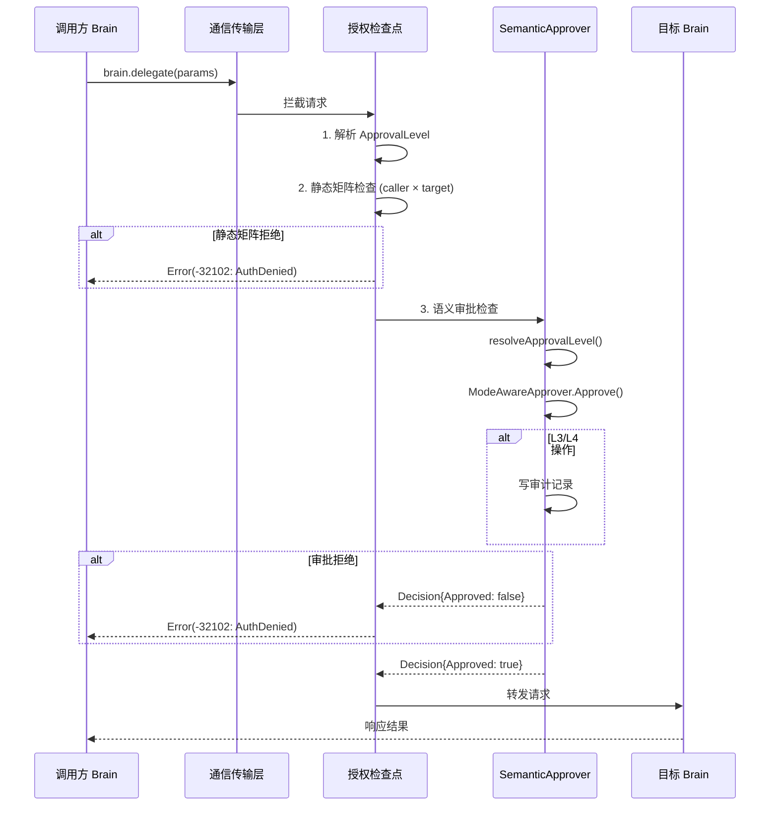

# 35. 跨脑通信协议设计

> **⚠️ 实现简化说明（2026-04-24）：** POSIX 共享内存快路径（/dev/shm + mmap + Magic Number 0x42524E33）未实现。实际 `sdk/flow/ringbuf.go` 为进程内内存实现。慢路径 JSON-RPC 已正确实现。

> **状态**：v1 · 2026-04-17  
> **归属**：[32-v3-Brain架构.md](./32-v3-Brain架构.md) §5.2 跨脑通信双通道 的下位规格  
> **依赖文档**：  
> - [32-v3-Brain架构.md](./32-v3-Brain架构.md) §5.2 / §5.3 / §3.4 / §7.10  
> - [35-Flow-Edge存储与注册发现设计.md](./35-Flow-Edge存储与注册发现设计.md)（存储层）  
> - [35-语义审批分级设计.md](./35-语义审批分级设计.md)（授权与审批）  
> - [35-Context-Engine详细设计.md](./35-Context-Engine详细设计.md)（上下文共享）  
> **Phase 映射**：Phase A（慢路径基础）✅ → Phase B（快路径 + 授权）⚠️（进程内 ringbuf 替代 POSIX shm）→ Phase C（Workflow 集成）✅（Orchestrator.ExecuteWorkflow 已通过 delegate 慢路径完成跨脑 DAG 编排）→ Phase D（远程扩展）⚠️

---

## 1. 概述

### 1.1 设计目标

§5.2 定义了跨脑通信的双通道架构（快路径 ringbuf + 慢路径 JSON-RPC），§7.10 定义了 Flow Edge 作为任务间数据传递的存储抽象。本文档是**传输协议层**的完整规格，填补从"存储抽象"到"线上传输"的空白。

三层职责分工：

```text
┌────────────────────────────────────────────────────────┐
│  Flow Edge（§7.10 / 35-Flow-Edge 文档）                 │
│  存储抽象：CAS + Streaming Pipe                         │
│  回答"数据存在哪里、怎么读写"                            │
└──────────────────────┬─────────────────────────────────┘
                       │ 依赖
┌──────────────────────▼─────────────────────────────────┐
│  跨脑通信协议（本文档）                                   │
│  传输协议：快路径 Ring Buffer + 慢路径 JSON-RPC           │
│  回答"数据怎么在 Brain 之间传输、授权、路由"              │
└──────────────────────┬─────────────────────────────────┘
                       │ 依赖
┌──────────────────────▼─────────────────────────────────┐
│  语义审批（35-语义审批 文档）                              │
│  授权层：五级审批 + 审计                                  │
│  回答"这次跨脑调用是否被允许"                             │
└────────────────────────────────────────────────────────┘
```

### 1.2 双通道适用场景

| 通道 | 延迟目标 | 适用场景 | 典型数据 |
|------|----------|----------|----------|
| **快路径**（Ring Buffer） | < 100μs p99 | 高频实时数据分发 | 行情快照、特征向量、传感器数据 |
| **慢路径**（JSON-RPC 2.0） | < 5ms p99 | RPC 调用、任务委托、审查、控制指令 | delegate、result、cancel、heartbeat |

**选择规则**：

- 数据量大、频率高、容忍丢失 → 快路径
- 需要请求-响应语义、需要授权检查、需要可靠传递 → 慢路径
- 不确定时默认慢路径（安全、简单、可观测）

### 1.3 与 Flow Edge 的关系

Flow Edge 是**存储侧抽象**（CAS + PipeRegistry），本文档是**传输侧协议**。两者通过 `StreamBackend` 接口对接：

```text
Flow Edge StreamWriter/StreamReader
         │
         ├── backend=pipe     → 进程内 channel（无需本文档的协议）
         ├── backend=ringbuf  → 本文档 §2 快路径协议
         └── backend=queue    → 外部 MQ（Phase D）

Flow Edge EdgeWriter/EdgeReader (materialized)
         │
         └── CAS Write/Read   → 不走通信协议，直接走存储
                                （跨机 CAS 用 S3，Phase D）
```

慢路径 JSON-RPC 服务于**控制面通信**（delegate、result、cancel、heartbeat、context_share），不直接服务 Flow Edge 的数据传递。

---

## 2. 快路径：共享内存 Ring Buffer 协议

### 2.1 内存布局

快路径使用 POSIX 共享内存（`/dev/shm`），每对通信的 Brain 之间创建一个独立的 Ring Buffer 文件。

**命名规范**：

```
/dev/shm/brain_{session_id}_{src_kind}_{dst_kind}
```

示例：`/dev/shm/brain_sess01_data_quant`

**内存映射结构**：

```text
偏移量        字段                  大小      说明
────────────────────────────────────────────────────────────
0x0000        Magic Number          4B       固定 0x42524E33 ("BRN3")
0x0004        Version               2B       协议版本，当前 0x0001
0x0006        Flags                 2B       bit0: 写端活跃, bit1: 读端活跃, bit2-15: 保留
0x0008        Capacity              4B       Data 区的总字节数（必须是 2 的幂）
0x000C        SlotSize              4B       单帧最大字节数
0x0010        SlotCount             4B       槽位总数 = Capacity / SlotSize
0x0014        WritePos              8B       写序号（单调递增，永不回绕）
0x001C        ReadPos               8B       读序号（单调递增，永不回绕）
0x0024        WriteTimestamp        8B       最近一次写入的 Unix 纳秒时间戳
0x002C        ReadTimestamp         8B       最近一次读取的 Unix 纳秒时间戳
0x0034        Reserved              12B      保留，置零
0x0040        ── Header 结束 ──     共 64B   Header 区固定 64 字节
0x0040        Data[0]               SlotSize 第 0 个槽位
0x0040+S      Data[1]               SlotSize 第 1 个槽位
...           ...                   ...
0x0040+S*N    Data[N-1]             SlotSize 第 N-1 个槽位
────────────────────────────────────────────────────────────
```

**总大小计算公式**：

```
TotalSize = HeaderSize + SlotCount × SlotSize
          = 64 + SlotCount × SlotSize
```

默认配置（行情场景）：SlotCount=1024, SlotSize=4096 → TotalSize = 64 + 1024 × 4096 = 4,194,368 字节（约 4MB）。

**Go 结构定义**：

```go
// protocol/ringbuf/header.go

package ringbuf

import "unsafe"

const (
    MagicNumber = uint32(0x42524E33) // "BRN3"
    Version     = uint16(0x0001)
    HeaderSize  = 64
)

// Header 是 Ring Buffer 的共享内存头部，固定 64 字节。
// 所有多字节字段使用 little-endian。当前实现仅支持 x86_64（小端原生），无需转换。
// 若未来需支持大端架构，须在 Header.Flags 中启用 FlagBigEndian (0x01)，
// 读写端根据 flags 决定是否执行字节序翻转。
// WritePos / ReadPos 使用 atomic load/store，无锁并发安全。
type Header struct {
    Magic          uint32 // 0x00: 魔数校验
    Version        uint16 // 0x04: 协议版本
    Flags          uint16 // 0x06: 状态标志位
    Capacity       uint32 // 0x08: Data 区总字节数
    SlotSize       uint32 // 0x0C: 单帧最大字节数
    SlotCount      uint32 // 0x10: 槽位总数
    WritePos       uint64 // 0x14: 写序号（atomic）
    ReadPos        uint64 // 0x1C: 读序号（atomic）
    WriteTimestamp uint64 // 0x24: 最近写入时间（Unix ns）
    ReadTimestamp  uint64 // 0x2C: 最近读取时间（Unix ns）
    _reserved      [12]byte
}

const _ = unsafe.Sizeof(Header{}) // 编译期校验大小

// Flag 位定义
const (
    FlagWriterAlive uint16 = 1 << 0 // bit0: 写端进程存活
    FlagReaderAlive uint16 = 1 << 1 // bit1: 读端进程存活
)
```

### 2.2 帧格式

每个槽位内存放一个 Frame，Frame 由 Frame Header + Payload 组成。

```text
槽位内部布局（SlotSize 字节）：
────────────────────────────────────────
偏移  字段           大小     说明
0x00  FrameType      1B      帧类型
0x01  FrameFlags     1B      帧标志位
0x02  SeqNum         4B      帧序号（与 WritePos 对应）
0x06  PayloadLen     4B      有效载荷长度（不含 Frame Header）
0x0A  Checksum       4B      CRC32C 校验和（覆盖 Payload）
0x0E  ── Frame Header 结束 ── 共 14 字节
0x0E  Payload        PayloadLen  有效载荷数据
────────────────────────────────────────
最大 PayloadLen = SlotSize - 14
```

> **SeqNum 生成规则**：SeqNum 是每个通道独立的 uint32 单调递增计数器，与 Header.WritePos（uint64 字节级偏移）解耦。
> 溢出后自然回绕至 0（uint32 wrap-around），接收端通过无符号减法 `new_seq - last_ack_seq` 判断是否为新帧，
> 可正确处理回绕（只要单次积压不超过 2^31 帧）。

**帧类型定义**：

```go
// protocol/ringbuf/frame.go

// FrameType 标识帧的语义类别。
type FrameType uint8

const (
    // FrameData 数据帧，承载业务数据（行情快照、特征向量等）。
    FrameData FrameType = 0x01

    // FrameControl 控制帧，承载通道管理指令（如 Drain、Reset）。
    FrameControl FrameType = 0x02

    // FrameHeartbeat 心跳帧，写端定期发送，读端据此判断写端存活。
    FrameHeartbeat FrameType = 0x03

    // FrameAck 确认帧，读端发送给写端（可选，用于流控场景）。
    FrameAck FrameType = 0x04
)

// FrameFlags 帧标志位。
type FrameFlags uint8

const (
    // FlagCompressed 表示 Payload 经过 LZ4 压缩。
    FlagCompressed FrameFlags = 1 << 0

    // FlagFragmented 表示该帧是大消息的分片（当前版本不支持，预留）。
    FlagFragmented FrameFlags = 1 << 1

    // FlagUrgent 表示高优先级帧，读端应优先处理。
    FlagUrgent FrameFlags = 1 << 2
)

// FrameHeader 是每个帧的固定头部，14 字节。
type FrameHeader struct {
    Type       FrameType  // 1B
    Flags      FrameFlags // 1B
    SeqNum     uint32     // 4B: 帧序号
    PayloadLen uint32     // 4B: 载荷长度
    Checksum   uint32     // 4B: CRC32C of payload
}

const FrameHeaderSize = 14
```

**Payload 序列化格式**：

| 格式 | 适用场景 | 性能 |
|------|----------|------|
| **MessagePack**（默认） | 行情快照、特征向量等结构化数据 | 编码 ~200ns，解码 ~300ns（1KB payload） |
| **Raw bytes** | 已序列化的数据（protobuf 等） | 零拷贝，无额外开销 |
| **JSON** | 调试模式 | 慢 5-10 倍，但人类可读 |

```go
// protocol/ringbuf/codec.go

// Codec 定义 Payload 的编解码接口。
type Codec interface {
    Encode(v any) ([]byte, error)
    Decode(data []byte, v any) error
    Name() string
}

// MsgpackCodec 是默认编解码器，使用 MessagePack。
type MsgpackCodec struct{}

func (MsgpackCodec) Encode(v any) ([]byte, error) {
    return msgpack.Marshal(v)
}

func (MsgpackCodec) Decode(data []byte, v any) error {
    return msgpack.Unmarshal(data, v)
}

func (MsgpackCodec) Name() string { return "msgpack" }
```

### 2.3 背压处理

Ring Buffer 是**有界缓冲区**，写入速度超过读取速度时必须有明确策略。三种策略与 Flow Edge 的 `BackpressureStrategy` 对齐（见 35-Flow-Edge §6）。

```go
// protocol/ringbuf/backpressure.go

// BackpressureMode 定义写入端在 buffer 满时的行为。
type BackpressureMode int

const (
    // ModeBlock 阻塞写入，直到读端消费腾出空间。
    // 适用于不能丢数据的场景（如 materialized edge 的临时缓冲）。
    // 风险：写端阻塞可能导致上游级联阻塞。
    ModeBlock BackpressureMode = iota

    // ModeOverwrite 覆写最旧的槽位（新数据优先）。
    // 适用于实时行情场景——旧快照天然过时，丢弃不影响业务。
    // 这是 Data→Quant 行情通道的默认模式。
    ModeOverwrite

    // ModeSpillToSlow 溢出到慢路径（JSON-RPC 通道传递）。
    // 适用于不能丢且不能阻塞的场景。
    // 溢出帧通过 brain.spill_frame JSON-RPC 方法传递。
    ModeSpillToSlow
)
```

**写入端满检测**：

```go
// Write 写入一帧数据到 Ring Buffer。
func (rb *RingBuffer) Write(frame []byte, mode BackpressureMode) error {
    writePos := atomic.LoadUint64(&rb.header.WritePos)
    readPos := atomic.LoadUint64(&rb.header.ReadPos)

    // 计算当前积压
    lag := writePos - readPos

    switch {
    case lag < uint64(rb.header.SlotCount):
        // 有空间，正常写入
        rb.writeSlot(writePos, frame)
        atomic.AddUint64(&rb.header.WritePos, 1)
        atomic.StoreUint64(&rb.header.WriteTimestamp, uint64(time.Now().UnixNano()))
        return nil

    case mode == ModeOverwrite:
        // 覆写最旧槽位
        rb.writeSlot(writePos, frame)
        atomic.AddUint64(&rb.header.WritePos, 1)
        // 读端下次读取时会检测到 gap
        metrics.RingbufOverwritten.Inc()
        return nil

    case mode == ModeBlock:
        // 阻塞等待
        return rb.blockUntilSpace(frame)

    case mode == ModeSpillToSlow:
        // 溢出到慢路径
        metrics.RingbufSpilled.Inc()
        return ErrBufferFull // 调用方负责将帧转发到慢路径
    }

    return ErrUnknownBackpressureMode
}
```

**读取端慢读检测**：

```go
// MonitorLag 监控 consumer lag，超过阈值时发出告警。
func (rb *RingBuffer) MonitorLag(threshold uint64, onAlert func(lag uint64)) {
    writePos := atomic.LoadUint64(&rb.header.WritePos)
    readPos := atomic.LoadUint64(&rb.header.ReadPos)
    lag := writePos - readPos

    if lag > threshold {
        onAlert(lag)
        metrics.RingbufConsumerLag.Set(float64(lag))
    }
}
```

### 2.4 生命周期管理

```go
// protocol/ringbuf/lifecycle.go

// RingBufferManager 管理所有快路径 Ring Buffer 的生命周期。
type RingBufferManager struct {
    mu      sync.RWMutex
    buffers map[string]*RingBuffer // key: shm path
    basePath string               // 默认 "/dev/shm"
}

// Create 创建一个新的 Ring Buffer（lazy 创建：首次通信时调用）。
//
// 创建时机：
// - Brain 间首次需要快路径通信时由发送方创建
// - WorkflowEngine 初始化 streaming edge 时预创建
//
// 创建流程：
// 1. 生成 shm 路径：/dev/shm/brain_{session}_{src}_{dst}
// 2. 创建并 mmap 共享内存文件
// 3. 写入 Header（Magic, Version, Capacity 等）
// 4. 注册到 PipeRegistry（与 Flow Edge 集成）
func (m *RingBufferManager) Create(cfg RingBufferConfig) (*RingBuffer, error) {
    m.mu.Lock()
    defer m.mu.Unlock()

    path := cfg.ShmPath
    if _, exists := m.buffers[path]; exists {
        return nil, ErrBufferAlreadyExists
    }

    // 创建共享内存文件
    fd, err := syscall.Open(path, syscall.O_CREAT|syscall.O_RDWR|syscall.O_TRUNC, 0600)
    if err != nil {
        return nil, fmt.Errorf("create shm: %w", err)
    }

    totalSize := HeaderSize + int(cfg.SlotCount)*int(cfg.SlotSize)
    if err := syscall.Ftruncate(fd, int64(totalSize)); err != nil {
        syscall.Close(fd)
        return nil, fmt.Errorf("ftruncate: %w", err)
    }

    // mmap
    data, err := syscall.Mmap(fd, 0, totalSize,
        syscall.PROT_READ|syscall.PROT_WRITE, syscall.MAP_SHARED)
    if err != nil {
        syscall.Close(fd)
        return nil, fmt.Errorf("mmap: %w", err)
    }

    // 初始化 Header
    header := (*Header)(unsafe.Pointer(&data[0]))
    header.Magic = MagicNumber
    header.Version = Version
    header.Capacity = uint32(cfg.SlotCount) * cfg.SlotSize
    header.SlotSize = cfg.SlotSize
    header.SlotCount = uint32(cfg.SlotCount)
    header.Flags = FlagWriterAlive

    rb := &RingBuffer{
        header: header,
        data:   data[HeaderSize:],
        fd:     fd,
        path:   path,
        cfg:    cfg,
    }
    m.buffers[path] = rb
    return rb, nil
}

// Destroy 销毁 Ring Buffer 并清理共享内存文件。
//
// 销毁时机：
// - Session 正常结束（TaskExecution 完成）
// - Brain 进程退出（Shutdown hook）
// - 管理员手动清理
//
// 销毁流程：
// 1. 将 Flags 中 WriterAlive/ReaderAlive 清零
// 2. munmap 共享内存
// 3. 删除 /dev/shm 文件
// 4. 从 PipeRegistry 注销
func (m *RingBufferManager) Destroy(path string) error {
    m.mu.Lock()
    defer m.mu.Unlock()

    rb, exists := m.buffers[path]
    if !exists {
        return ErrBufferNotFound
    }

    // 清除存活标志
    atomic.StoreUint16(&rb.header.Flags, 0)

    // munmap + close
    if err := syscall.Munmap(rb.rawData); err != nil {
        return fmt.Errorf("munmap: %w", err)
    }
    syscall.Close(rb.fd)

    // 删除 shm 文件
    os.Remove(path)

    delete(m.buffers, path)
    return nil
}

// Recover 崩溃恢复：检测并重建损坏的 Ring Buffer。
//
// 崩溃场景：
// - 写端进程被 kill -9，Flag 未清零
// - 共享内存文件残留但无进程持有
//
// 恢复流程：
// 1. 扫描 /dev/shm/brain_* 文件
// 2. mmap 并校验 Magic Number
// 3. Magic 不匹配 → 删除（损坏文件）
// 4. Magic 匹配但 WriterAlive 标志 → 检查进程是否存在
// 5. 进程不存在 → 重建或删除
func (m *RingBufferManager) Recover() (recovered int, cleaned int, err error) {
    entries, err := filepath.Glob(filepath.Join(m.basePath, "brain_*"))
    if err != nil {
        return 0, 0, err
    }

    for _, path := range entries {
        result := m.recoverOne(path)
        switch result {
        case recoverResultOK:
            recovered++
        case recoverResultCleaned:
            cleaned++
        }
    }
    return recovered, cleaned, nil
}

func (m *RingBufferManager) recoverOne(path string) recoverResult {
    fd, err := syscall.Open(path, syscall.O_RDWR, 0)
    if err != nil {
        os.Remove(path)
        return recoverResultCleaned
    }
    defer syscall.Close(fd)

    // 读取 Header
    headerBuf := make([]byte, HeaderSize)
    if _, err := syscall.Read(fd, headerBuf); err != nil {
        os.Remove(path)
        return recoverResultCleaned
    }

    header := (*Header)(unsafe.Pointer(&headerBuf[0]))

    // Magic 校验
    if header.Magic != MagicNumber {
        os.Remove(path)
        return recoverResultCleaned
    }

    // 版本校验
    if header.Version != Version {
        os.Remove(path)
        return recoverResultCleaned
    }

    // 检查写端进程是否仍然存活（通过 pid 文件或 /proc）
    // 如果进程已死，清除 WriterAlive 标志
    if header.Flags&FlagWriterAlive != 0 {
        // 写端标记存活但可能已崩溃
        // 通过 WriteTimestamp 判断：超过 30s 未更新视为死亡
        lastWrite := time.Unix(0, int64(header.WriteTimestamp))
        if time.Since(lastWrite) > 30*time.Second {
            os.Remove(path)
            return recoverResultCleaned
        }
    }

    return recoverResultOK
}

type recoverResult int

const (
    recoverResultOK      recoverResult = iota
    recoverResultCleaned
)
```

**RingBuffer 配置**：

```go
// RingBufferConfig 是创建 Ring Buffer 的配置。
type RingBufferConfig struct {
    // ShmPath 共享内存文件路径。
    // 命名规范：/dev/shm/brain_{session_id}_{src_kind}_{dst_kind}
    ShmPath string

    // SlotCount 槽位总数。必须是 2 的幂（方便位运算取模）。
    // 默认 1024。行情场景推荐 1024-4096。
    SlotCount int

    // SlotSize 单帧最大字节数。
    // 默认 4096。行情快照通常 1-2KB，4096 留有余量。
    SlotSize uint32

    // BackpressureMode 背压模式。默认 ModeOverwrite。
    BackpressureMode BackpressureMode

    // HeartbeatInterval 心跳帧发送间隔。默认 1s。
    // 读端据此检测写端存活。
    HeartbeatInterval time.Duration

    // Codec 编解码器。默认 MsgpackCodec。
    Codec Codec
}
```

---

## 3. 慢路径：JSON-RPC 2.0 协议

### 3.1 传输层

**同机通信（Phase A-C）**：Unix Domain Socket

```text
路径：/tmp/brain_{brain_kind}.sock
示例：/tmp/brain_quant.sock
```

**跨机通信（Phase D）**：TCP + TLS

```text
地址：{host}:{port}
默认端口：9473（"BRAI" 的数字映射）
TLS：必须启用，使用 mTLS 双向认证
```

**连接管理**：

```go
// protocol/jsonrpc/transport.go

// TransportConfig 是 JSON-RPC 传输层配置。
type TransportConfig struct {
    // Network 网络类型："unix"（同机）/ "tcp"（跨机）
    Network string // 默认 "unix"

    // Address 连接地址。
    // unix: "/tmp/brain_quant.sock"
    // tcp:  "10.0.0.1:9473"
    Address string

    // PoolSize 连接池大小（每个目标 brain 的最大连接数）。
    // 默认 4。多连接用于并行 RPC 调用。
    PoolSize int

    // ConnectTimeout 建立连接超时。默认 5s。
    ConnectTimeout time.Duration

    // RequestTimeout 单次 RPC 请求超时。默认 30s。
    // delegate 类操作可能需要更长超时（由调用方覆盖）。
    RequestTimeout time.Duration

    // MaxRetries 连接失败后最大重试次数。默认 3。
    MaxRetries int

    // RetryBackoff 重试退避策略。默认指数退避（100ms, 200ms, 400ms）。
    RetryBackoff BackoffStrategy

    // TLS 配置（仅 tcp 网络生效）
    TLSConfig *tls.Config
}

// ConnPool 是到单个目标 Brain 的连接池。
type ConnPool struct {
    cfg     TransportConfig
    conns   chan net.Conn
    mu      sync.Mutex
    closed  bool
}

// Get 从连接池获取一个连接。
// 池为空时创建新连接，达到 PoolSize 上限时阻塞等待。
func (p *ConnPool) Get(ctx context.Context) (net.Conn, error) {
    select {
    case conn := <-p.conns:
        // 检查连接是否仍然有效
        if isConnAlive(conn) {
            return conn, nil
        }
        conn.Close()
        // 创建新连接
        return p.dial(ctx)
    case <-ctx.Done():
        return nil, ctx.Err()
    default:
        // 池为空，创建新连接
        return p.dial(ctx)
    }
}

// Put 归还连接到池。
func (p *ConnPool) Put(conn net.Conn) {
    if p.closed {
        conn.Close()
        return
    }
    select {
    case p.conns <- conn:
        // 归还成功
    default:
        // 池已满，关闭多余连接
        conn.Close()
    }
}
```

### 3.2 方法定义

所有方法遵循 JSON-RPC 2.0 规范。方法名以 `brain.` 为命名空间前缀。

#### 3.2.1 brain.delegate — 委托任务

Central Brain 委托子任务给专精 Brain 时调用。

```json
// 请求
{
    "jsonrpc": "2.0",
    "method": "brain.delegate",
    "id": "req-001",
    "params": {
        "task_id": "task-abc123",
        "target_brain": "quant",
        "capabilities": ["trading.execute", "risk.manage"],
        "context": {
            "instruction": "分析 BTC/USDT 近 4 小时走势并给出交易建议",
            "parent_run_id": "run-xyz789",
            "relevant_messages": [],
            "token_budget": 50000
        },
        "approval_level": "L3:control-plane",
        "priority": "high",
        "timeout_ms": 60000
    }
}

// 响应
{
    "jsonrpc": "2.0",
    "id": "req-001",
    "result": {
        "execution_id": "exec-def456",
        "status": "accepted",
        "estimated_duration_ms": 15000
    }
}
```

```go
// protocol/jsonrpc/methods.go

// DelegateParams 是 brain.delegate 的请求参数。
type DelegateParams struct {
    TaskID       string            `json:"task_id"`
    TargetBrain  string            `json:"target_brain"`
    Capabilities []string          `json:"capabilities"`
    Context      *SubtaskContext   `json:"context"`
    ApprovalLevel string           `json:"approval_level"`
    Priority     string            `json:"priority,omitempty"`
    TimeoutMs    int64             `json:"timeout_ms,omitempty"`
}

// DelegateResult 是 brain.delegate 的响应。
type DelegateResult struct {
    ExecutionID       string `json:"execution_id"`
    Status            string `json:"status"`
    EstimatedDuration int64  `json:"estimated_duration_ms,omitempty"`
}
```

#### 3.2.2 brain.result — 返回执行结果

专精 Brain 向 Central Brain 返回任务执行结果。

```json
// 请求
{
    "jsonrpc": "2.0",
    "method": "brain.result",
    "id": "req-002",
    "params": {
        "execution_id": "exec-def456",
        "status": "completed",
        "output": {
            "summary": "BTC/USDT 4H 趋势偏多，建议做多",
            "confidence": 0.78,
            "artifacts": []
        },
        "metrics": {
            "turns": 5,
            "tokens_used": 12000,
            "duration_ms": 8500
        }
    }
}

// 响应
{
    "jsonrpc": "2.0",
    "id": "req-002",
    "result": {
        "ack": true,
        "merged": true
    }
}
```

```go
// ResultParams 是 brain.result 的请求参数。
type ResultParams struct {
    ExecutionID string          `json:"execution_id"`
    Status      string          `json:"status"` // "completed" / "failed" / "partial"
    Output      json.RawMessage `json:"output"`
    Metrics     *ExecutionMetrics `json:"metrics,omitempty"`
    Error       *RPCError       `json:"error,omitempty"` // status=failed 时填写
}

type ExecutionMetrics struct {
    Turns      int   `json:"turns"`
    TokensUsed int   `json:"tokens_used"`
    DurationMs int64 `json:"duration_ms"`
}

// ResultAck 是 brain.result 的响应。
type ResultAck struct {
    Ack    bool `json:"ack"`
    Merged bool `json:"merged"` // 结果是否已 merge 到 Central 上下文
}
```

#### 3.2.3 brain.cancel — 取消执行

```json
// 请求
{
    "jsonrpc": "2.0",
    "method": "brain.cancel",
    "id": "req-003",
    "params": {
        "execution_id": "exec-def456",
        "reason": "user_requested"
    }
}

// 响应
{
    "jsonrpc": "2.0",
    "id": "req-003",
    "result": {
        "ack": true,
        "final_status": "cancelled"
    }
}
```

```go
// CancelParams 是 brain.cancel 的请求参数。
type CancelParams struct {
    ExecutionID string `json:"execution_id"`
    Reason      string `json:"reason"` // "user_requested" / "timeout" / "superseded" / "error"
}

// CancelAck 是 brain.cancel 的响应。
type CancelAck struct {
    Ack         bool   `json:"ack"`
    FinalStatus string `json:"final_status"` // "cancelled" / "already_completed"
}
```

#### 3.2.4 brain.heartbeat — 心跳检测

每个 Brain 定期向 Central 报告自身状态。

```json
// 请求
{
    "jsonrpc": "2.0",
    "method": "brain.heartbeat",
    "id": "req-004",
    "params": {
        "brain_id": "quant",
        "load": {
            "active_tasks": 2,
            "cpu_percent": 35.5,
            "memory_mb": 256,
            "goroutines": 48
        },
        "capabilities": ["trading.execute", "trading.review", "risk.manage"],
        "uptime_seconds": 3600
    }
}

// 响应
{
    "jsonrpc": "2.0",
    "id": "req-004",
    "result": {
        "ack": true,
        "directives": []
    }
}
```

```go
// HeartbeatParams 是 brain.heartbeat 的请求参数。
type HeartbeatParams struct {
    BrainID      string       `json:"brain_id"`
    Load         *BrainLoad   `json:"load"`
    Capabilities []string     `json:"capabilities"`
    UptimeSeconds int64       `json:"uptime_seconds"`
}

type BrainLoad struct {
    ActiveTasks int     `json:"active_tasks"`
    CPUPercent  float64 `json:"cpu_percent"`
    MemoryMB    int     `json:"memory_mb"`
    Goroutines  int     `json:"goroutines"`
}

// HeartbeatAck 是 brain.heartbeat 的响应。
type HeartbeatAck struct {
    Ack        bool            `json:"ack"`
    Directives []BrainDirective `json:"directives,omitempty"` // Central 下发的管理指令
}

// BrainDirective 是 Central 通过心跳响应下发的管理指令。
type BrainDirective struct {
    Action string          `json:"action"` // "drain" / "reload_config" / "gc"
    Params json.RawMessage `json:"params,omitempty"`
}
```

#### 3.2.5 brain.context_share — 跨脑上下文共享

将一个 Brain 的上下文安全地传递给另一个 Brain（配合 Context Engine 使用）。

```json
// 请求
{
    "jsonrpc": "2.0",
    "method": "brain.context_share",
    "id": "req-005",
    "params": {
        "source_brain": "central",
        "target_brain": "quant",
        "context_keys": ["task_goal", "relevant_history", "prior_results"],
        "privacy_level": "team",
        "envelope": {
            "from_brain": "central",
            "to_brain": "quant",
            "messages": [],
            "memory_summary": "...",
            "protocol_ver": "1"
        }
    }
}

// 响应
{
    "jsonrpc": "2.0",
    "id": "req-005",
    "result": {
        "shared_context": {
            "accepted_keys": ["task_goal", "relevant_history", "prior_results"],
            "rejected_keys": [],
            "token_count": 3200
        }
    }
}
```

```go
// ContextShareParams 是 brain.context_share 的请求参数。
type ContextShareParams struct {
    SourceBrain  string                  `json:"source_brain"`
    TargetBrain  string                  `json:"target_brain"`
    ContextKeys  []string                `json:"context_keys"`
    PrivacyLevel string                  `json:"privacy_level"` // "public" / "team" / "private"
    Envelope     *SharedContextEnvelope  `json:"envelope"`
}

// ContextShareResult 是 brain.context_share 的响应。
type ContextShareResult struct {
    AcceptedKeys []string `json:"accepted_keys"`
    RejectedKeys []string `json:"rejected_keys"`
    TokenCount   int      `json:"token_count"`
}

// SharedContextEnvelope 是跨脑上下文共享的信封结构。
// 与 Context Engine (35-7) 的 Share() 方法对应：
//   ContextEngine.Share(ctx, from, to, msgs, opts)
//     → 序列化为 SharedContextEnvelope
//     → 通过 brain.context_share RPC 传输
//     → 接收端 ContextEngine.Receive() 反序列化并合入 MemoryStore
type SharedContextEnvelope struct {
    Version      int            `json:"version"`        // 信封格式版本，当前 1
    SourceBrain  string         `json:"source_brain"`   // 发送方 brain ID
    TargetBrain  string         `json:"target_brain"`   // 接收方 brain ID
    PrivacyLevel string         `json:"privacy_level"`  // public / team / private
    Slots        []SharedSlot   `json:"slots"`          // 共享的上下文槽位
    TokenBudget  int            `json:"token_budget"`   // 接收方 token 预算上限
    Timestamp    int64          `json:"timestamp"`      // Unix 毫秒时间戳
    Signature    string         `json:"signature"`      // HMAC-SHA256 签名（防篡改）
}

// SharedSlot 是共享信封中的单个上下文槽位。
type SharedSlot struct {
    Key        string `json:"key"`         // 槽位键（如 "system_prompt", "recent_history"）
    Content    string `json:"content"`     // 序列化后的消息内容（JSON 数组）
    TokenCount int    `json:"token_count"` // 本槽位 token 数
    Compress   string `json:"compress"`    // 压缩方式：none / summary / truncate
}
```

#### 3.2.6 brain.spill_frame — 背压溢出帧传递

当快路径 Ring Buffer 满载且背压策略为 `ModeSpillToSlow` 时，写入端通过慢路径发送溢出帧。

```jsonc
// 请求
{
    "jsonrpc": "2.0",
    "method": "brain.spill_frame",
    "id": 7,
    "params": {
        "source_brain": "data-sidecar",
        "target_brain": "quant-sidecar",
        "channel_id": "brain_sess01_data_quant",
        "frames": [
            {"seq": 4294967295, "type": 1, "payload": "base64...", "checksum": 1234567890},
            {"seq": 0, "type": 1, "payload": "base64...", "checksum": 987654321}
        ]
    }
}

// 响应
{
    "jsonrpc": "2.0",
    "id": 7,
    "result": {"received": 2, "next_expected_seq": 1}
}
```

```go
// SpillFrameParams 是 brain.spill_frame 的请求参数。
type SpillFrameParams struct {
    SourceBrain string       `json:"source_brain"`
    TargetBrain string       `json:"target_brain"`
    ChannelID   string       `json:"channel_id"`   // Ring Buffer 通道标识
    Frames      []SpillFrame `json:"frames"`        // 溢出帧数组（按 seq 升序）
}

// SpillFrame 是从 Ring Buffer 溢出到慢路径的单帧。
// Seq 与 Ring Buffer 的 FrameHeader.SeqNum 连续，接收端可据此排序重组。
type SpillFrame struct {
    Seq      uint32 `json:"seq"`      // 原始序列号（与 Ring Buffer 帧序列连续）
    Type     uint8  `json:"type"`     // 帧类型（与 Ring Buffer FrameType 一致）
    Payload  string `json:"payload"`  // 帧负载（base64 编码）
    Checksum uint32 `json:"checksum"` // CRC32 校验（与 Ring Buffer 计算方式一致）
}

// SpillFrameResult 是 brain.spill_frame 的响应。
type SpillFrameResult struct {
    Received        int    `json:"received"`          // 成功接收的帧数
    NextExpectedSeq uint32 `json:"next_expected_seq"` // 下一个期望的序列号
}
```

> **错误码**：当接收端也过载时返回 `-32111 SpillRejected`，发送端应降级为落盘（CAS 存储）。

### 3.3 错误码

标准 JSON-RPC 2.0 错误码 + Brain 专用错误码。

```go
// protocol/jsonrpc/errors.go

// 标准 JSON-RPC 2.0 错误码
const (
    ErrCodeParseError     = -32700 // 请求不是合法 JSON
    ErrCodeInvalidRequest = -32600 // 请求不符合 JSON-RPC 规范
    ErrCodeMethodNotFound = -32601 // 方法不存在
    ErrCodeInvalidParams  = -32602 // 参数无效
    ErrCodeInternal       = -32603 // 内部错误
)

// Brain 专用错误码（-32100 到 -32199）
const (
    // ErrCodeBrainNotFound 目标 Brain 未注册或未启动。
    // 可重试：是（Brain 可能在启动中）。
    // 客户端策略：指数退避重试 3 次，间隔 1s/2s/4s。
    ErrCodeBrainNotFound = -32100

    // ErrCodeBrainBusy 目标 Brain 过载，无法接受新任务。
    // 可重试：是（等待 Brain 空闲）。
    // 客户端策略：等待心跳报告 load 下降后重试。
    ErrCodeBrainBusy = -32101

    // ErrCodeAuthDenied 授权检查拒绝（语义审批未通过）。
    // 可重试：否（授权配置不变则结果不变）。
    // 客户端策略：上报错误，提示用户切换 ExecutionMode 或修改 manifest。
    ErrCodeAuthDenied = -32102

    // ErrCodeExecutionNotFound 指定的 execution_id 不存在。
    // 可重试：否。
    // 客户端策略：记录日志，可能是 race condition（已完成/已清理）。
    ErrCodeExecutionNotFound = -32103

    // ErrCodeExecutionTimeout 任务执行超时。
    // 可重试：是（可以重新 delegate）。
    // 客户端策略：记录日志，根据 RestartPolicy 决定是否重试。
    ErrCodeExecutionTimeout = -32104

    // ErrCodeCapabilityMismatch 目标 Brain 不具备请求的 capability。
    // 可重试：否。
    // 客户端策略：选择其他 Brain 或降级处理。
    ErrCodeCapabilityMismatch = -32105

    // ErrCodeContextTooLarge 上下文超过目标 Brain 的 token 预算。
    // 可重试：是（压缩上下文后重试）。
    // 客户端策略：调用 ContextEngine.Compress() 后重试。
    ErrCodeContextTooLarge = -32106

    // ErrCodeLeaseConflict Capability Lease 冲突（资源被占用）。
    // 可重试：是（等待 Lease 释放）。
    // 客户端策略：等待 LeaseManager 通知后重试。
    ErrCodeLeaseConflict = -32107

    // ErrCodePrivacyViolation 上下文共享违反隐私边界。
    // 可重试：否。
    // 客户端策略：移除违规的 context_keys 后重试。
    ErrCodePrivacyViolation = -32108

    // ErrCodeProtocolMismatch 协议版本不兼容。
    // 可重试：否。
    // 客户端策略：升级 Brain 版本。
    ErrCodeProtocolMismatch = -32109

    // ErrCodeRateLimited 请求频率超限。
    // 可重试：是。
    // 客户端策略：按 Retry-After 头等待后重试。
    ErrCodeRateLimited = -32110

    // ErrCodeSpillRejected 接收端过载，拒绝接收溢出帧。
    // 可重试：是（等待接收端恢复）。
    // 客户端策略：降级为 CAS 落盘存储，待接收端空闲后异步拉取。
    ErrCodeSpillRejected = -32111
)

// RPCError 是 JSON-RPC 错误响应的结构。
type RPCError struct {
    Code    int             `json:"code"`
    Message string          `json:"message"`
    Data    json.RawMessage `json:"data,omitempty"` // 附加信息
}

// ErrorMeta 是 RPCError.Data 的结构化附加信息。
type ErrorMeta struct {
    Retryable  bool          `json:"retryable"`
    RetryAfter time.Duration `json:"retry_after,omitempty"` // 建议重试间隔
    BrainID    string        `json:"brain_id,omitempty"`
    Details    string        `json:"details,omitempty"`
}
```

**错误码总表**：

| 码 | 名称 | 可重试 | 客户端策略 |
|----|------|--------|-----------|
| -32100 | BrainNotFound | 是 | 退避重试 3 次 |
| -32101 | BrainBusy | 是 | 等心跳后重试 |
| -32102 | AuthDenied | 否 | 上报用户 |
| -32103 | ExecutionNotFound | 否 | 记日志 |
| -32104 | ExecutionTimeout | 是 | 按 RestartPolicy |
| -32105 | CapabilityMismatch | 否 | 选其他 Brain |
| -32106 | ContextTooLarge | 是 | 压缩后重试 |
| -32107 | LeaseConflict | 是 | 等 Lease 释放 |
| -32108 | PrivacyViolation | 否 | 移除违规 key |
| -32109 | ProtocolMismatch | 否 | 升级版本 |
| -32110 | RateLimited | 是 | 按 RetryAfter |

#### 3.2.7 llm/stream/delta — Brain → Sidecar LLM 流式实时推送

> **⚠️ 新增于 2026-04-27。** 用于 Host Brain 向 Sidecar 实时推送 LLM SSE 增量，实现跨端逐 token 流式体验。

`llm/stream/delta` 不是 JSON-RPC 请求/响应方法，而是**单向通知（notification）**。Sidecar 通过 `Handle()` 注册处理函数，Brain 通过 `Notify()` 推送事件，零 RTT。

```json
// 通知（Brain → Sidecar）
{
    "jsonrpc": "2.0",
    "method": "llm/stream/delta",
    "params": {
        "stream_id": "stream-42",
        "event": {
            "type": "content",
            "text": "Hello",
            "index": 0
        }
    }
}
```

```go
// protocol/methods.go
const MethodLLMStreamDelta = "llm/stream/delta"

// sdk/kernel/llm_proxy.go handleStream 中的推送逻辑
if req.StreamID != "" {
    _ = rpc.Notify(ctx, protocol.MethodLLMStreamDelta, map[string]interface{}{
        "stream_id": req.StreamID,
        "event":     event,
    })
}
```

**协议语义：**
- Sidecar 发起 `llm.stream` 请求时，在 `llmRequest` 中携带 `stream_id`（由 `generateStreamID()` 生成）。
- Brain 在 `handleStream` 中读取 `provider.Stream()` 的每个 `llm.StreamEvent` 时，同时通过 `Notify` 推送到 Sidecar。
- Sidecar 的 `llm/stream/delta` handler 将事件写入已注册的 `chan<- llm.StreamEvent`，`channelStreamReader` 消费并返回给调用方。
- 流结束后，Brain 仍通过正常的 JSON-RPC response 返回聚合的 `llmCompleteResponse`。
- 旧 Sidecar（不带 `stream_id`）保持原有行为，完全向后兼容。

**适用场景：**
- Host Brain 代理 OpenAI / DeepSeek 等提供商的 SSE 流，将每个增量实时转发给 Sidecar，避免 Sidecar 等待完整响应。
- `channelStreamReader` 的缓冲深度为 256（`make(chan llm.StreamEvent, 256)`），满时丢帧不阻塞，防止背压。

#### 3.2.8 brain/progress — Sidecar → Brain 执行进度实时推送

> **⚠️ 新增于 2026-04-27。** 用于 Sidecar 向 Host Brain 实时推送执行进度（工具调用、LLM 增量、Turn 状态），供 HTTP SSE 客户端订阅。

`brain/progress` 是**单向通知（notification）**，Sidecar 通过 `NotifyKernel()` 发送，Brain 通过 `Handle()` 注册处理函数。

```json
// 通知（Sidecar → Brain）
{
    "jsonrpc": "2.0",
    "method": "brain/progress",
    "params": {
        "kind": "tool_start",
        "execution_id": "exec-123",
        "brain_kind": "code",
        "tool_name": "code.write_file",
        "args": "{\"path\":\"main.go\"}"
    }
}
```

```go
// protocol/methods.go
const MethodBrainProgress = "brain/progress"

// sdk/sidecar/progress.go
func EmitProgress(ctx context.Context, ev ProgressEvent) bool
```

**协议语义：**
- Sidecar 在 Agent Loop 执行过程中，通过 `EmitProgress` 发送进度事件。
- `ProgressEvent.Kind` 取值：`tool_start`、`tool_end`、`turn`、`content`、`llm_start`、`llm_end`、`llm_delta`、`tool_call_delta`。
- `execution_id` 由 Host 生成并通过 `brain/execute` payload 传给 Sidecar，Sidecar 回传时携带，用于事件路由。
- Brain 的 `MethodBrainProgress` handler 将事件解析后 `Publish` 到 `events.MemEventBus`，HTTP 客户端通过 SSE 订阅。
- 丢失不影响业务正确性，fire-and-forget，失败静默。

#### 3.2.9 HTTP SSE 事件流 — Brain → Client 统一出口

> **⚠️ 新增于 2026-04-27。** `brain serve` 的 HTTP API 通过 SSE 将执行过程实时暴露给外部客户端。

**端点：**
- `POST /v1/contracts/execute?stream=true` — Contract 执行 SSE 流
- `GET /v1/executions/{id}/events` — Execution 生命周期 SSE 流（已存在，扩展事件类型）

**SSE 格式：**
```text
data: {"id":"evt-1","execution_id":"exec-123","type":"execution.started","timestamp":"...","data":{...}}

data: {"id":"evt-2","execution_id":"exec-123","type":"llm.content_delta","timestamp":"...","data":{"text":"Hello"}}

data: {"id":"evt-3","execution_id":"exec-123","type":"agent.tool_start","timestamp":"...","data":{"tool_name":"code.write_file"}}

data: {"id":"evt-4","execution_id":"exec-123","type":"execution.done","timestamp":"...","data":{"status":"ok"}}
```

**统一事件类型命名空间：**

| Type | 来源 | 说明 |
|------|------|------|
| `llm.message_start` | Brain LLMProxy | LLM 开始生成 |
| `llm.content_delta` | Brain/Sidecar | 文本/token 增量 |
| `llm.thinking_delta` | Brain LLMProxy | 推理过程增量 |
| `llm.tool_call_delta` | Brain/Sidecar | 工具调用参数增量 |
| `llm.message_end` | Brain LLMProxy | LLM 完成，携带 usage |
| `agent.tool_start` | Sidecar | 工具开始执行 |
| `agent.tool_end` | Sidecar | 工具执行完成 |
| `agent.turn` | Sidecar | Turn 状态变化 |
| `execution.started` | Brain HTTP | 执行开始 |
| `execution.done` | Brain HTTP | 执行完成 |
| `execution.error` | Brain HTTP | 执行出错 |
| `execution.cancelled` | Brain HTTP | 执行被取消 |

**取消链路：**
Client 关闭 SSE 连接 → `r.Context().Done()` → Brain RPC context 取消 → Sidecar `ctx.Done()` → Provider HTTP 请求取消。

---

## 4. 跨脑授权协议

### 4.1 授权决策流程

每次跨脑通信在传输层执行授权检查，确保只有被许可的操作才能到达目标 Brain。



**授权检查点在通信层的位置**：

```text
JSON-RPC Server 收到请求
         │
         ▼
    路由到方法 handler
         │
         ▼
    ┌─── 授权检查点 ───┐    ← 在方法 handler 入口，业务逻辑执行前
    │  1. 静态矩阵     │
    │  2. 语义审批      │
    │  3. 令牌验证      │
    └──────┬───────────┘
           │ 通过
           ▼
    执行业务逻辑
```

```go
// protocol/jsonrpc/auth_interceptor.go

// AuthInterceptor 是 JSON-RPC 方法的授权拦截器。
// 嵌入到 JSON-RPC server 的 handler 链中。
type AuthInterceptor struct {
    approver  SemanticApprover
    tokenMgr  *AuthTokenManager
}

// Intercept 在方法执行前进行授权检查。
func (a *AuthInterceptor) Intercept(
    ctx context.Context,
    method string,
    callerKind string,
    params json.RawMessage,
) error {
    // 从方法和参数推导 ApprovalRequest
    req := a.buildApprovalRequest(method, callerKind, params)

    // 令牌验证（Phase B+）
    if token := extractToken(ctx); token != "" {
        if err := a.tokenMgr.Validate(token); err != nil {
            return &RPCError{
                Code:    ErrCodeAuthDenied,
                Message: fmt.Sprintf("令牌验证失败: %v", err),
            }
        }
    }

    // 语义审批
    decision, err := a.approver.Approve(ctx, req)
    if err != nil {
        return &RPCError{Code: ErrCodeInternal, Message: err.Error()}
    }
    if !decision.Approved {
        return &RPCError{
            Code:    ErrCodeAuthDenied,
            Message: fmt.Sprintf("授权拒绝 [%s]: %s", req.Level, decision.Reason),
        }
    }

    return nil
}
```

### 4.2 动态授权

从 §5.3 的静态白名单到动态 Capability-based 授权的演进路径：

**Phase A**：静态白名单（当前已实现）
```
caller_kind × target_kind × tool_prefix → 允许/拒绝
```

**Phase B**：语义审批分级（35-语义审批文档）
```
ApprovalLevel(tool) × ExecutionMode × ManifestPolicy → 五级决策
```

**Phase C+**：动态 Capability-based 授权令牌

```go
// protocol/auth/token.go

// AuthToken 是跨脑授权令牌，采用类 JWT 结构。
// 由 Central Brain（或授权中心）签发，专精 Brain 验证。
type AuthToken struct {
    // Header
    Algorithm string `json:"alg"`  // "HS256" / "RS256"
    TokenType string `json:"typ"`  // "brain-auth"

    // Claims（载荷）
    Issuer       string    `json:"iss"`       // 签发者 brain kind（通常是 "central"）
    Subject      string    `json:"sub"`       // 被授权者 brain kind
    Capabilities []string  `json:"cap"`       // 授权的能力列表
    Expiry       time.Time `json:"exp"`       // 过期时间
    IssuedAt     time.Time `json:"iat"`       // 签发时间
    Scope        string    `json:"scope"`     // 作用域："session" / "task" / "one-shot"

    // Brain 专属扩展
    TaskID          string        `json:"task_id,omitempty"`     // 关联的 TaskExecution ID
    MaxApprovalLevel string       `json:"max_level,omitempty"`   // 允许的最高审批等级
    AllowedMethods  []string      `json:"methods,omitempty"`     // 允许调用的 RPC 方法
}

// AuthTokenManager 管理令牌的签发、验证、刷新和撤销。
type AuthTokenManager struct {
    signingKey   []byte
    revokedSet   sync.Map // tokenID → struct{}
    mu           sync.RWMutex
}

// Issue 签发新令牌。
func (m *AuthTokenManager) Issue(claims AuthToken) (string, error) {
    claims.IssuedAt = time.Now()
    if claims.Expiry.IsZero() {
        // 默认有效期：session scope = 24h, task scope = 1h, one-shot = 5min
        switch claims.Scope {
        case "session":
            claims.Expiry = time.Now().Add(24 * time.Hour)
        case "task":
            claims.Expiry = time.Now().Add(1 * time.Hour)
        case "one-shot":
            claims.Expiry = time.Now().Add(5 * time.Minute)
        default:
            claims.Expiry = time.Now().Add(1 * time.Hour)
        }
    }
    return m.sign(claims)
}

// Validate 验证令牌有效性。
func (m *AuthTokenManager) Validate(tokenStr string) error {
    claims, err := m.parse(tokenStr)
    if err != nil {
        return fmt.Errorf("令牌解析失败: %w", err)
    }

    // 1. 检查过期
    if time.Now().After(claims.Expiry) {
        return ErrTokenExpired
    }

    // 2. 检查撤销
    if _, revoked := m.revokedSet.Load(tokenStr); revoked {
        return ErrTokenRevoked
    }

    return nil
}

// Refresh 刷新令牌（延长有效期，保持相同 claims）。
func (m *AuthTokenManager) Refresh(tokenStr string) (string, error) {
    claims, err := m.parse(tokenStr)
    if err != nil {
        return "", err
    }
    // 撤销旧令牌
    m.revokedSet.Store(tokenStr, struct{}{})
    // 签发新令牌
    return m.Issue(claims)
}

// Revoke 立即撤销令牌。
func (m *AuthTokenManager) Revoke(tokenStr string) {
    m.revokedSet.Store(tokenStr, struct{}{})
}
```

### 4.3 隐私边界

上下文共享的隐私级别与 Context Engine（35-Context-Engine §5.6）的隐私边界规则对齐。

```go
// protocol/auth/privacy.go

// PrivacyLevel 定义跨脑数据共享的隐私级别。
type PrivacyLevel string

const (
    // PrivacyPublic 任何 Brain 都可访问。
    // 适用于：公共市场数据、系统状态信息。
    PrivacyPublic PrivacyLevel = "public"

    // PrivacyTeam 同一 Session 内的 Brain 可访问。
    // 适用于：任务上下文、中间结果。
    // 这是 brain.delegate 和 brain.context_share 的默认级别。
    PrivacyTeam PrivacyLevel = "team"

    // PrivacyPrivate 仅产生数据的 Brain 自身可访问。
    // 适用于：用户凭证、API Key、个人偏好档案原始数据。
    // 任何跨脑传递请求都会被拒绝。
    PrivacyPrivate PrivacyLevel = "private"
)

// PrivacyFilter 在通信层过滤不可跨脑传递的数据。
type PrivacyFilter struct {
    rules []PrivacyRule
}

// PrivacyRule 单条隐私过滤规则。
type PrivacyRule struct {
    FromBrain string          // 源 brain kind（"*" 表示所有）
    ToBrain   string          // 目标 brain kind（"*" 表示所有）
    Action    PrivacyAction   // allow / deny
    Pattern   string          // 正则匹配内容
}

type PrivacyAction string

const (
    PrivacyAllow PrivacyAction = "allow"
    PrivacyDeny  PrivacyAction = "deny"
)

// Filter 执行隐私过滤。
func (f *PrivacyFilter) Filter(from, to string, data []byte) ([]byte, error) {
    for _, rule := range f.rules {
        if !matchBrain(rule.FromBrain, from) || !matchBrain(rule.ToBrain, to) {
            continue
        }
        if rule.Action == PrivacyDeny && matchPattern(rule.Pattern, data) {
            return nil, &RPCError{
                Code:    ErrCodePrivacyViolation,
                Message: fmt.Sprintf("隐私边界拒绝: %s → %s 的数据包含受限内容", from, to),
            }
        }
    }
    return data, nil
}

// DefaultPrivacyRules 是默认隐私过滤规则集。
var DefaultPrivacyRules = []PrivacyRule{
    // 绝对禁止跨脑传递凭证
    {FromBrain: "*", ToBrain: "*", Action: PrivacyDeny, Pattern: `(?i)(api_key|password|secret|token\s*=)`},
    // central → quant：不传递 code brain 的完整执行历史
    {FromBrain: "central", ToBrain: "quant", Action: PrivacyDeny, Pattern: `\[SUBTASK_COMPLETE brain=code`},
    // central → browser：不传递交易数据
    {FromBrain: "central", ToBrain: "browser", Action: PrivacyDeny, Pattern: `(?i)(order_id|position_size|pnl)`},
}
```

---

## 5. Remote Brain 通信扩展（Phase D）

### 5.1 本地 → 远程的协议升级路径

```text
Phase A-C（本地）：
    快路径: /dev/shm mmap ring buffer
    慢路径: Unix Domain Socket + JSON-RPC 2.0

Phase D（远程）：
    快路径: gRPC streaming（替代 mmap，跨机无法共享内存）
    慢路径: TCP + TLS + JSON-RPC 2.0  或  gRPC unary
    服务发现: DNS-SD / etcd

升级是透明的——上层 StreamWriter/StreamReader 和 JSON-RPC 方法签名不变，
只有传输层切换。
```

### 5.2 gRPC 接口定义

```protobuf
// protocol/grpc/brain_service.proto

syntax = "proto3";
package brain.v1;

option go_package = "github.com/leef-l/brain/protocol/grpc/brainv1";

// BrainService 是远程 Brain 通信的 gRPC 服务定义。
// Phase D 实现，Phase A-C 只定义接口不实现。
service BrainService {
    // Delegate 委托任务（对应 brain.delegate JSON-RPC 方法）
    rpc Delegate(DelegateRequest) returns (DelegateResponse);

    // Result 返回执行结果（对应 brain.result）
    rpc Result(ResultRequest) returns (ResultResponse);

    // Cancel 取消执行（对应 brain.cancel）
    rpc Cancel(CancelRequest) returns (CancelResponse);

    // Heartbeat 心跳检测（对应 brain.heartbeat）
    rpc Heartbeat(HeartbeatRequest) returns (HeartbeatResponse);

    // ContextShare 上下文共享（对应 brain.context_share）
    rpc ContextShare(ContextShareRequest) returns (ContextShareResponse);

    // StreamData 双向流式数据传输（替代本地 mmap ring buffer）
    // 用于 Data→Quant 等高频数据场景的跨机传输
    rpc StreamData(stream DataFrame) returns (stream DataAck);
}

message DataFrame {
    string pipe_id = 1;
    bytes payload = 2;
    string frame_type = 3;  // "market.snapshot" / "feature.vector" 等
    uint64 seq_num = 4;
    int64 timestamp_ns = 5;
}

message DataAck {
    uint64 acked_seq = 1;
    string status = 2;  // "ok" / "backpressure"
}
```

### 5.3 服务发现

```go
// protocol/discovery/discovery.go

// ServiceDiscovery 是远程 Brain 的服务发现接口。
type ServiceDiscovery interface {
    // Register 注册当前 Brain 的地址和能力。
    Register(ctx context.Context, info BrainEndpoint) error

    // Deregister 注销。
    Deregister(ctx context.Context, brainKind string) error

    // Discover 发现指定 kind 的 Brain 端点。
    // 返回多个端点时，调用方自行做负载均衡。
    Discover(ctx context.Context, brainKind string) ([]BrainEndpoint, error)

    // Watch 监听 Brain 端点变更（上线/下线）。
    Watch(ctx context.Context, brainKind string) (<-chan DiscoveryEvent, error)
}

// BrainEndpoint 描述一个远程 Brain 的网络端点。
type BrainEndpoint struct {
    BrainKind    string            `json:"brain_kind"`
    Address      string            `json:"address"`       // "10.0.0.1:9473"
    Protocol     string            `json:"protocol"`      // "jsonrpc" / "grpc"
    Capabilities []string          `json:"capabilities"`
    Load         *BrainLoad        `json:"load,omitempty"`
    Metadata     map[string]string `json:"metadata,omitempty"`
    RegisteredAt time.Time         `json:"registered_at"`
    TTL          time.Duration     `json:"ttl"`           // 注册有效期
}

type DiscoveryEvent struct {
    Type     string         `json:"type"` // "added" / "removed" / "updated"
    Endpoint BrainEndpoint  `json:"endpoint"`
}
```

**实现后端**（Phase D 按需选择）：

| 后端 | 适用场景 | 特点 |
|------|----------|------|
| **DNS-SD** (mDNS) | 局域网内少量 Brain（< 10） | 零依赖，开箱即用 |
| **etcd** | 集群环境，需要强一致性 | 支持 watch，适合动态伸缩 |
| **Consul** | 已有 Consul 基础设施 | 健康检查集成好 |

### 5.4 网络分区处理

```go
// protocol/partition/handler.go

// PartitionHandler 处理网络分区场景。
type PartitionHandler struct {
    localBrainKind string
    discovery      ServiceDiscovery
    fallbackPolicy PartitionFallbackPolicy
}

// PartitionFallbackPolicy 定义网络分区时的降级策略。
type PartitionFallbackPolicy struct {
    // MaxRetry 分区检测后的最大重试次数。
    MaxRetry int // 默认 5

    // RetryInterval 重试间隔。
    RetryInterval time.Duration // 默认 2s

    // FallbackToLocal 是否在远程不可达时降级为本地执行。
    // 仅当本地也部署了对应 brain 时生效。
    FallbackToLocal bool

    // QueueWhenPartitioned 分区期间的请求是否排队等待恢复。
    // true: 排队（可能 OOM），false: 立即拒绝。
    QueueWhenPartitioned bool

    // QueueMaxSize 排队上限。
    QueueMaxSize int // 默认 100
}

// HandlePartition 在检测到网络分区时执行降级逻辑。
func (h *PartitionHandler) HandlePartition(ctx context.Context, targetBrain string, req any) (any, error) {
    // 1. 尝试重连
    for i := 0; i < h.fallbackPolicy.MaxRetry; i++ {
        endpoints, err := h.discovery.Discover(ctx, targetBrain)
        if err == nil && len(endpoints) > 0 {
            return nil, nil // 恢复，由调用方重试
        }
        select {
        case <-ctx.Done():
            return nil, ctx.Err()
        case <-time.After(h.fallbackPolicy.RetryInterval):
        }
    }

    // 2. 降级策略
    if h.fallbackPolicy.FallbackToLocal {
        return nil, ErrFallbackToLocal // 调用方切换到本地 brain
    }

    if h.fallbackPolicy.QueueWhenPartitioned {
        return nil, ErrQueued // 调用方将请求入队
    }

    return nil, &RPCError{
        Code:    ErrCodeBrainNotFound,
        Message: fmt.Sprintf("网络分区：无法连接 %s brain，已用尽重试", targetBrain),
    }
}
```

---

## 6. Hybrid Brain 通信模型

### 6.1 native + mcp-backed 工具路由规则

Hybrid Brain（§3.4 runtime type: `hybrid`）同时拥有本地 native 工具和 MCP server 提供的工具。通信层需要根据工具来源路由到不同的执行路径。

```go
// protocol/hybrid/router.go

// HybridToolRouter 根据工具来源路由到不同执行路径。
type HybridToolRouter struct {
    // nativeTools 是本地实现的工具集合。
    nativeTools map[string]ToolHandler

    // mcpClients 是 MCP server 客户端映射。
    // key: MCP server 名称, value: MCP client
    mcpClients map[string]MCPClient

    // toolMapping 记录每个工具名到执行路径的映射。
    // 初始化时从 Brain Manifest 解析生成。
    toolMapping map[string]ToolRoute
}

// ToolRoute 描述单个工具的路由信息。
type ToolRoute struct {
    ToolName string
    Source   ToolSource // "native" / "mcp"
    MCPServer string   // Source=mcp 时的 MCP server 名称
    Priority int       // 当同名工具存在多个来源时，优先级高的优先
}

// ToolSource 工具来源。
type ToolSource string

const (
    ToolSourceNative ToolSource = "native"
    ToolSourceMCP    ToolSource = "mcp"
)
```

### 6.2 调用优先级

```text
工具调用路由决策树：
                    ┌──────────────────────┐
                    │  收到 tool_call       │
                    │  tool_name = X        │
                    └──────────┬───────────┘
                               │
                    ┌──────────▼───────────┐
                    │  X 在 nativeTools 中？│
                    └────┬───────────┬─────┘
                        YES          NO
                         │           │
                    ┌────▼────┐  ┌──▼─────────────┐
                    │ 本地执行 │  │ X 在 toolMapping │
                    │ (最低延迟)│  │ 且 Source=mcp?  │
                    └─────────┘  └──┬──────────┬───┘
                                   YES         NO
                                    │           │
                              ┌─────▼─────┐  ┌─▼───────────┐
                              │ MCP 调用   │  │ 返回         │
                              │ (网络延迟) │  │ ToolNotFound │
                              └───────────┘  └─────────────┘
```

**规则总结**：
1. **Native 优先**：同名工具同时存在 native 和 MCP 实现时，优先使用 native（延迟更低、无网络依赖）
2. **MCP 补充**：native 不存在的工具，路由到 MCP server
3. **可配置覆盖**：Manifest 中可以显式指定某个工具强制走 MCP（用于测试或特殊场景）

### 6.3 故障降级策略

```go
// protocol/hybrid/fallback.go

// MCPFallbackPolicy 定义 MCP server 不可用时的降级策略。
type MCPFallbackPolicy struct {
    // MaxRetry MCP 调用失败后的最大重试次数。默认 2。
    MaxRetry int

    // RetryTimeout 单次重试超时。默认 3s。
    RetryTimeout time.Duration

    // FallbackToNative MCP 不可用时是否降级到 native 同名工具。
    // 仅当 native 有同名工具时生效。
    FallbackToNative bool

    // FallbackToError MCP 不可用且无 native 降级时，是否直接返回错误。
    // false: 将错误包装为 tool_result 返回给 LLM，让 LLM 决策
    // true: 向上抛出错误，终止当前 turn
    FallbackToError bool

    // CircuitBreaker 熔断器配置。
    // 连续 N 次失败后熔断 M 秒，期间直接降级不尝试 MCP。
    CircuitBreakerThreshold int           // 默认 5
    CircuitBreakerDuration  time.Duration // 默认 30s
}

// FallbackRouter 在 MCP 故障时执行降级路由。
type FallbackRouter struct {
    primary    *HybridToolRouter
    policy     MCPFallbackPolicy
    breakers   map[string]*CircuitBreaker // key: MCP server name
}

// Route 执行带降级的工具路由。
func (r *FallbackRouter) Route(ctx context.Context, toolName string, params json.RawMessage) (json.RawMessage, error) {
    route, exists := r.primary.toolMapping[toolName]
    if !exists {
        return nil, ErrToolNotFound
    }

    // Native 工具直接执行
    if route.Source == ToolSourceNative {
        return r.primary.nativeTools[toolName].Execute(ctx, params)
    }

    // MCP 工具：检查熔断器
    breaker := r.breakers[route.MCPServer]
    if breaker != nil && breaker.IsOpen() {
        // 熔断中，尝试降级
        return r.fallback(ctx, toolName, params, fmt.Errorf("MCP server %s 熔断中", route.MCPServer))
    }

    // 尝试 MCP 调用
    result, err := r.callMCP(ctx, route.MCPServer, toolName, params)
    if err == nil {
        if breaker != nil {
            breaker.RecordSuccess()
        }
        return result, nil
    }

    // MCP 调用失败，记录到熔断器
    if breaker != nil {
        breaker.RecordFailure()
    }

    // 降级
    return r.fallback(ctx, toolName, params, err)
}

func (r *FallbackRouter) fallback(ctx context.Context, toolName string, params json.RawMessage, originalErr error) (json.RawMessage, error) {
    // 尝试 native 降级
    if r.policy.FallbackToNative {
        if handler, ok := r.primary.nativeTools[toolName]; ok {
            metrics.MCPFallbackToNative.Inc()
            return handler.Execute(ctx, params)
        }
    }

    // 无法降级
    if r.policy.FallbackToError {
        return nil, fmt.Errorf("MCP 工具 %s 不可用且无降级路径: %w", toolName, originalErr)
    }

    // 包装为 tool_result 让 LLM 感知
    errorResult := map[string]string{
        "error": fmt.Sprintf("工具 %s 暂不可用: %v", toolName, originalErr),
        "suggestion": "请使用其他方式完成任务，或稍后重试",
    }
    return json.Marshal(errorResult)
}
```

---

## 7. 数据结构

### 7.1 核心接口

```go
// protocol/brain_protocol.go

package protocol

import (
    "context"
    "time"
)

// BrainTransport 是跨脑通信的统一传输接口。
// 屏蔽快路径/慢路径的差异，上层只关心"发送/接收"。
type BrainTransport interface {
    // Send 发送消息到目标 Brain。
    // 传输层根据消息类型自动选择快路径或慢路径。
    Send(ctx context.Context, target string, msg *BrainMessage) error

    // Receive 接收来自指定 Brain 的消息。
    // 阻塞直到收到消息或 ctx 取消。
    Receive(ctx context.Context, from string) (*BrainMessage, error)

    // Call 同步 RPC 调用（请求-响应模式）。
    // 内部走慢路径 JSON-RPC。
    Call(ctx context.Context, target string, method string, params any) (json.RawMessage, error)

    // Stream 获取到目标 Brain 的流式通道（快路径）。
    // 返回的 StreamChannel 可以进行高频数据传输。
    Stream(ctx context.Context, target string) (StreamChannel, error)

    // Close 关闭传输层，释放所有连接和共享内存。
    Close() error
}

// BrainMessage 是跨脑通信的统一消息结构。
type BrainMessage struct {
    // ID 消息唯一标识。
    ID string `json:"id"`

    // From 发送方 brain kind。
    From string `json:"from"`

    // To 接收方 brain kind。
    To string `json:"to"`

    // Type 消息类型。
    Type MessageType `json:"type"`

    // Method JSON-RPC 方法名（Type=RPC 时有效）。
    Method string `json:"method,omitempty"`

    // Payload 消息载荷。
    Payload json.RawMessage `json:"payload"`

    // Metadata 消息元数据。
    Metadata *MessageMetadata `json:"metadata,omitempty"`

    // Timestamp 消息创建时间。
    Timestamp time.Time `json:"timestamp"`
}

// MessageType 消息类型。
type MessageType string

const (
    MessageTypeRPC       MessageType = "rpc"       // JSON-RPC 请求/响应
    MessageTypeStream    MessageType = "stream"     // 流式数据帧
    MessageTypeControl   MessageType = "control"    // 控制指令
    MessageTypeHeartbeat MessageType = "heartbeat"  // 心跳
)

// MessageMetadata 消息元数据。
type MessageMetadata struct {
    PrivacyLevel PrivacyLevel `json:"privacy_level,omitempty"`
    AuthToken    string       `json:"auth_token,omitempty"`
    TraceID      string       `json:"trace_id,omitempty"`
    SpanID       string       `json:"span_id,omitempty"`
    Priority     int          `json:"priority,omitempty"` // 0=normal, 1=high, 2=urgent
}

// StreamChannel 是快路径流式通道接口。
type StreamChannel interface {
    // Write 写入一帧数据。
    Write(ctx context.Context, frame []byte) error

    // Read 阻塞读取下一帧。
    Read(ctx context.Context) ([]byte, error)

    // Close 关闭通道。
    Close() error

    // Stats 返回通道统计信息。
    Stats() StreamStats
}

// StreamStats 流式通道统计。
type StreamStats struct {
    WrittenFrames uint64
    ReadFrames    uint64
    DroppedFrames uint64
    Lag           uint64
    BytesWritten  uint64
    BytesRead     uint64
    LastWriteAt   time.Time
    LastReadAt    time.Time
}
```

### 7.2 传输层实现

```go
// protocol/transport_impl.go

// LocalBrainTransport 是本地（同机）跨脑通信的实现。
// 快路径使用 mmap ring buffer，慢路径使用 Unix Domain Socket JSON-RPC。
type LocalBrainTransport struct {
    selfKind     string
    ringbufMgr   *RingBufferManager
    rpcClients   map[string]*ConnPool     // brain_kind → 连接池
    rpcServer    *JSONRPCServer
    authInterceptor *AuthInterceptor
    privacyFilter   *PrivacyFilter
    metrics      *TransportMetrics
}

// TransportMetrics 传输层可观测性指标。
type TransportMetrics struct {
    // 慢路径
    RPCRequestsTotal    *prometheus.CounterVec   // {method, target, status}
    RPCLatency          *prometheus.HistogramVec  // {method, target}
    RPCErrorsTotal      *prometheus.CounterVec   // {method, target, error_code}
    RPCActiveConns      *prometheus.GaugeVec     // {target}

    // 快路径
    RingbufWriteLatency *prometheus.HistogramVec  // {pipe_id}
    RingbufReadLatency  *prometheus.HistogramVec  // {pipe_id}
    RingbufLag          *prometheus.GaugeVec      // {pipe_id}
    RingbufOverwritten  *prometheus.CounterVec    // {pipe_id}
    RingbufSpilled      *prometheus.CounterVec    // {pipe_id}

    // 授权
    AuthChecksTotal     *prometheus.CounterVec   // {method, decision}
    AuthLatency         *prometheus.HistogramVec  // {method}
}

// NewLocalBrainTransport 创建本地传输层。
func NewLocalBrainTransport(cfg LocalTransportConfig) (*LocalBrainTransport, error) {
    t := &LocalBrainTransport{
        selfKind:   cfg.SelfKind,
        ringbufMgr: NewRingBufferManager(cfg.ShmBasePath),
        rpcClients: make(map[string]*ConnPool),
        metrics:    newTransportMetrics(),
    }

    // 初始化 RPC server
    t.rpcServer = NewJSONRPCServer(cfg.ListenAddress)
    t.authInterceptor = &AuthInterceptor{
        approver: cfg.Approver,
        tokenMgr: cfg.TokenManager,
    }
    t.privacyFilter = &PrivacyFilter{rules: DefaultPrivacyRules}

    // 注册方法 handler
    t.rpcServer.Register("brain.delegate", t.handleDelegate)
    t.rpcServer.Register("brain.result", t.handleResult)
    t.rpcServer.Register("brain.cancel", t.handleCancel)
    t.rpcServer.Register("brain.heartbeat", t.handleHeartbeat)
    t.rpcServer.Register("brain.context_share", t.handleContextShare)

    // 崩溃恢复
    recovered, cleaned, err := t.ringbufMgr.Recover()
    if err != nil {
        return nil, fmt.Errorf("ringbuf recovery: %w", err)
    }
    if recovered > 0 || cleaned > 0 {
        log.Info("ringbuf recovery complete",
            "recovered", recovered,
            "cleaned", cleaned)
    }

    return t, nil
}

// LocalTransportConfig 本地传输层配置。
type LocalTransportConfig struct {
    SelfKind      string
    ShmBasePath   string // 默认 "/dev/shm"
    ListenAddress string // 默认 "/tmp/brain_{self_kind}.sock"
    Approver      SemanticApprover
    TokenManager  *AuthTokenManager
}
```

---

## 8. 性能指标

### 8.1 延迟目标

| 指标 | 目标 | 测试条件 |
|------|------|----------|
| 快路径写入延迟（p50） | < 10μs | 1KB payload, MsgPack, SlotCount=1024 |
| 快路径写入延迟（p99） | < 100μs | 同上 |
| 快路径读取延迟（p50） | < 5μs | 同上 |
| 快路径读取延迟（p99） | < 50μs | 同上 |
| 慢路径 RPC 延迟（p50） | < 1ms | brain.heartbeat, Unix Socket |
| 慢路径 RPC 延迟（p99） | < 5ms | brain.delegate（含授权检查） |
| 慢路径 RPC 延迟（p99） | < 50ms | brain.delegate（含 L3/L4 审批+审计写入） |

### 8.2 吞吐量目标

| 指标 | 目标 | 说明 |
|------|------|------|
| 快路径写入吞吐 | > 500,000 帧/秒 | 单 Ring Buffer, 1KB 帧 |
| 快路径带宽 | > 500MB/s | 单 Ring Buffer |
| 慢路径 RPC 吞吐 | > 10,000 req/秒 | Unix Socket, 4 连接池 |
| 并发 delegate 上限 | > 100 并发 | 单 Central → 多专精 Brain |

### 8.3 资源消耗目标

| 指标 | 目标 | 说明 |
|------|------|------|
| 单 Ring Buffer 内存 | 4MB（默认） | 1024 slot × 4KB |
| 连接池内存 | < 1MB/目标 | 4 连接 × 64KB 缓冲 |
| CPU 开销（空闲） | < 0.1% | 心跳维持 |
| /dev/shm 总占用 | < 64MB | 最多 16 个 Ring Buffer 同时存在 |

### 8.4 基准测试方案

```go
// protocol/bench_test.go

func BenchmarkRingbufWrite(b *testing.B) {
    rb := createTestRingBuffer(1024, 4096)
    frame := make([]byte, 1024)
    rand.Read(frame)

    b.ResetTimer()
    b.ReportAllocs()
    for i := 0; i < b.N; i++ {
        _ = rb.Write(frame, ModeOverwrite)
    }
}

func BenchmarkRingbufRead(b *testing.B) {
    rb := createTestRingBuffer(1024, 4096)
    frame := make([]byte, 1024)
    // 预写入数据
    for i := 0; i < 1024; i++ {
        rb.Write(frame, ModeOverwrite)
    }

    b.ResetTimer()
    b.ReportAllocs()
    for i := 0; i < b.N; i++ {
        _, _ = rb.Read()
    }
}

func BenchmarkJSONRPCCall(b *testing.B) {
    server, client := createTestRPCPair()
    defer server.Close()
    defer client.Close()

    ctx := context.Background()
    params := &HeartbeatParams{
        BrainID: "test",
        Load:    &BrainLoad{ActiveTasks: 1},
    }

    b.ResetTimer()
    b.ReportAllocs()
    for i := 0; i < b.N; i++ {
        _, _ = client.Call(ctx, "brain.heartbeat", params)
    }
}
```

---

## 9. 测试策略

### 9.1 单元测试

| 测试范围 | 覆盖要点 | 优先级 |
|---------|---------|--------|
| Ring Buffer Header 读写 | Magic 校验、字节序、atomic 操作正确性 | P0 |
| Frame 编解码 | MsgPack/Raw 编码往返一致性、CRC32C 校验 | P0 |
| 背压策略 | Block/Overwrite/SpillToSlow 三种模式行为 | P0 |
| JSON-RPC 方法 | 五个方法的参数验证、正常响应、错误响应 | P0 |
| 错误码 | 每个 Brain 专用错误码的可重试性标记 | P0 |
| 授权拦截器 | 静态矩阵 + 语义审批 + 令牌验证 | P1 |
| 隐私过滤 | 凭证过滤、跨脑规则匹配 | P1 |
| 连接池 | Get/Put/满池阻塞/坏连接检测 | P1 |

### 9.2 集成测试

```go
// protocol/integration_test.go

// TestDelegateEndToEnd 验证完整的 delegate 流程：
// Central → 授权检查 → JSON-RPC → Quant → 执行 → Result 回传
func TestDelegateEndToEnd(t *testing.T) {
    // 1. 启动 Quant Brain 的 JSON-RPC server
    quantServer := startTestBrainServer("quant")
    defer quantServer.Close()

    // 2. 创建 Central 的 transport
    centralTransport := NewLocalBrainTransport(LocalTransportConfig{
        SelfKind:      "central",
        ListenAddress: testSocket("central"),
        Approver:      newTestApprover(alwaysApprove),
    })
    defer centralTransport.Close()

    // 3. delegate 任务
    result, err := centralTransport.Call(
        context.Background(),
        "quant",
        "brain.delegate",
        &DelegateParams{
            TaskID:      "test-task-001",
            TargetBrain: "quant",
            Context: &SubtaskContext{
                Instruction: "分析 BTC 走势",
            },
        },
    )
    require.NoError(t, err)

    var delegateResult DelegateResult
    require.NoError(t, json.Unmarshal(result, &delegateResult))
    assert.Equal(t, "accepted", delegateResult.Status)
}

// TestRingbufDataQuant 验证 Data→Quant 快路径通信：
// Data Brain 写入行情快照 → Ring Buffer → Quant Brain 读取
func TestRingbufDataQuant(t *testing.T) {
    mgr := NewRingBufferManager("/dev/shm")

    // 1. 创建 Ring Buffer
    rb, err := mgr.Create(RingBufferConfig{
        ShmPath:   "/dev/shm/brain_test_data_quant",
        SlotCount: 64,
        SlotSize:  4096,
    })
    require.NoError(t, err)
    defer mgr.Destroy(rb.path)

    // 2. Writer goroutine（模拟 Data Brain）
    go func() {
        for i := 0; i < 100; i++ {
            snapshot := MarketSnapshot{
                InstID:    "BTC-USDT",
                Price:     50000.0 + float64(i),
                Timestamp: time.Now().UnixNano(),
            }
            data, _ := msgpack.Marshal(snapshot)
            _ = rb.Write(data, ModeOverwrite)
            time.Sleep(1 * time.Millisecond)
        }
    }()

    // 3. Reader（模拟 Quant Brain）
    var received int
    deadline := time.Now().Add(5 * time.Second)
    for time.Now().Before(deadline) && received < 100 {
        frame, err := rb.TryRead()
        if err == ErrNoData {
            time.Sleep(500 * time.Microsecond)
            continue
        }
        require.NoError(t, err)
        var snapshot MarketSnapshot
        require.NoError(t, msgpack.Unmarshal(frame, &snapshot))
        assert.Equal(t, "BTC-USDT", snapshot.InstID)
        received++
    }
    assert.Equal(t, 100, received)
}

// TestAuthDenied 验证授权拒绝场景：
// Browser Brain 尝试调用 quant.place_order → 被拒绝
func TestAuthDenied(t *testing.T) {
    transport := NewLocalBrainTransport(LocalTransportConfig{
        SelfKind: "browser",
        Approver: DefaultSemanticApprover(testPool, testBus, nil),
    })

    _, err := transport.Call(
        context.Background(),
        "quant",
        "brain.delegate",
        &DelegateParams{
            TaskID:      "test-denied",
            TargetBrain: "quant",
            Capabilities: []string{"trading.execute"},
        },
    )
    require.Error(t, err)

    var rpcErr *RPCError
    require.True(t, errors.As(err, &rpcErr))
    assert.Equal(t, ErrCodeAuthDenied, rpcErr.Code)
}
```

### 9.3 压力测试

| 测试场景 | 目标 | 验证点 |
|---------|------|--------|
| Ring Buffer 高频写入 | 100 万帧/秒持续 60s | 无 panic、无内存泄漏、延迟不退化 |
| 并发 delegate | 100 并发 delegate × 10 轮 | 无死锁、所有请求有响应、错误码正确 |
| MCP 故障注入 | MCP server 随机断开 | 熔断器触发、降级路由生效、恢复后正常 |
| 网络分区模拟 | iptables 阻断 Brain 间通信 | 检测及时、降级执行、分区恢复后重连 |
| 共享内存崩溃恢复 | kill -9 写端进程 | 读端检测超时、Recover 清理残留 |

### 9.4 混沌测试

```go
// protocol/chaos_test.go

// TestChaos_WriterCrash 模拟写端进程崩溃后的恢复。
func TestChaos_WriterCrash(t *testing.T) {
    mgr := NewRingBufferManager("/dev/shm")

    // 1. 创建 Ring Buffer
    rb, _ := mgr.Create(RingBufferConfig{
        ShmPath:   "/dev/shm/brain_chaos_test",
        SlotCount: 64,
        SlotSize:  4096,
    })

    // 2. 写入一些数据
    rb.Write([]byte("hello"), ModeOverwrite)

    // 3. 模拟崩溃：直接关闭 fd 但不清理 shm 文件
    syscall.Close(rb.fd)

    // 4. 新 manager 执行 Recover
    mgr2 := NewRingBufferManager("/dev/shm")
    recovered, cleaned, err := mgr2.Recover()
    require.NoError(t, err)

    // 崩溃的 buffer 应被清理（WriteTimestamp 过期）
    // 或被恢复（如果进程仍在运行）
    assert.True(t, recovered+cleaned > 0)
}
```

---

## 10. 实现优先级

| 优先级 | 工作项 | Phase | 预估工作量 | 说明 |
|--------|--------|-------|-----------|------|
| P0 | JSON-RPC server/client 骨架 + 5 个方法 | A | 3 天 | 慢路径是所有跨脑通信的基础 |
| P0 | 错误码定义 + 重试策略 | A | 0.5 天 | 与 JSON-RPC 同步交付 |
| P0 | 连接池 + 超时管理 | A | 1 天 | 生产可用的连接管理 |
| P0 | 授权拦截器（静态矩阵适配） | A | 1 天 | 向后兼容当前白名单 |
| P1 | Ring Buffer 内存布局 + Header | B | 2 天 | 快路径基础 |
| P1 | Frame 编解码 + CRC 校验 | B | 1 天 | 快路径帧格式 |
| P1 | Ring Buffer 读写 + 背压 | B | 2 天 | 快路径核心逻辑 |
| P1 | Ring Buffer 生命周期 + 崩溃恢复 | B | 1.5 天 | 生产稳定性 |
| P1 | 动态授权令牌 | B | 2 天 | 配合语义审批分级 |
| P1 | 隐私过滤 | B | 1 天 | 配合 Context Engine |
| P2 | Hybrid Brain 路由 + 降级 | C | 2 天 | MCP-backed brain 支持 |
| P2 | 熔断器 | C | 1 天 | MCP 故障降级 |
| P3 | gRPC 接口定义（proto） | D | 1 天 | 只定义，不实现 |
| P3 | 服务发现接口 | D | 1 天 | 只定义，不实现 |
| P3 | 网络分区处理 | D | 2 天 | 远程场景 |

**总计**：P0 约 5.5 天，P1 约 9.5 天，P2 约 3 天，P3 约 4 天。

---

## 11. 一句话结论

跨脑通信协议用**双通道分治**（快路径 Ring Buffer 做高频数据、慢路径 JSON-RPC 做控制面 RPC）+ **统一授权拦截**（语义审批 + 动态令牌 + 隐私过滤）+ **渐进式远程扩展**（本地 mmap/UDS → 远程 gRPC/TLS），让 N 个 Brain 之间的通信既快又安全又可演进。
